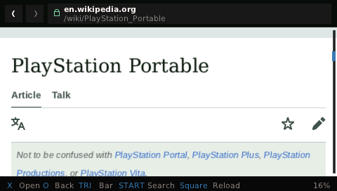
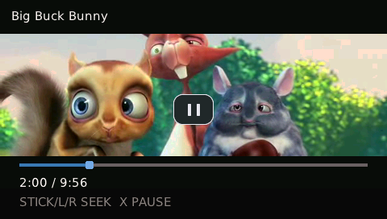
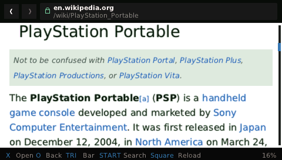
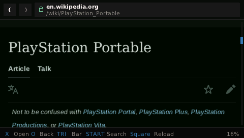
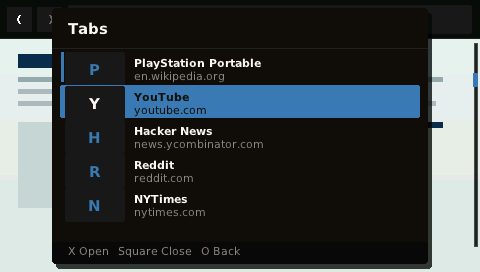
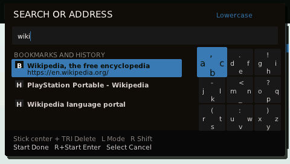

# Tilefinch

*An experimental browser that runs the modern web entirely on a Sony PSP
(333 MHz, 64 MB) with a from-scratch layout engine, JavaScript, and
hardware-decoded video.*

| Wikipedia at PSP resolution | 360p video playback |
|---|---|
|  |  |

| Reader mode | Dark mode |
|---|---|
|  |  |
| Five-tab switcher | Danzeff text entry |
|  |  |

## Why

I picked up my PSP for the first time in about a decade and wanted an excuse
to see (1) how far the machine could be pushed, (2) how much of the modern web
could really run in a setting this constrained, and (3) what today's coding
agents are capable of. A web browser was a good test of all three.

## What it does

| Feature | Support |
|---|---|
| **Web browsing** | Real HTTPS pages with JavaScript, cookies, images, mobile layout, and TrueType text; no proxy or companion computer. |
| **YouTube** | Built-in lightweight provider with 240p/360p playback, seeking, buffering UI, and resumable offline downloads. |
| **Tabs and navigation** | Five tabs, bookmarks, history, address/search suggestions, in-page find, optional session restore, and optional one-tab hibernation. |
| **Ad blocking** | Conservative request blocking and cosmetic hiding are on by default; custom uBlock/EasyList-style rules and per-site exceptions are supported. |
| **Cookie notices** | Common consent banners are hidden by default without clicking Accept or creating consent cookies; sites can be exempted individually. |
| **Reader and offline modes** | Reflow articles for the PSP screen, choose sans/serif text, remember optional per-site sizing, and save articles for later. |
| **Text entry** | PSP system keyboard or the faster Danzeff radial keyboard, with local bookmark/history completion. |
| **Appearance** | Automatic or forced dark mode, page text scaling, three chrome themes, and installable CJK/color-emoji packs. |
| **Native PSP UI** | First-frame home screen, Collections, clock, battery/Wi-Fi status, contextual controls, and PNG screenshots. |
| **Updates** | Signed in-app updates use A/B slots, a trial boot, automatic rollback, and explicit user approval. |
| **Experimental voice search** | Optional separate download; off by default and currently slow and inaccurate. |

### At a glance

| | |
|---|---|
| **Hardware target** | PSP-3000, 333 MHz MIPS, 64 MiB physical RAM (~43 MiB measured newlib heap; 32 MiB shared page/voice envelope), 480×272 RGB565 display |
| **Execution model** | Networking, HTML, CSS, JavaScript, layout, and rendering run locally |
| **Browser engine** | Lexbor HTML parser, Tilefinch style/layout/rendering, QuickJS runtime |
| **Presentation** | Incremental retained display list with a bounded RGB565 tile cache |
| **Networking** | HTTPS with certificate and hostname verification, cookies, redirects, and caching |
| **License** | MIT, with separately licensed third-party components |

### Engineering highlights

| Area | What makes it interesting |
|---|---|
| **A browser, not a port** | The style, layout, paint, policy, media, and native UI layers are original C11. Lexbor, QuickJS, curl, Mbed TLS, nghttp2, and FreeType are vendored and hash-pinned ([notices](THIRD_PARTY_NOTICES.md)). |
| **One strict memory ledger** | DOM, JavaScript, CSS, resources, layout, and tiles share a 24 MiB page budget. Tables and loops are bounded; allocation refusal is tested as a recoverable path rather than treated as exceptional. |
| **Useful pixels before EOF** | Streaming HTML/CSS, preload discovery, resumable layout, visible-resource priority, lazy bootstrap modules, and bounded compiled-style/script caches target first paint on a 333 MHz in-order core. |
| **Deterministic rendering** | Host and PSP use the same layout and rasterizer, including ordered RGB565 dithering. Chrome-reference fidelity floors may only move upward ([fidelity workflow](docs/FIDELITY.md)). |
| **Firmware video acceleration** | A raw-NAL bridge and bounded H.264 recovery-point rewriter feed the PSP Media Engine. Two guarded decode surfaces overlap conversion and presentation ([media state machine](docs/engineering/PSP_MEDIA_SESSION_STATE.md)). |
| **360p through a 480×272 display** | 640×360 frames stage through EDRAM as two guarded strips; the GE performs bilinear downscaling without a CPU per-pixel pass ([device envelope](docs/engineering/PSP_ENVELOPE.md)). |
| **Explicit lifecycle ownership** | Media and networking use pure reducers, epoch-tokened services, consumer leases, pumped teardown, and quarantine instead of freeing memory beneath live firmware or worker activity ([architecture](docs/ARCHITECTURE.md)). |
| **Security without pretending to sandbox** | HTTPS-first navigation, CORS/CSP/SRI, private-network protection, partition-aware resource authority, cookie controls, and signed A/B updates are enforced within a documented shared-process model ([security model](docs/SECURITY_MODEL.md)). |
| **Hardware-aware gates** | Release registers 127 host tests (126 enabled by default), plus sanitizer, hostile-input, WPT, fidelity, PSP cross-build, `.text`, and hot-symbol ratchets ([engineering guide](AGENTS.md)). |

## What you need

- A PSP able to run homebrew (custom firmware), with the expanded 64 MB
  physical-memory mode:
  - **PSP-3000** — the tested model; everything claimed on this page ran here.
  - **PSP-2000 and PSP Go** — same 64 MB memory mode, expected to work,
    not yet qualified.
  - **PSP-1000** — not supported: it has 32 MB of physical RAM, and most
    sites need more.
  - **PSP-E1000 (Street)** — has the memory but no Wi-Fi, so only the
    offline library would function; not a sensible target.
- About 20 MB of free Memory Stick space for ordinary browsing and updates.
  Optional language packs are roughly 1 MB each and the color-emoji pack is
  roughly 5 MB; Tilefinch shows the signed download size before installation.
  Installing the optional voice model temporarily needs about 19 MB more
  (the verified download and transactional candidate coexist); 40 MB free is
  the comfortable choice if you want voice recognition.
- Wi-Fi the PSP can join: with the latest ARK-4 CFW, WPA2 networks work; on
  other firmware the PSP joins only WPA (TKIP) or open networks — a
  hardware-era limit, and most routers can enable a WPA/TKIP guest SSID.
  Save the connection in the PSP's own Network Settings first.

## Install

1. Download `tilefinch-v0.1.3-psp.zip` from the
   [latest Tilefinch release](https://github.com/stjanovitz/tilefinch/releases/latest).
2. Extract the archive and copy its entire `TILEFINCH` folder to
   `PSP/GAME/` on your Memory Stick. The launcher should end up at
   `PSP/GAME/TILEFINCH/EBOOT.PBP`; keep `slot-a`, `slot-b`, `data`, and
   `NOTICES` beside it.
3. Safely disconnect the PSP, then start **Tilefinch** from
   **Game → Memory Stick**.
4. If you have not already done so, save a Wi-Fi connection in the PSP's own
   Network Settings. Tilefinch uses connection profile 1 by default; a
   different saved profile can be selected in Options.

The `.tfum` and `.tfup` files on the release page are for Tilefinch's signed
in-app updater, not manual installation. Optional language, emoji, and voice
components are installed from their corresponding Options screens.

## Controls

| Button | Action |
|---|---|
| D-pad | Move focus between links and controls (hold to repeat) |
| Analog stick | Page cursor; hold against top/bottom edge to scroll (Options can switch to direct scrolling) |
| X | Activate the focused item / click under the cursor |
| Circle | Back, or cancel the current load |
| Square | Reload (starts voice input on a text field when Experimental Voice is on) |
| Triangle | Show or hide the browser chrome |
| Start | Address and search bar |
| Select | Menu: Home, Reader mode, Tabs, Library, Options, Find, Screenshot, Exit |
| L / R | Page up / page down |
| L held at boot | Safe start: boot the previous version (after a first update exists) |

Pressing Start or activating a text field opens the selected keyboard. The PSP
system keyboard remains the default; **Options → Browsing & input → Keyboard**
enables the faster Danzeff layout. In Danzeff, move the analog stick among nine
character groups, press Triangle/Square/X/Circle for the character in that
direction, hold R for uppercase/symbols, and press L to switch letters/numbers.
Start accepts, Select cancels, and the D-pad edits the cursor or chooses a
matching bookmark/history result. Address completion stays entirely on-device
and URL history contributes only when its existing opt-in setting is enabled.

Type a URL to go there, or anything else to search.
Screenshots are written incrementally to `data/screenshots/` so Memory Stick
I/O does not freeze navigation. The completion message names the new file;
**Library → View screenshots** lists the newest 32 captures and their sizes
without scanning the directory during boot.

For long pages, choose **Menu → Find in page**. Enter a term with the selected
keyboard, then use D-pad Up/Down or L/R to move between highlighted matches.
Hold a direction to repeat. Press X or Start to edit the term and Circle to
close Find. Results are capped at 256 so an unusually repetitive page cannot
consume unbounded memory.

Choose **Menu → Reader mode** on an article to hide surrounding navigation and
sidebars, use the full viewport width, and increase line spacing. It is a
reversible presentation change: turning it off restores the existing page
without refetching it. **Options → Reader font** selects Sans or Serif. The
ordinary Web pages size control changes Reader text while Reader mode is open.
**Remember size** can retain that scale for at most 16 sites; it is off by
default, so reading and resizing articles causes no extra Memory Stick writes.
See [docs/READER_MODE.md](docs/READER_MODE.md) for the exact boundary.
Use **Library → Save article for later** to create a self-contained text
snapshot, or **View offline library** to open and delete saved articles and to
pause, resume, play, or delete YouTube downloads. The combined library is
capped at 12 items and is not read during boot. See
[docs/OFFLINE_LIBRARY.md](docs/OFFLINE_LIBRARY.md) for formats and limits.

Basic ad blocking and conservative cosmetic hiding are on by default.
**Options → Ad blocking** selects Off, Basic, or Custom; **Hide page ads**
controls only cosmetic hiding, and **Allow site** bypasses both for the page's
registrable site. Basic performs no Memory Stick list read. Custom reads
`data/adblock.txt`; **Load allowlist** explicitly imports extra site
exceptions from `data/adblock-allow.txt` into the bounded 32-site resident
set. See [docs/CONTENT_BLOCKING.md](docs/CONTENT_BLOCKING.md) for the exact
built-in hosts/selectors, accepted custom syntax, and limits.

Common cookie-consent overlays are also hidden by default without clicking
Accept or writing consent cookies. **Options → Cookie notices** can show them
again for the current site; this preference is independent of ad blocking.

## Updating

Updates are checked from **Options → Version / Update**. An optional
background check looks for new release metadata at most twice a week and can
be turned off in Options; Tilefinch never downloads or installs an update
without you asking. Stable and Beta releases are cryptographically signed and
verified before installation. The explicitly selected Developer channel is
unsigned and trusts its configured endpoint. New versions install into a
second slot and boot as a trial: if the new version fails to start properly,
the launcher automatically returns to the one that worked, and holding L at
boot always starts the previous version on demand. Details in
[docs/SECURE_UPDATES.md](docs/SECURE_UPDATES.md) and [SECURITY.md](SECURITY.md).

## Privacy

- No telemetry, no analytics, no accounts. Tilefinch sends nothing about
  you or your browsing anywhere; requests to YouTube carry your PSP's
  language setting so YouTube can localize results.
- Everything the browser stores — history (off by default), cookies, cache,
  saved pages and videos, screenshots, settings — lives on your Memory
  Stick and nowhere else. **Options → Site data** clears HTTP caches,
  cookies, local storage, and session storage individually.
- To connect faster on a return visit, Tilefinch normally keeps the short-lived
  TLS resumption tickets that servers hand out (in `data/tls-sessions.bin`).
  These are sensitive bearer material, so they live only on your Memory
  Stick, are never sent anywhere except back to the same site, and are
  erased along with the caches by **Options → Site data → Clear HTTP
  caches**. **Options → Privacy → TLS ticket saving** can disable this
  cross-boot storage without disabling live connection reuse.
- The device contacts only the sites you visit, plus — if the update check
  is enabled — the GitHub releases API at most twice a week to compare
  version numbers. That check can be turned off in Options and sends no
  identifying information beyond an ordinary HTTPS request.
- On the start page, when you rest on one of your own tiles (a bookmark or a
  built-in card) for about a third of a second, Tilefinch quietly opens the
  connection to that site in the background so it is ready the instant you
  press X. It only ever does this for a tile you have highlighted — never a
  page-supplied address — and it opens the connection only: it completes the
  TLS handshake and stops, sending no web request and fetching no content
  until you actually open the site. Only one such connection is ever open at
  a time, and it is dropped the moment you move away or the browser suspends.
- Voice search runs entirely on the PSP; audio is recognized on-device and
  never leaves it.

## Security

Tilefinch's security defaults, compatibility controls, threat model, and
known isolation limits are documented in
[the security model](docs/SECURITY_MODEL.md).

## Known limits

- Many sites render imperfectly and some heavy sites do not load at all.
  Tilefinch does not yet implement every browser standard or API completely.
  Pages that exceed the memory budget degrade or stop loading instead of
  crashing.
- YouTube support depends on YouTube not changing things; it breaks
  occasionally and updates fix it.
- Voice search is experimental: slow, often wrong, English only.
- Tabs retain bounded history, URL, focus, and scroll facts rather than five
  complete page graphs, so switching tabs reloads through the shared cache.
  The switcher keeps one 60x34 RGB565 preview per tab (about 20 KiB total),
  sampled from an already-rendered frame; previews never retain page graphs
  or trigger another render.
  Optional **Hibernate tab** storage is off by default; it moves one inactive
  snapshot—not the page heap—to the Memory Stick and marks it `[Z]`.
- Sites behind Cloudflare managed challenges do not work.
- There is no desktop-grade process sandbox or complete CSP. Tilefinch
  enforces a bounded response-header CSP/resource/framing subset, script and
  stylesheet Subresource Integrity, and restrictive iframe sandbox/origin
  boundaries, documented in
  [the security model](docs/SECURITY_MODEL.md), but it does not isolate origins
  into separate processes. Do not use it for sensitive accounts or
  transactions.

### Reporting problems

If something misbehaves, start with [TROUBLESHOOTING.md](TROUBLESHOOTING.md).
When filing a bug, include the PSP model and custom firmware (for example
"PSP-3000, ARK-4"), the Tilefinch version from **Options → Version / Update**,
the site or URL involved, and what you pressed. If the browser crashed, attach
`PSP/GAME/TILEFINCH/data/tilefinch-crash.txt` from the Memory Stick — a
512-byte file of zeros just means no crash was recorded. For suspected
security problems, [SECURITY.md](SECURITY.md) states what the project
protects and how to report.

## Building from source (development)

The desktop laboratory builds and tests the same engine on your computer at
PSP viewport and memory profiles; the first configure downloads hash-pinned
dependencies, and host builds need libcurl development headers and zlib:

```sh
cmake --preset release
cmake --build build-preset-release
ctest --test-dir build-preset-release
```

See [docs/DEVELOPMENT.md](docs/DEVELOPMENT.md) for the full workflow and
[CONTRIBUTING.md](CONTRIBUTING.md) before sending changes.

## How it works

One engine runs everywhere: bounded, budget-accounted parsing, styling,
layout, scripting, and tile-based rendering, designed so that allocation
failure, malformed pages, and cancellation are normal events rather than
crashes. [docs/ARCHITECTURE.md](docs/ARCHITECTURE.md) has the system
diagrams, memory contracts, and lifecycle boundaries.

More documentation: [docs/README.md](docs/README.md) is the complete map,
including focused engineering manuals under
[docs/engineering/](docs/engineering/README.md).

**Evaluating the engineering?** Read in this order:
[ARCHITECTURE](docs/ARCHITECTURE.md) (the system and its ownership rules) →
[SECURITY_MODEL](docs/SECURITY_MODEL.md) (what fails closed, and which
guarantees remain absent) → the two device lifecycle contracts
([media](docs/engineering/PSP_MEDIA_SESSION_STATE.md),
[network](docs/engineering/PSP_NETWORK_SUPERVISOR.md)) → the
[device qualification strategy](docs/engineering/DEVICE_QUALIFICATION.md)
(which claims host, emulator, and hardware can each prove) →
[RELEASE_PROCESS](docs/RELEASE_PROCESS.md) (gates, ratchets, and the offline
signing ceremony).

## Contributing

Issues and pull requests are welcome. Tilefinch is developed in spare time,
not on a continuous schedule, so responses and reviews may take a while. See
[CONTRIBUTING.md](CONTRIBUTING.md) for the build and test expectations.

## License and independence

Tilefinch is MIT licensed; see [LICENSE](LICENSE). Third-party components
retain their respective licenses and notices, documented in
[THIRD_PARTY_NOTICES.md](THIRD_PARTY_NOTICES.md). Security policy and
vulnerability reporting: [SECURITY.md](SECURITY.md).

The default browser download contains no acoustic model or speech
dictionary. If the optional voice component is requested in-app, its signed
package carries the Alpha Cephei and CMUdict license files alongside the model;
the base browser bundle retains the PocketSphinx license required by the
linked decoder.

Optional language and color-emoji packs are likewise not part of the browser
download. They are generated from regional Noto fonts, carry their complete
SIL Open Font License notice and source-font digest, and are fetched only after
the user requests one. Tilefinch does not read proprietary PSP firmware fonts.

Tilefinch is an independent, unofficial homebrew project. It is not
affiliated with, sponsored by, or endorsed by Sony Interactive
Entertainment. PlayStation, PSP, and related marks belong to their
respective owners. The project contains no proprietary Sony SDK material,
firmware, artwork, or branding.

The Wikipedia screenshots show the English article
["PlayStation Portable"](https://en.wikipedia.org/wiki/PlayStation_Portable).
Wikipedia text is licensed
[CC BY-SA 4.0](https://creativecommons.org/licenses/by-sa/4.0/).
Wikipedia and its marks are trademarks of the Wikimedia Foundation and are
shown only to identify browser compatibility; Tilefinch is not affiliated
with the Wikimedia Foundation.

The video screenshot contains a frame from *Big Buck Bunny*, copyright 2008
Blender Foundation, licensed
[CC BY 3.0](https://creativecommons.org/licenses/by/3.0/). The film and its
credits are available from the
[Blender open-movie project](https://studio.blender.org/projects/big-buck-bunny/).
