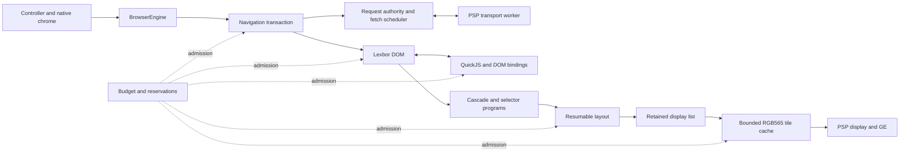
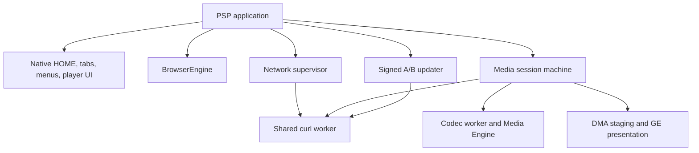
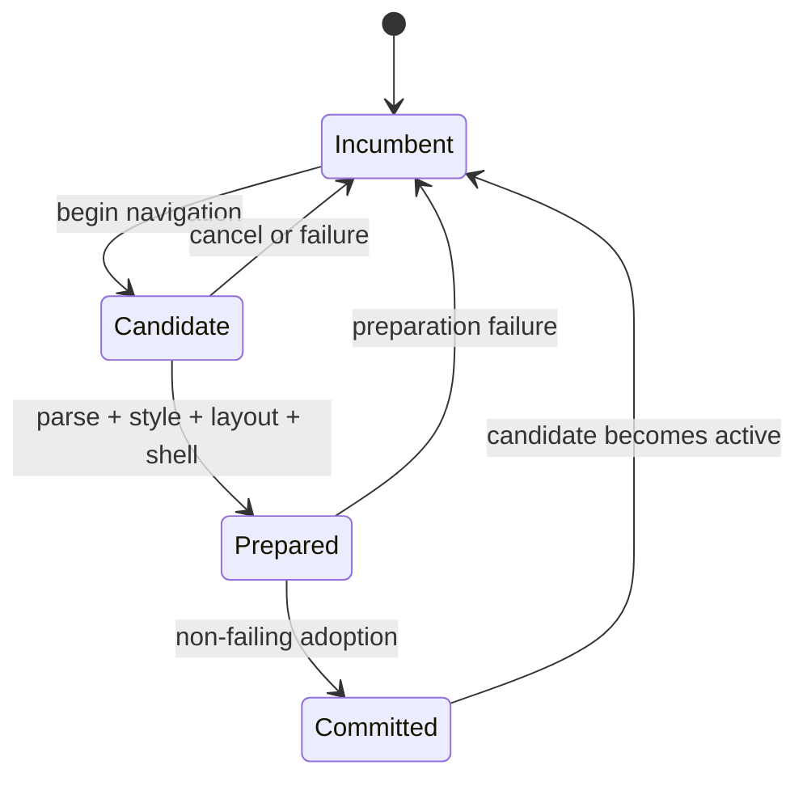
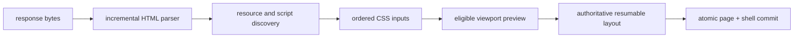

# Architecture

Tilefinch is a C11 web browser for the Sony PSP: a 333 MHz, 32-bit,
single-core MIPS system with 64 MiB of physical RAM, a 480×272 RGB565 display,
and no virtual memory. On that machine it fetches HTTPS pages, parses HTML and
CSS, runs JavaScript, lays out modern mobile sites, rasterizes them, and plays
video through the PSP firmware or a bounded two-core software decoder.

Memory on the shipping PSP-3000 build is layered:

- PSPSDK's grow-to-largest heap takes what is left after 2 MiB is held back.
  After the executable, stacks, modules, and system reserves, physical
  validation measures about 43 MiB allocatable through newlib (PPSSPP reports
  47 MiB).
- That process heap does not decide what a page may use. Page and voice work
  share a 32 MiB envelope, and the ordinary page profile admits at most
  24 MiB.

The constrained target is not a reduced-quality build of a desktop design. It
shapes the architecture:

- every page-owned byte is admitted through one memory budget;
- every variable-size structure has a fixed bound or an explicit eviction
  policy;
- long operations are resumable and cancellable at deterministic points;
- a partially built page never replaces the last usable page;
- ownership of firmware, DMA, transport, and browser-thread state is explicit;
- host, emulator, and device validation prove different things and are never
  treated as interchangeable.

The result is a small browser whose resource policy can be read from the
source, rather than inferred from whether a large machine happens to survive a
page.

## System map

`BrowserEngine` is the page ownership boundary. A frontend submits navigation,
input, and frame work through it and gets back bounded snapshots or borrowed
read-only views. The DOM, runtime, controller, render shell, and allocation
ledger cannot outlive the engine independently.

The PSP frontend adds process services around that boundary:

## The five architectural rules

### 1. One ledger owns page memory

Every page-pipeline allocation goes through `Budget`: DOM, styles, scripts,
resources, layout, display lists, tiles, session state, and allocator
metadata. The PSP profiles set 16 MiB and 24 MiB content ceilings. These are
admission limits, not estimates of whatever heap happens to remain.

Budget categories record where memory went; they do not carve out stranded
sub-heaps. Fixed-capacity concurrent pools and inline session tables are
represented by reservations against the same ceiling. Process-lifetime state
that no page can own, such as the CA bundle and the cross-navigation TLS
session store, is bounded separately and counted in the device reserve.

A refused allocation is a normal result. Parser checkpoints, candidate pages,
layout jobs, cache insertion, and script admission all have rollback or
bounded-degradation paths. Failure injection exercises those paths, and
teardown reconciles the ledger to zero.

The consequence compounds: adding a cache or a Web API is never just another
allocation. It must state its maximum, its accounting category, its lifetime,
and what still works when admission fails.

### 2. The browser graph has one mutation owner

Only the browser thread mutates the DOM, JavaScript, style, layout, history,
cookies, cache policy, and UI state. The object graph therefore needs no
locks, and a cancellation checkpoint is a trustworthy transaction boundary.

Other threads exist only where the platform can block or where hardware
genuinely runs concurrently:

| Worker | Owns | Publishes |
|---|---|---|
| transport | curl handles and fixed response buffers | immutable response chunks and terminal status |
| raster decode | one browser-admitted JPEG arena | generation-tagged RGBA completion |
| codec | one prepared firmware job at a time | decoded audio or a generation-tagged video surface |
| DMA | framebuffer staging transfer | completion for the exact slot generation |
| audio | PSP audio submission | consumed PCM position |
| voice | optional recognizer job | bounded recognition result |
| clock/watchdog | platform timing or liveness observation | atomics and fixed records |

These are operating-system threads. A page's Web Workers are not: each
dedicated worker is another QuickJS context on the browser thread (see
[Realms, workers, and frames](#realms-workers-and-frames)), so creating one
adds a realm, never a second mutator.

Workers never walk the DOM, call page allocators, update chrome, or write
profile state. Cross-thread messages use bounded slots, generation tokens, and
release/acquire publication. Thread priorities are declared together in
`include/tilefinch/psp_threads.h`, so their ordering can be reviewed as one
system. JPEG entropy decoding, for example, runs below browser priority;
cancelling it invalidates its token without waiting, and only the browser
thread may adopt the finished pixels or trigger the resulting relayout.

The rule is enforced, not only described. The `Budget` intrusive list is
deliberately unlocked, so a build with `TILEFINCH_OWNER_CHECKS` binds each
ledger to the first thread that mutates it and reports any other thread that
allocates, frees, reserves, or reallocates through it. A worker that needs
page-charged memory uses a `BudgetConcurrentPool`: its parent reservation is
taken on the owning thread, and its own small lock covers worker allocations.
An intentional handoff calls `budget_adopt_current_thread()`. Because every
page allocation crosses this one choke point, a worker reaching into DOM,
style, layout, or script state is caught at the allocation, not later through
a corrupted list.

The first device run with the check enabled caught exactly that. The
loading-UI supervisor, which draws chrome from the callback thread while page
work runs, rasterized status-text glyphs lazily through the engine's font face
and so allocated on the page ledger. The chrome glyph cache is now filled on
the owning thread when faces are bound: every printable ASCII glyph at the
current UI scale, 190 glyphs, about 30 ms per binding on a PSP-3000 (the
UI-scale setting fills the other size the same way). A miss on any other
thread draws the built-in bitmap for that tick instead of loading a glyph, and
binding and filling hold the supervisor's presentation fence because a
supervisor frame draws straight from the cache. A validation run through a
full media journey now reports `tilefinch-owner-checks: budget-violations=0`.

The two environments use the check differently, in keeping with rule 5:

- **Host:** on by default wherever tests are built, and a violation aborts
  the test. Host engine code creates no threads, so this mostly guards tests
  and any future host concurrency.
- **PSP:** every worker in the table exists only here. A build may opt in for
  a PPSSPP or device qualification run; violations are counted, the first
  eight are logged, and the exit report prints
  `tilefinch-owner-checks: budget-violations=N`. Ordinary validation builds
  leave it off, because a thread-identity syscall on every allocation would
  distort the timing those builds exist to measure.

### 3. Commit complete state, never partial state

Navigation is an incumbent/candidate transaction:

The incumbent page stays renderable while the candidate receives bytes,
parses, resolves resources, runs admitted blocking scripts, and builds its
authoritative layout. Before the old graph is destroyed, the candidate also
prepares its controller and tile shell. The final adoption only moves state
that is already owned, so it cannot allocate.

Reader presentation rides the same candidate-shell transaction across
navigations. After admitted scripts settle, one bounded, budget-charged
content-shape pass classifies the page as an article, listing, watch page, or
raw page and installs a hidden semantic extraction beside the untouched raw
DOM. That tree keeps headings, paragraphs, lists, links, images, captions,
tables, and code under explicit node, depth, and byte limits. Reader CSS
switches between the two trees without reparsing, and text anchors keep the
nearest reading position across the relayout. When Reader is already active,
this happens before the candidate's first authoritative layout, so the page
is not laid out once as authored and again as Reader.

A navigation failure leaves the incumbent usable and opens a bounded recovery
surface over it. Retry and Reader retry use the retained candidate URL; the
sign-in, site-JavaScript, audio-only, and quality actions appear only when
their context can help, and Return simply shows the incumbent again. None of
these actions publishes half a candidate with stale controller or render
state.

The experimental compressed-section mode is the named exception: replacing a
resident section may retire its old DOM before materializing its neighbor, to
keep the memory saving. Its narrower guarantee is documented in
[streaming navigation](engineering/STREAMING_NAVIGATION.md).

### 4. Work is budgeted in time as well as bytes

Parsing, selector matching, scripting, layout, resource decoding, tile
rasterization, screenshots, offline saves, and installation all run as
bounded pumps. The main loop spends a quota, presents progress the user can
see, and resumes from an owned continuation.

#### Optional pumps are admitted by one declared table

The pipeline stages of a frame (input, navigation, runtime, media, raster,
present) have fixed positions in the PSP resident loop. The *optional* work
between them has no private predicate at each call site. It is admitted by one
constant policy table, `src/frame_pumps.c`, whose entries are in loop order:

| Pump | Refused while | Yields to | Claims |
|---|---|---|---|
| preconnect | (its dwell machine owns eligibility) | — | — |
| update-session | — | — | Memory Stick |
| screenshot | — | — | Memory Stick |
| offline-download | navigation, any media pipeline, a supervised scope | — | Memory Stick, idle slice |
| site-restore-storage | buttons, paused/dirty/rendering page, navigation, visible or opening media | the three storage writers above, pending or just finished | Memory Stick, idle slice |
| site-restore-cache | the same, plus network association | the same, plus storage restoration and unfinished baseline fonts | Memory Stick, idle slice |
| provider-preresolve | any input, dirty/rendering page, navigation, media, a supervised scope | a download; a restore slice this frame | idle slice |
| page-idle | any input, paused/dirty/rendering page, visible/opening/decoding media | a restore or download slice this frame | idle slice |
| deferred-image | any input, paused/rendering page, navigation, media, a supervised scope | a download; a restore or page-idle slice this frame | idle slice |
| baseline-fonts | a preconnect handshake once association has finished | a storage-writer or restore slice this frame | Memory Stick |

The split is deliberate:

- *Readiness* ("do I have work?") stays with the pump's owner, and pending
  work is read from that owner at the moment of admission, never inferred
  from an earlier sample, because a writer can start and finish between two
  admissions.
- *Admission* ("may I run, given everything else?") is answered only by
  `frame_pumps_admit()`. Just before each admission, the frontend
  (`src/psp_app/psp_app_frame_pumps.c`) samples only the conditions that
  pump's entry names and stops at the first refusal. A condition changed
  earlier in the frame is never stale, and an idle frame does not pay for
  media, network, or storage predicates no declared relation depends on.

The resident loop pays one out-of-line call per site instead of an inline
predicate chain; that function is instruction-cache ratcheted, and the
conversion made it smaller.

The table governs only work that goes through it, so the wiring is tested
too. Every site, including those whose entry refuses nothing today, asks for
admission and records the slice it then consumes; a slice recorded without an
admission in the same frame counts as a wiring violation. A source contract
test requires every pump to be both admitted and recorded in the frontend and
every pump's work function to sit behind its own admission. The two mandatory
callers of site restoration, the navigation gate and exit cleanup, are the
only named exceptions.

The loop is single-threaded, so pumps never race, but they do contend: for
the frame's latency allowance and for the Memory Stick. Each entry states what
one slice claims. A host test then computes exactly which pump pairs can claim
the same resource in one frame, using only the admit-then-record calls a real
site can make. It enumerates every pending workload and in-slice completion
against every distinct set of refused pumps; fact combinations that refuse the
same pumps are equivalent, because admission reads frame facts only through
each entry's refusal mask. The resulting set of overlapping pairs is pinned,
with a written reason for each. Adding a pump, dropping a yield, or claiming a
new resource changes the set and fails the test until the author adds a
relation or records why the overlap is acceptable.

Every overlap has been decided. A frame performs at most one long idle slice,
so page-idle yields to a download slice. It performs at most one optional
Memory Stick operation, so the baseline font read yields to a storage writer
or storage-restore slice, while expendable cache restoration waits for the
required baseline fonts rather than the reverse. The overlaps that remain are
deliberate: pre-resolution may share a frame with a page-idle or
deferred-image slice, and the three user-started writers (update, screenshot,
download) do not yield to one another. Transport descriptors are not a frame
resource; the transport worker's own slot admission arbitrates them.

Validation builds also count admissions that happen behind a later pump,
since a yield to "a slice this frame" means something only when the loop and
the table agree on order. At exit they print both violation counts and, for
each pump, how many admissions and slices the run saw and how often it was
refused because of another pump rather than a frame fact
(`tilefinch-frame-pump: name=baseline-fonts admissions=1 slices=1 yields=1`).
Admissions and slices show that a site is live, not merely present in the
source; a yield shows that a declared relation arbitrated something. The
`site-restore` emulator scenario boots native HOME from a checked-in Memory
Stick seed and requires both restore phases to take slices and the font read
to yield to one. Two relations rest on the table test alone, with no emulator
evidence: cache restoration waiting for fonts (on this boot path, the
association fact holds cache restoration back until long after the single
font slice) and page-idle yielding to a download slice (which needs a live
media download).

#### Resumable jobs

The authoritative layout is a `LayoutBuildJob` with explicit phases: flow,
compaction, visibility and focus, paint order, spatial indexing, scroll
metadata, and finalization. Container queries get at most one measured probe
followed by one authoritative rebuild. Partial display lists stay private to
the job until `layout_build_job_take()` publishes a complete result.

#### Input during long scripts

Post-load PSP runtime work arms a lazy, **owner-thread-only** cooperative UI
scope. At a checkpoint after 8 ms, the scope keeps the last completed engine
frame and copies the UI state; it then samples input at most once every
16 ms. Direction and activation presses enter the existing four-entry queue,
with visible queued-input feedback, and replay once the task returns; Circle
requests cancellation. The callback-thread presenter cannot enter this scope,
and resource-worker hooks cannot borrow its state. Native WebGL finishes and
synchronizes its GE list before returning to these checkpoints. No controller
or DOM action runs inside a suspended mutation, and no framebuffer ownership
changes hands. Page-controls capture bypasses this path so a game keeps its
own input and frame loop.

This is cooperation, not preemption: a native call with no checkpoints can
still block feedback, and page actions wait for a safe task boundary.
Validation reports the first checkpoint gap and the latency from input sample
to successful presentation, and it names every call of 100 ms or more that
serviced no checkpoint. Neither a queued press nor a completed receiver trace
is, by itself, a time-to-interactive pass.

#### Fast paths

The engine uses several PSP-specific fast paths that do not change results:

- checked 32-bit multiply and divide handle ordinary viewport geometry,
  falling back to 64-bit arithmetic only for values that need it;
- font advances and kerning use fixed-point values in hot measurement paths;
- selector programs compare interned identifiers and reuse node-local
  attribute facts;
- compiled stylesheet fragments are reused from bounded RAM caches and never
  written to the Memory Stick;
- preview layout limits its work to geometry that can affect the viewport;
- simple script-free pages load visible images before publication, then pump
  offscreen images from idle work one viewport-ranked request and one decode
  at a time, so input and navigation never wait on thumbnail I/O, and decoded
  images stay in the bounded RAM cache for repeat navigations;
- image discovery carries the computed parent style instead of rebuilding the
  cascade for each image;
- repeated gradients, glyphs, and tiles use bounded caches with measured
  eviction rather than unbounded memoization.

### 5. Host determinism and device truth are separate gates

The host and the PSP run the same retained display list and software raster
primitives. RGB565 conversion uses coordinate-stable ordered dithering, so a
pixel does not depend on traversal order. The host lab can therefore compare
the engine against a 480×272 Chrome reference while unit tests pin exact
layout, counter, and raster behavior.

That does not make host timing a prediction of PSP timing. The host proves
logic, rollback, bounds, and visual output. PPSSPP proves the Allegrex build
and many PSP ABI paths. Only hardware proves cache coherency, module
availability, WLAN timing, Media Engine behavior, Memory Stick semantics, and
real input latency. [Device qualification](engineering/DEVICE_QUALIFICATION.md)
assigns each claim to the environment able to prove it.

## Navigation and first paint

A document is not downloaded and then parsed. A navigation advances a bounded
pipeline:

The resource scanner starts stylesheets and eligible scripts while later HTML
is still arriving. A preview paint is attempted only when the parsed prefix
can produce visible pixels: eligible pages can paint before parser-blocking
scripts run, while pages that depend on scripts keep the correct blocking
order. Stylesheet suffixes preserve the selector compiler's and index's state,
and `@font-face` rules are discovered during the main CSS parse rather than in
a second walk.

The fetch scheduler caps active page slots, response bytes, callback work,
and elapsed pump time, and it pauses curl delivery when its bounded handoff
buffer is full. The candidate owns every continuation, so replacing or
cancelling it retires the whole pipeline without a callback reaching the next
page.

## JavaScript

QuickJS runs within a page-specific heap limit and the shared page budget.

### Bootstrap without spending the realm at startup

The platform bootstrap is generated as uncompressed QuickJS bytecode and
restored directly from read-only program data with `JS_READ_OBJ_ROM_DATA`,
with no per-navigation inflate buffer or duplicate copy of the bytecode.

Bootstrap features are split into modules that activate lazily within fixed
bounds. Core DOM and event semantics are available immediately; larger
facilities install when a page first reaches their surface (the `Intl`
polyfill, for example, on first access to the `Intl` global). Lazy factories
and resident bundles have fixed caps, and a generated manifest proves that the
authored sources and the committed bytecode agree.

- **Compacted source.** The generator embeds a compacted copy of every
  bootstrap source (indentation, trailing whitespace, and comments removed;
  newlines kept) and refuses to emit unless bytecode compiled from that copy
  is identical to bytecode compiled from the authored file. The bootstrap
  source ceiling therefore measures code rather than prose, and it is
  separate from the ceiling for authored page scripts.
- **Stripped bytecode.** The committed bytecode carries no source, line
  tables, or local-variable names. QuickJS copies line tables and variable
  definitions out of ROM into the realm heap on restore, so stripping them
  returned about 217 KiB of resident heap on the device realm. Bootstrap
  exceptions still name the module and function, and
  `TILEFINCH_DISABLE_BOOTSTRAP_BYTECODE=1` compiles the embedded source with
  full debug information when host line numbers are needed.
- **Attributed growth.** `TILEFINCH_TRACE_JS_STARTUP=1` prints, per module,
  the heap its evaluation retained, broken down by QuickJS category
  (functions, objects, properties, shapes, atoms, strings). That is how growth
  is attributed before the footprint guard test trips.

### Realms, workers, and frames

Every script realm a page owns runs on the browser thread. There are three
kinds, and none adds a mutator:

| Realm | Bound | Isolation | Communicates by |
|---|---|---|---|
| same-origin nested frame | 16 contexts per parent runtime | a QuickJS context sharing the parent's heap and `Budget` | direct object access, as the platform requires |
| dedicated Web Worker | 4 contexts per page runtime | its own context and global; structured clone across the boundary | messages queued as platform tasks |
| loaded child document (`<iframe>` navigation) | 4 per page | its own `ScriptRuntime`, document, and image set | a generation-tagged, sequence-numbered message queue pumped by the owner |

A Web Worker is concurrency in the page's programming model, not in the
engine: `postMessage` crosses a structured-clone boundary into another
context, and the worker's turn runs when the single event loop reaches its
task. Its global inherits from `DedicatedWorkerGlobalScope.prototype`. Names
the worker realm does not define resolve, read-only, through a fallback to the
owner's platform implementations, which keeps each realm well under 100 KiB
instead of instantiating the platform again. Values a worker API returns
(encoded bytes, fetch responses, permission objects) are created in the
worker's realm, so `instanceof` and brand checks hold there.

A loaded child document is the heavier case. It is parsed, styled, laid out,
and scripted as its own document with `SCRIPT_DOCUMENT_SCOPE_CHILD_FRAME`,
then shown in its parent as an opaque pixel snapshot at the iframe element's
box; the parent never reads the child's DOM. A committed child mutation marks
its snapshot dirty. If the bounded layout or raster allocation for the refresh
is refused, the dirty bit stays set while the owning page is live and the
owner tick retries, skipping a frame that cannot publish yet (one with no box,
for example) so it cannot starve a later one. Trusted input in a child
notifies user activation on that realm and every ancestor before the event is
dispatched, so parent and child handlers see one activation state.

Nested frames live in `frames.js`, an eager module that only defines an
installer; `platform.js` calls it with its private helpers and then deletes
it. Same-origin frame evaluation uses a persistent QuickJS context (at most 16
per parent runtime) whose global `this` is the child WindowProxy, including
for sloppy functions and the child's `Function` constructor. QuickJS owns
global and lexical bindings: closures and later scripts see the same
variables, comma-separated declarations stay intact, and lexical declarations
do not become Window properties. No source-scanning or declaration-copying
pass runs per evaluation. Context allocations share the page's heap and
`Budget`; failed setup releases its slot, and eviction retires the realm
before releasing its native reference, so retained functions keep their
storage alive but cannot run after retirement.

Worker termination uses the same retirement boundary: pending jobs are
discarded during normal bounded draining, and retained callbacks cannot run
in a retired realm. A failed worker construction returns its quota slot,
settled fetches remove both their lifetime and author-signal abort listeners,
and microtasks and delayed import retries check that the worker is still
active.

### Tasks, timers, and activation

One scheduler owns every queued callback, and it makes the same distinction
the platform does.

- *Timers* (`setTimeout` and `setInterval`, in pages and workers alike) run
  the HTML timer algorithm. Each carries a nesting level inherited from the
  timer that scheduled it, and beyond the fifth level a delay below 4 ms is
  clamped to 4 ms, for intervals and mixed chains too.
- *Platform tasks* (IndexedDB steps, promise-returning platform operations,
  performance-observer delivery, worker and `MessagePort` messages) share the
  bounded queue and quota but never enter the timer algorithm, so a page's
  timer chain can neither delay browser bookkeeping nor be reset by it.

A `MessagePort` delivers one message per task through the listener microtask
checkpoint and schedules the next delivery only after that one finishes,
which keeps an endpoint's messages in order even when a listener posts back
synchronously. Author-dispatched events remain synchronous.

User activation is a timed realm state, not a flag held during one dispatch.
Trusted input opens a five-second transient window and sets a sticky "has been
active" bit, both exposed through `navigator.userActivation`.
Activation-gated native operations (fullscreen, resuming game audio, page
controls, starting multiplayer) ask the realm whether the window is open, and
fullscreen consumes it. A script-initiated navigation snapshots the state when
it is requested, because the host may not act on the request until a later
turn; that snapshot, not the presence of a referrer, is what request context
and Fetch Metadata report as user-activated.

### Platform objects keep private identity

Platform interfaces are ordinary bootstrap JavaScript, so their brand must not
be forgeable or breakable from the page. The convention is uniform:

- instance state lives in a closure-held `WeakMap` captured before author code
  runs, never in `_underscore` properties;
- constructors reject everything but a private token;
- receiver checks compare against that captured identity, not `instanceof` or
  a mutable global such as `window.navigator`.

A page that replaces `navigator`, poisons a prototype, or calls an accessor on
a look-alike gets the `TypeError` a browser would raise and cannot disturb the
real object. Native handoffs follow the same rule: the host captures what a
lazy module needs (for example the `StorageManager` instance for the
origin-private file system) before author code runs and passes it through a
temporary global that is deleted immediately. `Event.isTrusted` is a
non-configurable own accessor backed by the same private state. New Web API
surface is expected to follow this pattern.

### Computed style is one generated registry

`getComputedStyle()` reports resolved values for the properties the engine
supports, and only those. A disconnected element has an empty declaration
block, and an unsupported name is absent rather than answered from a table of
initial values.

Which properties exist is decided by a single X-macro list,
`COMPUTED_STYLE_PROPERTIES` in `src/js_dom_bindings.c`. It generates the
read-only table behind `name in style`, `length`, `item()`, and enumeration;
the `ComputedStylePropertyId` enumeration the getter dispatches on after one
binary search; and per-row flags for the two sparse families resolved from
retained authored text, for used-geometry properties that need a box, and for
cascade-only properties that may be read after a DOM mutation without laying
the page out first. Because every serializer arm names an identifier, no value
can resolve for a property the registry does not list. A source check covers
what the compiler cannot see: `strcmp` order, no string matching creeping back
into the getter, and every row having an arm or a family flag.

Values are serialized from `ComputedStyle` fields, never from authored text,
so `inherit`, `var()`, relative units, and `!important` are settled before a
value is printed. `width`, `height`, and percentage padding are used values
resolved against the real containing block; a pseudo-element or non-replaced
inline reports its computed value instead of a box that is not its own. Where
the cascade keeps less than CSS allows (whole-pixel `letter-spacing`,
keyword-only `vertical-align`, underline as the only decoration line), the
serialization is exact for what is kept, which is also what is painted. Two
tests hold this: exact expected values for the cases with logic in them, and a
checked-in dump of every registered property across a fixture page
(`tests/fixtures/computed-style-dump.*`), which turns any change to a resolved
value into a reviewable diff.

### QuickJS is vendored and changed in place

QuickJS lives in `third_party/quickjs` with Tilefinch's changes already
applied. `cmake/TilefinchDependencies.cmake` pins the SHA-256 of `quickjs.c`
and `quickjs.h`, and a mismatch fails configure, so an engine change is an
ordinary reviewed diff plus a pin update. The historical patch files under
`patches/` survive only as inputs for lab variants, which rebuild a copy of
the engine in the build directory with selected layers reversed and have
their own pinned fingerprints. `third_party/quickjs/README.md` lists every
carried change in application order.

Most of the changes serve the memory ceiling: bounded array growth that
collects near the limit instead of refusing, collection opportunities at
allocation sites upstream never checks (native string producers, property
table growth), interruptible compilation, and Latin-1 string storage.

The change with architectural weight is the compact array family. A dense
`Array` built only from one-character Latin-1 strings, unsigned or signed
bytes, or signed 16-bit integers is stored packed in a string-shaped backing
store, one or two bytes per element instead of a boxed value. That is what
keeps a decoder's or bytecode interpreter's working arrays inside a PSP script
heap. The representation is invisible to the language, and its invariants are
the ones every packed representation here must keep:

- the backing store belongs to the array alone. An operation that would hand
  it to JavaScript (`join('')`) returns a copy, because a string can be
  interned, concatenated in place, or outlive the array;
- mutation is copy-on-write whenever the store is shared or interned, and the
  interpreter's in-place element store is used only when it is neither;
- a value the representation cannot hold widens bytes to 16-bit in place or
  converts the array to ordinary boxed elements. That conversion is checked
  against the device-profile array ceiling first, since packed storage admits
  up to eight times more elements than boxed storage under the same byte cap;
- re-packing a homogeneous array is only an optimization. It is attempted at
  power-of-two lengths and large capacity boundaries, and a refused
  allocation leaves the boxed array and the append untouched.

### Script admission

Page scripts are admitted by source size, count, heap, time, and callback
work, and interrupt checks cover QuickJS execution and native callback
boundaries.

- **Data, not code.** Inert JSON script types stay DOM data. A narrow
  classic-script subset (`window`, `globalThis`, `var`, or bare global
  assignments of strict JSON) installs its data without compiling bytecode or
  consuming executable quota.
- **No `nomodule` fallback.** Because the engine supports modules, classic
  `nomodule` scripts are rejected before preload, quota admission, or
  dynamic-script scheduling, and a module fetch or execution failure never
  enables the legacy alternative.
- **Cost shedding.** Large cross-origin classic bundles pass an
  allocation-free lexical cost scan, and only high-cost bodies are shed; source
  size and watchdog misses are kept as tuning telemetry. Rejection is
  page-local, and server-rendered content stays usable.
- **Hydration rollback.** Before the first parser-blocking author callback,
  the stream keeps at most one complete, visibly useful snapshot of the body.
  If later hydration fails or runs out of quota and collapses that content,
  commit restores the snapshot transactionally; a useful replacement that
  succeeds stays authoritative.
- **Circuit breaker.** One navigation may spend at most 1 MiB of parser-stage
  source work, eight seconds across its blocking checkpoints, or three
  consecutive failed scripts. When a bound trips, the remaining blocking
  scripts are soft-skipped, parsing continues to the end, and the committed
  page is marked Limited. The author realm is then retired for that document,
  so deferred, asynchronous, and dynamic work already queued cannot resume the
  hydration the circuit abandoned. When the circuit does not trip, those
  script classes keep their normal lifecycle and quotas.

Compiled external scripts and parsed stylesheet fragments may be reused from
bounded in-memory caches for the life of the process; ordinary browsing never
writes compiler artifacts to storage. An explicitly installed offline app is
the exception: installation may add bounded, locally generated classic-script
bytecode beside the retained source. That artifact is bound to the source and
to a dedicated QuickJS bytecode ABI (not the Tilefinch release version), and
launch falls back to compiling the source whenever restoration is unavailable
or fails.

Small WebAssembly modules use the standard JavaScript API through the
[bounded WebAssembly profile](WEBASSEMBLY.md). Host labs link the pinned
interpreter directly; the PSP EBOOT keeps only a versioned adapter and loads
the interpreter lazily from the active signed slot on first namespace access.
The module, runtime pool, memory, imports, exports, stack, and native
instruction work all have fixed ceilings. Unsupported proposals and import
kinds fail through the API without weakening the page's Budget, origin, CSP,
or transport policy.

DOM mutations are journaled and coalesced before they trigger style and
layout. The journal is bounded, and when it fills the engine chooses a safe,
broader invalidation instead of growing it.

## Rendering and presentation

Layout produces a retained display list of text, fills, borders, images,
stacking contexts, transforms, clipping, fixed and sticky geometry, and focus
metadata. The renderer rasterizes 128×128 RGB565 tiles on demand and keeps a
bounded spatial index, so scrolling costs work in proportion to the visible
content, not the document's length.

Unsupported motion resolves to one coherent static presentation: final
visibility and opacity are kept, scroll-linked transforms flatten, and
synthetic spacer scenes are contained. Layout records the first coordinate
clamp and confines a saturated non-root subtree, so the coordinate sentinel
cannot blank every later scroll viewport.

Mixed-direction page text is a sparse extension of the same retained layout,
not a second document representation. A parser and style census lets ordinary
left-to-right paragraphs bypass it. Admitted right-to-left paragraphs keep
their logical DOM text while a bounded UAX #9 analysis produces levels,
Arabic-family contextual forms, shaped advances, visual line order, and
logical-to-visual glyph sidecars. Painting, links, controls, focus hit
testing, and find highlights all use the same visual geometry. The limits and
degradation contract are in [Bidirectional page text](TEXT_BIDI.md).

Simple focus decorations use retained paint when geometry is unchanged. Up to
64 rounded controls can reserve, during layout, one zero-offset, unblurred
inset-ring command. Focus then updates that ring's color, opacity, and
thickness in place with bounded damage, after a dry run proves every old and
new focus target, and scaled visual copies keep the correct ring thickness.
Complex shadows, background-clipping changes, inherited or relational
effects, and exhausted slots fall back to authoritative layout. Expanding a
section is still a layout operation, not an outline update.

Web content and native chrome are separate layers. The browser frame stays
stable while menus, find, the keyboard, loading status, and player controls
animate over it. Mode-specific painters are deliberately out of line, so the
per-frame browser and media compositors stay small enough for the Allegrex
instruction cache; the ELF build ratchets those hot symbols separately from
total `.text`.

Fullscreen video keeps the decoder's 8888 scanout rather than narrowing the
whole picture to the page renderer's RGB565 format. The native player projects
its overlay into at most 16 clipped, disjoint rectangles. Opaque title and
control bars start from cleared RGB565 scratch and so never import the moving
picture; only translucent badges, previews, and panels import their bounded
backdrop before the ordinary chrome compositor runs. The result is widened
only inside those rectangles, and every pixel outside them is the decoder's
original output, byte for byte. Fixed player shapes use precomputed coverage
from the same bounded antialiasing sampler as the generic path.

Images are decoded without forced-dark color inversion. Dark mode transforms
authored foreground and background colors at paint boundaries, while
photographs, thumbnails, and decoded video keep their source colors.

### Canvas 2D

Canvas 2D uses an exact, lazily allocated RGBA backing array inside the page's
QuickJS budget, plus at most four budget-owned native snapshots (1 MiB in
total). The duplication is deliberate. The JavaScript array is the exact
mutable state that `getImageData()`, export, and canvas-to-canvas drawing
require; the native snapshot is a stable presentation generation the renderer
may read while author code keeps changing the canvas. Removing either copy
without first moving exact readback and generation ownership into a native
surface would trade memory for stale-frame races or visible pixel changes.
This keeps `getImageData()` and `putImageData()` deterministic without giving
every canvas an unrestricted framebuffer. Pixel-oriented scripts can create a
blank buffer from another `ImageData`'s dimensions, publish only a clipped
dirty rectangle, or reset the context without replacing the canvas, and dirty
publication uses bounded row copies rather than a JavaScript pixel loop.

The native raster seam draws actual Tilefinch font glyphs, 2×2-coverage paths
and strokes, per-pixel gradients, and transformed nearest-neighbor or
bilinear sprites. It supports bounded nested clips, rounded geometry, line
caps, joins, and dashes, and the practical Porter-Duff subset. Ordinary
decoded `` resources and other canvases use the same sprite path.
`Path2D` accepts bounded SVG path strings and transformed `addPath()`
geometry. Small path and text shadows use a fixed native sampling pattern;
complex geometry degrades to one offset sample instead of letting blur work
grow with page input.

Drawing crosses into native code in batches: up to 64 solid rectangles or 16
consecutive sprite blits per JavaScript turn, and a separate 16-command queue
that paths and text share, so an animated chart's geometry and labels cross
together. All drawing in a turn coalesces into one dirty rectangle, copies
only those rows into the native snapshot, and invalidates only the affected
page tiles. A same-size animation therefore rebuilds no style, layout, or
retained display list.

- Animation-frame callbacks run at most once per presented browser tick, use
  that tick's monotonic timestamp, stay paused while the page is inactive,
  and skip elapsed frames rather than replaying a backlog.
- Native surfaces, the media player, and physical suspend drive the Page
  Visibility API. `document.hidden` and `visibilityState` change at a normal
  browser-thread task checkpoint; `visibilitychange` preserves a
  suspend/resume pair even when both edges arrive before JavaScript resumes;
  and ordinary timers stay eligible while visual callbacks wait.
- Pointer capture and layout-derived canvas-relative coordinates keep canvas
  controls stable through hover, drag, and release.
- Authored dimensions beyond the PSP's surface envelope are scaled down
  proportionally to at most 480×272 and 131,072 pixels; a zero-sized axis
  stays zero while the other is still capped. Deep clip stacks and excess
  raster work fail softly while the rest of the page stays usable.

`HTMLImageElement.decode()` exposes bounded decode readiness, and
`createImageBitmap()` prepares at most eight cropped or resized asset
snapshots under a 1 MiB aggregate logical ceiling. Bitmap pixels stay in the
QuickJS budget and preserve the canvas origin-clean state. They add no
ordinary canvas backing store, and closing or collecting a bitmap returns its
separate asset allowance.

### Gamepad and fullscreen

The Gamepad API exposes one stable, standard-mapped controller object for the
built-in PSP controls. It stays disconnected until the user holds
Start+Select or a trusted Play click calls the bounded
`navigator.tilefinch.requestPageControls()` extension, which shows a native
Start+Select exit notice and suppresses the activating face button until it
is released. Native input authority is a small, generation-bearing capture
record: navigation, native media, or suspend disconnects the object and
returns control to the browser. Identical physical samples do not cross into
QuickJS, button objects and axes are reused rather than recreated on each
poll, and cross-origin child frames never receive the snapshot. The same held
chord returns control, and the firmware HOME callback sits outside page
capture and always works.

The page Fullscreen API is a single top-level presentation state. A trusted
activation commits the element's identity before native chrome is hidden;
Triangle or Start+Select exits immediately, and navigation or node retirement
clears the borrowed handle. The PSP has no separate compositor top layer, so
style resolution gives the active element a fixed viewport-sized box and
supports `:fullscreen` without adding a spoofable DOM attribute.

### WebGL

WebGL 1 is a lazy, bounded command translator over the PSP graphics engine
(GE), not a software GLSL interpreter. The JavaScript layer exposes the
familiar object and state model, admits only shader shapes compatible with
fixed-function vertex color or a single texture, combines a bounded chain of
position-matrix uniforms, and snapshots each draw's buffers, attributes,
transform, viewport, scissor, depth, cull, and blend state into a bounded
command batch. The native wire format is versioned and uses fixed 32-bit
integer and float words, which avoids software double-precision conversion on
Allegrex while keeping draw-time snapshots. The native side reads possibly
unaligned words with `memcpy` and validates every scalar and byte span again
before either the host reference rasterizer or the GE sees it. Unsupported
shader control flow and state fail through WebGL errors or context loss while
the surrounding document stays usable.

Draw admission validates enabled-attribute spans and indexed-draw alignment,
count, offset, highest referenced vertex, and source-buffer bounds before a
command enters the batch, so malformed game geometry is an ordinary WebGL
error rather than a late native failure or context loss.

Each realm admits at most two contexts, 24 buffers, eight textures, 64 draws,
and 4,096 vertices. Buffer bytes are capped at 512 KiB, retained texture
pixels at 416 KiB, and a drawing buffer at 480×272 and 131,072 pixels; the PSP
scales larger authored dimensions proportionally instead of rejecting the
context or allocating a larger surface. It keeps one bounded EDRAM color
target, depth target, and texture cache, and shares GE command ownership with
the media presenter rather than adding a second graphics authority. Texture
generations avoid re-uploading unchanged pixels within one native
`(realm epoch, canvas handle)` owner; fresh realms, context restoration,
canvas changes, and the video layout's reuse of the EDRAM texture region clear
that authority before lookup. Page-owned command, buffer, texture, depth, and
presentation memory is charged through `Budget`, so a failed allocation or an
oversized scene refuses the operation without growing a hidden heap.

An opaque, untransformed canvas update can publish without rebuilding the
viewport's ordinary tiles. The renderer keeps the previous RGB565 frame,
overwrites only the canvas rectangle, then replays later document paint and
fixed or sticky chrome in order. Scaled nearest-neighbor publication converts
each source pixel once per run and copies repeated source rows, keeping the
fast path bounded without another canvas-sized allocation. Transparent,
filtered, rounded, multiply-blended, or ambiguously ordered canvases refuse
this path and use the normal retained-tile renderer.

PSP draw translation first counts the exact bounded vertex requirement, then
charges only that much scratch for the submission. All emitted vertices occupy
one contiguous prefix, so a single cache writeback just before `sceGuFinish`
publishes the batch. GE synchronization remains the ownership boundary before
CPU readback; command submission is deliberately synchronous.

The PSP's 8888 alpha channel doubles as its stencil plane, so Tilefinch
advertises an opaque drawing buffer (`alpha: false`) and resolves GE output to
an opaque native surface while copying each completed row. Games and charts
get fast, deterministic presentation without a claim of transparent-buffer
behavior the hardware cannot implement consistently. The host rasterizer
exercises pixels, clipping, depth, culling, blending, texture wrapping, and
line closure. A PSP-target GE probe separately measures representative cube,
sprite, draw-pressure, CPU-vertex, and texture-upload scenes, and PPSSPP's
software renderer is used when an end-to-end browser fixture must read GE
pixels back into the page renderer.

### Game audio

Game audio is another lazy, bounded module, not a second media player. One
`AudioContext` can decode up to eight PCM WAV buffers into a 512 KiB native
pool and mix four voices on a PSP audio worker. Buffer sources support bounded
loop regions, and sine, square, sawtooth, and triangle oscillators come from
the same mixer and a 130-byte quarter-wave table. Gain and stereo-pan changes
publish packed atomic coefficients that the worker samples once per
512-frame block, and start and stop times use a wrapping 32-bit output-frame
clock with a ten-second admission window. No synthesis path allocates or does
floating-point work on the audio thread.

The context starts suspended, and resuming it natively requires trusted
activation. Suspend releases the scarce PSP audio channel while keeping
decoded effects, and so does opening native page media, so game sounds cannot
take the video player's channel. A finished or stopped voice keeps its
generation-bearing slot until the browser thread takes its bounded completion
notice; only then does the captured bridge dispatch `ended`/`onended` and free
the slot. Worker code therefore never enters JavaScript, and a late completion
cannot target a newer sound. Compressed formats, custom synthesis graphs,
long-horizon scheduling, and PCM readback are unsupported and fail
explicitly.

## Request authority, transport, and cache provenance

Every page-originated request crosses one construction boundary. Callers
supply a typed `TilefinchRequestContext`, and
`fetch_prepare_page_request_context()` derives cookies, Origin, Referer, Fetch
Metadata, credentials, CORS, CSP, mixed-content and Private Network Access
policy, content blocking, and cache-partition authority. Validation rejects
page requests that bypass that preparation marker.

Response security fields are parsed once, while the complete wire headers are
available, into typed metadata, so CORS, CORP, CSP, HSTS, nosniff, frame
policy, and referrer-policy consumers never reinterpret a truncated generic
header snapshot. Resource-cache entries carry their partition and
authorization grant, and entries that carry authority stay in memory rather
than being serialized as generic cache records.

On the PSP, one shared transport worker owns curl. Up to six ordinary response
lanes grow lazily with concurrency, media uses two larger fixed range windows,
and the YouTube HOME preconnect has one bodyless descriptor: a highlighted
built-in YouTube HOME destination may warm one connection, and moving focus or
suspending cancels it. Redirects stay singular: the browser authorizes one
hop, the worker executes it, and the next hop starts only after the browser
accepts the result. Independent requests still run concurrently, and HTTP/2
multiplexing remains available.

An authoritative navigation supersedes its incumbent page's unfinished
optional network work before queuing the candidate document. The incumbent DOM
and last frame stay intact for rollback, but thumbnails, fonts, scripts, and
page fetches cannot hold all six worker descriptors ahead of the link the user
just activated. If the candidate is cancelled or fails, the incumbent stays
usable but the superseded requests are not restarted. This is a deliberate
responsiveness tradeoff until the transport has a separate
authoritative-priority lane.

The release owns its curl, Mbed TLS, and nghttp2 chain. Archives are
digest-pinned, runtime provenance is checked, HTTP/2 is negotiated through
ALPN with HTTP/1.1 fallback, and HTTP/3 is out of scope. By default, TLS
sessions are kept in a bounded, checksummed store, scoped to the same site,
and cleared with cache data; a global preference disables keeping them across
boots without disabling reuse within a process.

WebSockets reuse the same owned curl multi worker, TLS state, cookie
authority, and `connect-src`, mixed-content, and Private Network Access
decisions instead of creating a second network stack. The page API admits two
sockets, one 64 KiB message per socket, and 64 KiB of queued outbound data; a
single published receive event provides backpressure instead of a page-sized
queue. Handshake redirects are disabled, document cancellation closes the
socket, and all receive and send storage is charged to the page `Budget`. The
host runtime keeps the native duplex lane unavailable: deterministic
JavaScript lifecycle tests use an injectable native seam, while the Allegrex
build links curl's real WS/WSS framing path.

Installed offline games have a separate, explicitly user-activated direct
multiplayer lane. Its page surface resembles the message and lifecycle
portion of `RTCDataChannel`, while Tilefinch-specific setup performs bounded
LAN discovery, public-endpoint discovery through STUN, numeric-code exchange,
and explicit host approval. The PSP worker owns DNS and UDP; the browser
thread sees only fixed command and event rings. One session, 512-byte
datagrams, and fixed deadlines keep the feature inside the page `Budget` and
the network supervisor. Ordinary pages cannot open it, launching an offline
app does not request Wi-Fi, and leaving the document cancels the worker and
its lease. There is no relay, background lobby, or general page UDP API.
[Direct multiplayer](MULTIPLAYER.md) defines the author-facing contract.

### Provider caches

The native YouTube provider keeps at most two generated Home or first-search
documents for two minutes in the session Budget. Keys include the exact URL,
the presentation variant, and the cookie authority visible to the request;
eviction is least-recently-used. This cache is optional session memory: it
takes part in ordinary cache reclaim, **Clear HTTP caches**, and site-data
clearing, so a generated provider page cannot outlive the user's clear action
or crowd out an authoritative navigation under pressure. Raw provider
responses and decoded images are not kept. Result cards commit with fixed
thumbnail geometry, and their explicitly lazy images join the ordinary
post-paint resource queue.

YouTube detail expansions share this cache for a parsed snapshot of watch
facts (at most 16 KiB per entry, never the raw response). The key is the
mapped watch URL, and the request-cookie fingerprint, language, date format,
two-minute age limit, and captive-portal exclusion must all match. A normal
details navigation still fetches fresh data. Description can reuse the parsed
description with no network job, while Comments fetches only its fresh API
response. The comments token is discovered in bounded steps alongside the
original build; unfinished discovery never delays that build and instead sends
a later Comments request down the ordinary path, as does a cache or allocation
miss. A rejected cached continuation invalidates only its matching facts entry
and uses the existing single full-watch retry. Jobs copy facts before yielding
and never borrow a cache entry across a pump or keep DOM pointers.

[PSP transport](engineering/PSP_TRANSPORT.md) and the
[security model](SECURITY_MODEL.md) define the exact protocol and policy
boundaries.

## Explicit lifecycle machines

The two device subsystems with the most dangerous teardown ordering are
driven by pure, host-testable reducers.

### Network supervisor

The network supervisor reconciles demand (`off`, `ready(profile)`, suspend)
with the PSP's physical network state. Its inner APCTL and module ladder is
pumped rather than hidden inside a blocking effect. Consumers hold
generation-bearing transport leases. Network teardown closes admission, drains
the leases, leaves APCTL, then unwinds the owned rungs in reverse order.

A timeout never unloads the stack beneath a worker still executing inside it;
the stack is kept, with an explicit wedge obligation, until the lease retires.
Link errors are treated as hints and followed by an APCTL probe, so an HTTP
error or a CDN rate limit cannot spuriously restart networking. The full state
and event contract is in
[PSP network supervisor](engineering/PSP_NETWORK_SUPERVISOR.md).

`Ready` means the PSP stack is associated and has an address, not that the
access network grants Internet service. Captive-portal discovery is a
separate, user-initiated frontend operation: one bounded probe may open an
ephemeral tab and session authority, then re-probe and restore the incumbent
tab. It adds no portal guessing to the network reducer and never relaxes TLS
globally. The isolation and origin rules are in the
[security model](SECURITY_MODEL.md#captive-portal-sign-in).

### Media session

The media controller distinguishes opening, priming, playing, paused,
buffering, seeking, recovery, dormancy, quiescence, suspend, and failure.
Transitions produce commands; codec drain, DMA join, transport cancellation,
and pipeline release return completion events. No state that owns a pipeline
can jump directly to a resource-free terminal state.

The player has one packet pipeline, whatever the source. The built-in provider
supplies resolved split or progressive streams, offline downloads supply
bounded local files, and compatible page `<video>` and `<audio>` elements
supply authorized progressive MP4/M4A or HLS URLs. Every source keeps its
response authority and feeds the same decoder, buffering, clock, and
presentation services. Audio and video share one prepared codec-job queue.
Presentation follows media timestamps, uses bounded startup preroll and
adaptive rebuffering, and records claimed, staged, and displayed identities
instead of treating an attempted present as success. The control contract is
in [PSP media session](engineering/PSP_MEDIA_SESSION_STATE.md), and the host
and device seams are in [YouTube and media lab](engineering/YOUTUBE_VIDEO_LAB.md).

#### Choosing a decoder

The actual Annex-B SPS decides the backend before any decoder is built.
Baseline and Main streams within PSP bounds go to the firmware bridge (until
a software takeover, below), converted on the codec worker to its bounded
length-prefixed input; in-band parameter-set changes are rejected unless they
preserve the firmware configuration exactly. Compatible High-profile streams
use the optional software decoder. WebM and unsupported HLS forms fail as
unsupported formats rather than being misreported as firmware failures.

#### Firmware video

The ordinary PSP video path demuxes fragmented or progressive MP4, submits AVC
through the firmware bridge, and color-converts into two generation-tagged
surfaces. Each surface cycles through
`FREE → ME_WRITING → READY → DMA_READING → FREE`. DMA and codec completions carry slot identity and generation, stale
completions are discarded, and a timed-out reader quarantines its surface
rather than returning memory to a writer. Video is staged in EDRAM and scaled
by the GE; 240p and 360p use the same ownership protocol.

#### Optional software decoder

H.264 High at up to 432×240 can use a replaceable, user-built software-decoder
PRX. Official releases contain the loader but no custom H.264 or AAC decoder
binary. The component lives outside the A/B slots, carries a small ABI record,
and survives ordinary app updates; if it is missing or incompatible, this
route fails with an actionable player message while firmware-compatible video
keeps working.

The decoder keeps FFmpeg's allocations inside one admitted arena, runs CABAC,
deblocking, AAC, and most RGB565 conversion on the Media Engine, reconstructs
rows on the CPU, and publishes into a 25-slot generation-tagged ring. The
display clock slips forward instead of racing when a frame is more than 8 ms
late, quality rungs depend only on ring occupancy, and audio may not run more
than 80 ms ahead of the displayed picture. Once this path owns the Media
Engine, every later AVC or AAC route stays on it until suspend or process
exit. Suspend detaches and restores the firmware's ME state before the power
transition, and resume reattaches before the next software decode.

Every buffer shared with the Media Engine sits on an isolated 64-byte cache
line with tail padding, so range cache maintenance cannot touch Budget
metadata or a neighboring object. CPU-written AAC packets are written back
before submission, completed RGB surfaces are invalidated before the browser
reads them, and reordered pictures recover their presentation timestamps from
the source-AU mapping rather than the decoder's completion order. Each Annex-B
access unit revalidates any in-band SPS against the admitted geometry, the
decoder independently bounds the pictures it returns, and color conversion
receives the exact byte capacity of its destination slot. AAC output is
admitted only when its channel count fits the component's fixed two-plane
ABI. After a software takeover, later Baseline and Main streams must also fit
the software route's 432×240 bound; larger streams fail admission instead of
reaching an incompatible backend.

#### MP4 and HLS sources

MP4 sources perform a one-byte standard HTTP Range probe. HLS masters are
parsed exactly, and large live media playlists incrementally, keeping only
the newest twelve complete segment records rather than a DVR-sized response.
Demuxed masters keep at most one video and one audio source, and each source
streams one MPEG-TS segment at a time through the shared worker.

A live source starts from the last three advertised segments, refreshes the
rolling media playlist at half its target duration, maps media-sequence
changes onto one continuous local clock, and records any skipped window as a
discontinuity. One of the two request slots stays free for a near-edge
playlist refresh. Stale snapshots, temporary refresh failures, signed-URL
replacement, and an eventual `ENDLIST` are all bounded transitions, and a
playlist that makes no progress for 60 seconds fails visibly instead of
spinning.

HLS queues at most 64 samples and 576 KiB of payload, and it rejects
encrypted, fragmented-MP4, byte-range, and explicitly non-AVC variants.
Neither MP4 nor HLS writes media bytes to the Memory Stick. A finite HLS seek
resets only the selected segment and preserves an untouched in-flight request
across repeated cooperative readiness probes; rolling live playback
deliberately has no scrubber. Video-only variants may start priming as soon as
their PMT and first video sample are known instead of filling the whole first
segment.

#### Audio-only playback

Audio-only playback is a pipeline choice made at routing time, not a hidden
video surface. YouTube admits its adaptive AAC representation, and a page
`<audio>` element admits an authorized AAC-in-MP4/M4A source. Neither creates
a video range or demuxer or allocates an MPEG decoder or decoded-picture
surfaces, and the ordinary state machine, range recovery, clock, buffering,
pause, and seek contracts still apply. Page `<video>` and saved media are
deliberately unaffected by the global YouTube audio-only preference.

#### Tracks and subtitles

YouTube resolution carries independent, bounded audio, subtitle, and
alternate-language preferences from the profile, defaulting to the PSP's
system language. The parser scans the bounded player inventory but keeps only
the six highest-ranked distinct audio and caption descriptors. Exact selected
IDs, exact BCP-47 tags, primary-language fallbacks, the alternate language,
and the authored default are ordered without per-track allocation, and a late
track can displace a weaker retained one, so the menu's bound cannot hide a
preferred language.

Triangle opens the native player's track menu. Choosing another audio track
performs a generation-safe reopen at the current position and keeps the
player's play or pause intent. Subtitles are off by default, and their
preference affects only ranking. Selecting one re-resolves only the bounded
caption catalog and selected URL while the existing audio and video keep
playing, then starts a single optional, credential-free WebVTT request once
playback has a healthy presentation reserve. Neither request uses a
media-reserved descriptor, and a failure leaves video and controls usable.
Caption size, and either an opaque box or a text shadow, are profile
settings; the opaque player furniture avoids importing moving 8888 video into
the RGB565 chrome compositor.

#### Media found in page data

When a server-rendered `<video>` has no `src`, activating it may perform one
bounded, allocation-free scan of retained data scripts and generic media
attributes for direct MP4, HLS, or WebM references. Candidate selection
ignores hostnames, prefers the lowest direct MP4 quality at or above 240p, and
still passes URL resolution, CSP, request authority, and media probing. The
same retained-data seam recognizes schema-scoped `AudioObject` and
`MusicRecording.audio` sources, indexing at most twelve compact spans rather
than copying a JSON object graph. An otherwise inert Play or Preview button
may open the audio-only player only when one candidate exists, or when nearby
title or URL metadata identifies exactly one. Authored media elements,
JavaScript handlers, navigation, cancellation, and ambiguous matches always
take precedence.

## PSP frontend ownership

The frontend separates ownership from control:

| Structure | Contains | Must not contain |
|---|---|---|
| `PspProcessResources` | paths, boot configuration, native presentation, text input, clock ownership | media/network policy |
| `PspBrowserResources` | engine-lifetime handles and service objects | duplicate lifecycle authority |
| `PspInteractiveState` | one loop invocation's input, recovery, and validation records | resource ownership decisions |
| `PspEngineViews` | one refreshed snapshot of borrowed engine state | independently refreshed aliases |
| `PspExitPlan` | tagged reason and handoff | teardown obligations |
| `PspShutdownReport` | independent retained/quarantined obligations | user intent |

`psp_app_run_interactive()` is the resident loop. `psp_browser_close()` first
drives the media and network machines to safe terminal states, then frees only
the resources their reports mark releasable. Owners release resources;
machines decide when release is safe.

### Boot and HOME

HOME and Collections are native chrome, not hidden HTML documents. They can
render immediately from bounded profile snapshots while network warm-up and
page machinery progress in the background. The native HOME placeholder is
committed with JavaScript disabled, so it owns no unused QuickJS realm; the
configured global and per-site policy applies from the first real navigation.
Profile settings, bookmarks, and HOME destinations are still loaded before the
first frame, because they define that native UI.

An ordinary boot shows one static splash until HOME is ready, rather than
waiting on scanout for intermediate startup messages. The timing markers
`platform-ready` and `runtime-ready` describe native callbacks, input, clocks,
and service setup, **not** a page JavaScript runtime. The Media Engine pool
still reserves its addressable memory before the browser heap grows; that is
an ownership requirement, not deferrable page work. Synthetic clock
benchmarking runs only in the explicit `validation_power_test_auto` mode, not
in ordinary validation boots. HOME's first input sample skips the redundant
post-presentation vblank wait, while later frames keep their usual cadence.
Activating a HOME tile publishes `OPENING...` through the shared
acknowledgement path before any network or page preparation, so navigation
never has to hide input receipt while background warm-up finishes. The
measured boot timeline, and what an emulator measurement of it does and does
not establish, is in [PSP envelope](engineering/PSP_ENVELOPE.md#boot-timeline).

Page fonts follow the same staged boundary, with one presentation rule: the
regular sans face used by native HOME is loaded before HOME's first frame, so
its labels never switch from the bitmap fallback after they are visible. That
is the only page-font read before the first frame. Its metric-only
counterpart loads during association wait frames. On the frame networking
becomes ready, the highlighted built-in provider's preconnect takes precedence
over any remaining font read, and a navigation that outruns warm-up completes
this two-face baseline before measuring text. Serif, italic, and bold faces
are requested from the committed page's bounded census of draw commands and
load one at a time in 16 KiB idle slices, which navigation and rendering can
pre-empt. A newly arrived metric face triggers one transactional relayout
before its first repaint, so fallback measurements never survive under the
real glyph advances.

Optional disk-cache and local-storage restoration starts only after HOME is
interactive. A transactional reader advances in bounded 16 KiB idle slices
and publishes nothing until its checksum and record counts validate. Local
storage finishes before the first real navigation can commit, preserving web
storage semantics; cache restoration is expendable optimization work and is
cancelled when navigation needs the transport or the memory. If navigation
cancels an unread cache snapshot, exit keeps that on-disk generation instead
of rotating an empty live cache over it. Direct page boots restore both stores
before author code runs, since they have no native HOME idle window.

Five tabs keep navigation, scroll, focus, find, and thumbnail facts, but only
one engine page graph is live. Optional tab hibernation and session restore
serialize bounded navigation facts, never a DOM or JavaScript heap.

## Storage and updates

Normal frame, input, style, layout, raster, and playback paths never touch the
Memory Stick. Profile changes are coalesced, caches are optional, and large
jobs such as screenshots, offline articles, video downloads, and update
installation progress through bounded pumps. Files with crash-sensitive state
use temporary files, flushes, versioned records, and atomic publication suited
to PSP FAT behavior. [Storage](STORAGE.md) is the authoritative map of files
and write frequency.

Session state that pages can write is bounded per kind and keyed by an origin
the native layer derives from the document URL, never one the page supplies.
Web storage and the origin-private file system share one per-origin store:
each site starts with a small RAM allowance that grows while memory allows,
and a site that outgrows RAM can be moved to a Memory Stick log for the
session or for good, with the user's consent ([Storage](STORAGE.md#site-storage)).
The origin-private file system is available only to secure, non-opaque
origins while site data is allowed.
Writer generations ensure that a stream opened before a site-data clear cannot
write into the cleared store.

Manifest-backed offline apps extend the same library rather than adding a
second runtime. Installation serializes the committed document and a bounded
view of the live same-origin HTTP cache that keeps typed resource grants and
module provenance; launch restores that view before committing the saved
document under its original URL. Up to eight bounded classic-script resources
may be compiled, without being run, during preview or installation; their
source always remains authoritative, and old package versions remain
readable. The design supports small self-contained games without Service
Workers, background execution, or an offline-only authorization bypass.

The updater uses a stable launcher and A/B browser slots. A compact binary
manifest signs the release sequence, exact file sizes, and digests. The
launcher anchors verification in the public root embedded by the PSP preset;
private signing keys never enter the repository or a release package. Trial
boot and health confirmation are journaled, so a failed slot returns to the
last healthy one. [Secure updates](SECURE_UPDATES.md) defines the formats and
recovery rules.

## Validation architecture

Tilefinch treats evidence as part of the design:

| Gate | What it proves |
|---|---|
| focused unit and fault-injection tests | bounds, rollback, parser policy, reducers, allocators |
| frame-pump policy proof | every workload and completion against every distinct refusal set; the pinned set of pumps able to contend for one resource in a frame |
| ledger owner checks | no thread but its owner mutates a `Budget` (aborting on the host; counted in an opted-in PSP run, where the workers exist) |
| Canvas/WebGL game lane | animation lifecycle, Gamepad sampling, pixel output, indexed geometry and graphics bounds |
| selected upstream WPT | web-platform behavior against unchanged tests |
| response-keyed replay | deterministic network inputs and closed request ledgers |
| Chrome fidelity scoreboard | structural pixel similarity at the PSP viewport |
| PSP cross-build ratchets | 32-bit ABI, actual `.text`, `.rodata`, stack and hot-symbol size |
| PPSSPP | packaged EBOOT, Allegrex execution, deterministic scripted flows |
| physical PSP | firmware, caches, WLAN, Memory Stick, latency, media and lifecycle truth |

Release builds compile logging out. Validation builds aggregate counters in
RAM and normally publish one bounded report through PSPLink, avoiding Memory
Stick traffic during a run; per-event flushing is reserved for localizing
crashes.

## Source map

The main ownership boundaries are deliberately visible:

- `src/browser_engine.c`: public engine lifetime and facade;
- `src/navigation.c` and `src/navigation/`: candidate loads and commit;
- `src/style*.c`, `src/layout*.c`, `src/render.c`, `src/render/`: the visual
  pipeline;
- `src/js_runtime.c`, `src/js_*`, `src/bootstrap/`: JavaScript and Web APIs;
- `third_party/quickjs/`: the vendored, in-place-modified engine and the list
  of changes it carries; `patches/`: historical inputs for lab variants;
- `src/fetch.c`, `src/fetch/`, `src/request_context.c`, `src/session.c`:
  transport policy and browser session state;
- `src/media_*.c`, `src/psp_media_*.c`, `src/media_backend_psp.c`: media;
- `src/frame_pumps.c`: the declared admission policy for optional frame work,
  whose facts `src/psp_app/psp_app_frame_pumps.c` samples;
- `src/psp_network*.c`, `src/psp_app/`: PSP lifecycle and frontend;
- `src/update_*.c`, `src/update_launcher_psp.c`: update verification,
  installation, and launch;
- `cmake/TilefinchCore.cmake`: the canonical core source inventory;
- `src/generated/`: generated bootstrap and font artifacts, never edited by
  hand.

Private implementation seams use `.inc` files included exactly once by their
owning translation unit. This keeps tightly coupled hot code reviewable
without turning internal state into a public API or perturbing PSP code
generation.

For implementation work, continue with [Development](DEVELOPMENT.md), the
[security model](SECURITY_MODEL.md), and the focused subsystem contracts in
[engineering](engineering/README.md).
