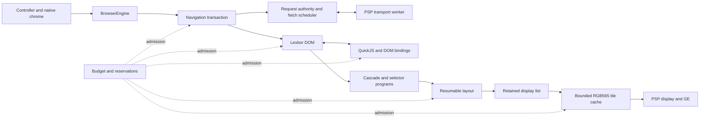
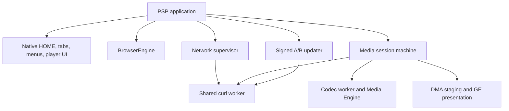
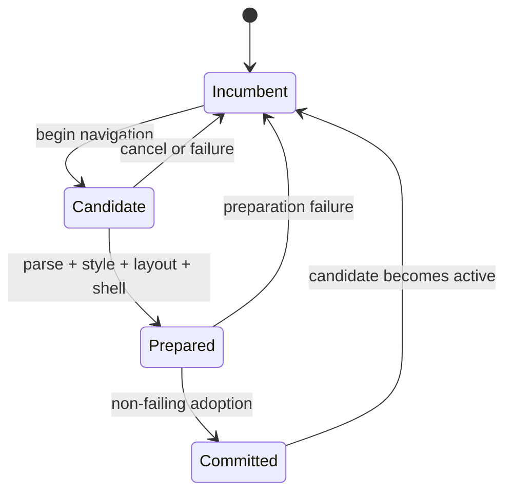
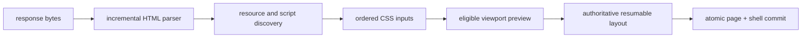

# Architecture

Tilefinch is a C11 web browser built for the Sony PSP: a 333 MHz, 32-bit
single-core MIPS system with 64 MiB of physical RAM, a 480×272 RGB565 display,
and no virtual memory. The shipping PSP-3000 build uses PSPSDK's grow-to-largest
heap while retaining 2 MiB outside it; physical validation measures about
43 MiB allocatable through newlib after the executable, stacks, modules, and
system reserves (PPSSPP reports 47 MiB). That process heap is not page
authority: page and voice work share a 32 MiB envelope, and the ordinary page
profile admits at most 24 MiB. Within those bounds Tilefinch fetches HTTPS
pages, parses HTML and CSS, runs JavaScript, lays out modern mobile sites,
rasterizes them, and presents video through PSP firmware or the bounded
two-core software decoder.

The constrained target is not a reduced-quality build of a desktop design.
It shapes the architecture:

- every page-owned byte is admitted through one memory budget;
- every variable-size structure has a fixed bound or an explicit eviction
  policy;
- long operations are resumable and cancellable at deterministic points;
- partially built pages never replace the last usable page;
- firmware, DMA, transport, and browser-thread ownership are explicit;
- host, emulator, and device validation prove different things and are never
  treated as interchangeable.

The result is a small browser whose resource policy can be inspected from the
source rather than inferred from whether a large machine happens to survive a
page.

## System map

`BrowserEngine` is the page ownership boundary. A frontend submits navigation,
input, and frame work through it and receives bounded snapshots or borrowed
read-only views. DOM, runtime, controller, render shell, and allocation ledger
cannot independently outlive the engine.

The PSP frontend adds process services around that boundary:

## The five architectural rules

### 1. One ledger owns page memory

All page-pipeline allocations use `Budget`: DOM, styles, scripts, resources,
layout, display lists, tiles, session state, and allocator metadata. The PSP
profiles expose 16 MiB and 24 MiB content ceilings; those are admission limits,
not estimates of whatever heap happens to remain.

Budget categories identify where memory went but do not create stranded
sub-heaps. Fixed-capacity concurrent pools and inline session tables are
represented by reservations against the same ceiling. Process-lifetime state
which cannot be owned by a page—such as the CA bundle and cross-navigation TLS
session store—is separately bounded and included in the device reserve.

Allocation refusal is a normal result. Parser checkpoints, candidate pages,
layout jobs, cache insertion, and script admission all have rollback or bounded
degradation paths. Failure injection exercises those paths, and teardown
reconciles the ledger to zero.

The important consequence is compositional: adding a cache or a new Web API
does not merely add an allocation. It must state its maximum, its accounting
category, its lifetime, and what remains usable when admission fails.

### 2. The browser graph has one mutation owner

DOM, JavaScript, style, layout, history, cookies, cache policy, and UI state are
mutated only by the browser thread. This avoids locks through the object graph
and makes a cancellation checkpoint a trustworthy transaction boundary.

Workers exist only where the platform can block or where hardware genuinely
runs concurrently:

| Worker | Owns | Publishes |
|---|---|---|
| transport | curl handles and fixed response buffers | immutable response chunks and terminal status |
| raster decode | one browser-admitted JPEG arena | generation-tagged RGBA completion |
| codec | one prepared firmware job at a time | decoded audio or a generation-tagged video surface |
| DMA | framebuffer staging transfer | completion for the exact slot generation |
| audio | PSP audio submission | consumed PCM position |
| voice | optional recognizer job | bounded recognition result |
| clock/watchdog | platform timing or liveness observation | atomics and fixed records |

Workers never traverse the DOM, call page allocators, update chrome, or write
profile state. Cross-thread messages use bounded slots, generation tokens, and
release/acquire publication. Thread priorities are named together in
`include/tilefinch/psp_threads.h`, where their ordering is reviewable as one
system. JPEG entropy decode runs below the browser priority; cancellation
invalidates its token without waiting, and only the browser thread may adopt
the finished pixels or trigger the resulting relayout.

### 3. Commit complete state, never partial state

Navigation uses an incumbent/candidate transaction:

The incumbent page remains renderable while the candidate receives bytes,
parses, resolves resources, executes admitted blocking scripts, and builds its
authoritative layout. Before the old graph is destroyed, the candidate also
prepares the controller and tile shell. The final adoption moves already-owned
state and cannot allocate.

The same candidate-shell transaction carries Reader presentation across page
navigations. After admitted scripts settle, one bounded, budget-charged
content-shape pass classifies the page as article, listing, watch, or raw and
installs a hidden semantic extraction. That tree retains headings, paragraphs,
lists, links, images, captions, tables, and code under explicit node, depth,
and byte limits; the untouched raw DOM remains beside it. Reader CSS switches
between the two trees without reparsing, and text anchors preserve the nearest
reading position across the relayout. When Reader is already active, this
happens before the candidate's first authoritative layout, avoiding an
author-layout/Reader-layout pair. A navigation failure leaves the incumbent
usable and opens a bounded recovery surface over it. Retry and Reader retry the
retained candidate URL; portal, site-JavaScript, audio-only, and quality
actions appear only when their context can help. Return simply exposes the
incumbent again. None of these actions publishes half a candidate with stale
controller or render state.

The experimental compressed-section mode is the named exception: replacing a
resident section may retire its old DOM before materializing its neighbor in
order to keep the memory win. Its narrower guarantee is documented in
[streaming navigation](engineering/STREAMING_NAVIGATION.md).

### 4. Work is budgeted in time as well as bytes

Parsing, selector matching, scripting, layout, resource decode, tile raster,
screenshots, offline saves, and installation all expose bounded pumps. The
main loop spends a quota, presents input-visible progress, and resumes from an
owned continuation.

The authoritative layout is a `LayoutBuildJob` with explicit phases: flow,
compaction, visibility and focus, paint order, spatial indexing, scroll
metadata, and finalization. Container queries get at most one measured probe
followed by one authoritative rebuild. Partial display lists remain private to
the job until `layout_build_job_take()` publishes a complete result.

The engine uses several PSP-specific fast paths without changing results:

- checked 32-bit multiply/divide handles normal viewport geometry and falls
  back to 64-bit arithmetic only for values that require it;
- font advances and kerning use fixed-point values in hot measurement paths;
- selector programs compare interned identifiers and reuse node-local
  attribute facts;
- compiled stylesheet fragments are reused within bounded RAM caches, never
  written to the Memory Stick;
- preview layout limits work to geometry capable of affecting the viewport;
- simple script-free pages load visible images before publication, then pump
  offscreen images one viewport-ranked request and one decode at a time from
  idle work; input and navigation therefore never wait on thumbnail network
  I/O, and decoded repeat-navigation hits remain in the bounded RAM cache;
- image discovery carries computed parent style instead of rebuilding the
  cascade per image;
- repeated gradients, glyphs, and tiles use bounded caches with measured
  eviction rather than unbounded memoization.

Mixed-direction page text is a sparse extension of the same retained layout,
not a second document representation. A parser/style census bypasses ordinary
LTR paragraphs. Admitted RTL paragraphs retain logical DOM text while a
bounded UAX #9 analysis produces levels, Arabic-family contextual forms,
shaped advances, line visual order, and logical-to-visual glyph sidecars.
Painting, links, controls, focus hit testing, and find highlights consume the
same visual geometry. The exact limits and clean degradation contract are in
[Bidirectional page text](TEXT_BIDI.md).

### 5. Host determinism and device truth are separate gates

The same retained display list and software raster primitives run on host and
PSP. RGB565 conversion uses coordinate-stable ordered dithering, so a pixel
does not depend on traversal order. The host lab can therefore compare the
engine against a 480×272 Chrome reference while unit tests pin exact layout,
counter, and raster behavior.

That does not make host timing a PSP timing prediction. The host proves logic,
rollback, bounds, and visual output. PPSSPP proves the Allegrex build and many
PSP ABI paths. Hardware alone proves cache coherency, module availability,
WLAN timing, Memory Engine behavior, Memory Stick semantics, and real input
latency. [Device qualification](engineering/DEVICE_QUALIFICATION.md) assigns
claims to the environment able to prove them.

## Navigation and first paint

The document stream is not “download, then parse.” A navigation advances a
bounded pipeline:

The resource scanner starts stylesheets and eligible scripts while later HTML
is still arriving. A preview paint is attempted only when the parsed prefix
can produce visible pixels; eligible pages can paint before parser-blocking
scripts execute, while script-dependent pages retain correct blocking order.
Stylesheet suffixes preserve selector compiler and index state, and
`@font-face` discovery occurs in the main CSS parse rather than a second walk.

The fetch scheduler caps active page slots, response bytes, callback work, and
elapsed pump time. It pauses curl delivery when its bounded handoff buffer is
full. The candidate owns every continuation, so replacement or cancellation
can retire the entire pipeline without a callback reaching the next page.

## JavaScript without spending the realm at startup

QuickJS runs inside a page-specific heap limit and the shared page budget. The
platform bootstrap is generated as uncompressed QuickJS bytecode and restored
directly from read-only program data with `JS_READ_OBJ_ROM_DATA`; there is no
per-navigation inflate buffer or duplicate bytecode copy.

Bootstrap features are split into modules with bounded lazy activation.
Core DOM and event semantics are available immediately; larger facilities are
installed when the page first reaches their surface. Lazy factories and
resident bundles have fixed caps, and a generated manifest proves the authored
sources and committed bytecode agree.

Page scripts have source, count, heap, time, and callback-work admission.
Interrupt checks cover QuickJS execution and native callback boundaries.
Inert JSON script types remain DOM data, while a narrow classic-script subset
(`window`, `globalThis`, `var`, or bare global assignments of strict JSON)
installs its data without compiling bytecode or consuming executable quota.
Because the engine supports modules, classic `nomodule` fallbacks are rejected
before preload, quota admission, or dynamic-script scheduling; module fetch or
execution failure never enables the legacy alternative.
Large cross-origin classic bundles pass an allocation-free lexical cost scan;
only high-cost bodies are shed, with source size and watchdog-miss signals
retained as tuning telemetry. Rejection is page-local and server-rendered
content remains usable. Before the first parser-blocking author callback, the
stream retains at most one complete, visibly useful body snapshot. If later
hydration fails or exhausts its quota and collapses that content, commit
restores the snapshot transactionally; a successful useful replacement stays
authoritative. Parser-blocking work also has a cumulative circuit breaker: one
navigation may spend at most 1 MiB of parser-stage source work, eight seconds
across its blocking checkpoints, or three consecutive failed scripts. When a
bound trips, remaining blocking scripts are soft-skipped, parsing continues to
EOF, and the committed page is marked Limited. The author realm is then retired
for that committed document, so already-queued deferred, asynchronous, and
dynamic work cannot resume a hydration path that the circuit deliberately
abandoned. When the circuit does not trip, those script classes retain their
existing lifecycle and quotas.
Compiled external scripts and parsed stylesheet fragments may be reused from
bounded in-memory caches during a process lifetime. Ordinary browsing never
writes compiler artifacts to storage. An explicitly installed offline app is
the exception: installation may add bounded, locally generated classic-script
bytecode beside the retained source. The artifact is bound to that source and
a dedicated QuickJS bytecode ABI—not the Tilefinch release version—and launch
falls back to source compilation whenever restoration is unavailable or fails.

Small WebAssembly modules use the standard JavaScript API through the
[bounded WebAssembly profile](WEBASSEMBLY.md). Host labs link the pinned
interpreter directly; the PSP EBOOT keeps only a versioned adapter and lazily
loads the interpreter from the active signed slot on first namespace access.
The module, runtime pool, memory, imports, exports, stack, and native
instruction work all have fixed ceilings. Unsupported proposals and import
kinds fail through the API without weakening the surrounding page's Budget,
origin, CSP, or transport policy.

DOM mutations are journaled and coalesced before they trigger style/layout.
The journal is bounded, and exhaustion selects a safe broader invalidation
instead of growing without limit.

## Rendering and presentation

Layout produces a retained display list containing text, fills, borders,
images, stacking contexts, transforms, clipping, fixed/sticky geometry, and
focus metadata. The renderer rasterizes 128×128 RGB565 tiles on demand and
keeps a bounded spatial index so scroll work is proportional to visible
content rather than document length.

Unsupported motion resolves to one coherent static presentation: terminal
visibility and opacity are retained, scroll-linked transforms flatten, and
synthetic spacer scenes are contained. The layout records the first coordinate
clamp and confines a saturated non-root subtree rather than letting the
coordinate sentinel blank every later scroll viewport.

Web content and native chrome are separate layers. The browser frame is stable
while menus, find, keyboard, loading, and player controls animate over it.
Mode-specific painters are deliberately out of line so the per-frame browser
and media compositors remain small enough for the Allegrex instruction cache;
the ELF build ratchets those hot symbols independently from total `.text`.

Fullscreen video keeps the decoder's 8888 scanout rather than narrowing the
whole picture to the page renderer's RGB565 format. The native player projects
its overlay into at most 16 clipped, disjoint rectangles. Opaque title and
control bars begin from cleared RGB565 scratch and therefore never import the
moving picture; only translucent badges, previews, and panels import their
bounded backdrop before the ordinary chrome compositor runs. The result is
widened only inside those rectangles, and every pixel outside them remains the
decoder's original byte-for-byte output. Fixed player shapes use precomputed
coverage from the same bounded antialiasing sampler used by the generic path.

Images are decoded without applying forced-dark color inversion. Dark mode
transforms authored foreground and background colors at paint boundaries,
while photographs, thumbnails, and decoded video retain their source colors.

Canvas 2D uses an exact, lazily allocated RGBA backing array inside the page's
QuickJS budget, plus at most four budget-owned native snapshots (1 MiB total).
The duplication is deliberate: JavaScript's RGBA array is the exact mutable
state required by `getImageData()`, export, and canvas-to-canvas drawing, while
the native snapshot is a stable presentation generation the renderer may read
after author code continues mutating the canvas. Removing either copy without
first moving exact readback and generation ownership into a native surface
would trade memory for stale-frame races or observable pixel changes. This
keeps `getImageData()` and `putImageData()` deterministic without giving every
canvas an unrestricted framebuffer. Pixel-oriented scripts can create a
blank buffer from another `ImageData` object's dimensions, publish only a
clipped dirty rectangle, or reset the context without replacing the canvas;
dirty publication uses bounded row copies rather than a JavaScript pixel loop.
The native raster seam draws actual
Tilefinch font glyphs, 2×2-coverage paths and strokes, per-pixel gradients, and
transformed nearest-neighbour or bilinear sprites. It supports bounded nested
clips, rounded geometry, line caps/joins/dashes, and the practical Porter-Duff
subset; ordinary decoded `` resources and other canvases use the same
sprite path. `Path2D` accepts bounded SVG path strings and transformed
`addPath()` geometry. Small path and text shadows use a fixed native sampling
pattern; complex geometry degrades to one offset sample rather than allowing
blur work to grow with page input.

Solid rectangles batch up to 64 commands and consecutive sprite blits batch
up to 16 commands per JavaScript turn. Paths and text share a separate
16-command queue so an animated chart's geometry and labels cross the
JavaScript/native boundary together. All drawing for a turn coalesces into one
dirty rectangle, copies only those rows into the
native snapshot, and invalidates only the affected page tiles. A same-size
animation therefore does not rebuild style, layout, or the retained display
list. Animation-frame callbacks run at most once per presented browser tick,
use that tick's monotonic timestamp, remain paused with an inactive page, and
skip elapsed frames rather than replaying a callback backlog. Native surfaces,
the media player, and physical suspend also drive the Page Visibility API:
`document.hidden` and `visibilityState` change at a normal browser-thread task
checkpoint, `visibilitychange` preserves a suspend/resume pair even when both
edges arrive before JavaScript resumes, and ordinary timers remain eligible
while visual callbacks stay queued. Pointer capture and layout-derived
canvas-relative coordinates keep canvas controls stable through hover, drag,
and release. Authored canvas dimensions above the PSP surface envelope are
scaled down proportionally to at most 480×272 and 131,072 pixels; a zero-sized
axis stays zero while the other axis is still capped. Deep clip stacks and
excess raster work fail soft while the rest of the page remains usable.

`HTMLImageElement.decode()` exposes bounded decode readiness, and
`createImageBitmap()` prepares at most eight cropped or resized asset snapshots
with a 1 MiB aggregate logical ceiling. Bitmap pixels remain in the QuickJS
budget and preserve canvas origin-clean state. They do not add another ordinary
canvas backing store; closing or collecting a bitmap returns its separate
asset allowance.

The Gamepad API exposes one stable standard-mapped controller object for the
built-in PSP controls. It is disconnected until the user holds Start+Select or
a trusted Play click calls the bounded
`navigator.tilefinch.requestPageControls()` extension. The latter shows a
native Start+Select exit notice and suppresses the activating face button until
release. Native input authority is a small generation-bearing capture record:
navigation, native media, or suspend
disconnects the object and returns control to the browser. Identical physical
samples do not cross into QuickJS, button objects and axes are retained rather
than recreated per poll, and cross-origin child frames never receive the
snapshot. The same sustained chord returns control; the firmware HOME callback
is outside page capture and remains unconditional.

The page Fullscreen API is a singular top-level presentation state. A trusted
activation commits the element identity before native chrome is hidden;
Triangle or Start+Select exits immediately, and navigation or node retirement
clears the borrowed handle. The PSP has no separate compositor top layer, so
style resolution gives the active element a fixed viewport-sized box and
supports `:fullscreen` without adding a spoofable DOM attribute.

WebGL 1 is a lazy, bounded command translator over the PSP graphics engine,
not a software GLSL interpreter. The JavaScript layer exposes the familiar
object and state model, admits only fixed-function-compatible vertex-color or
single-texture shader shapes, combines a bounded chain of position-matrix
uniforms, and snapshots each draw's buffers, attributes, transform, viewport,
scissor, depth, cull, and blend state into a bounded command batch. The native
wire is versioned and uses fixed 32-bit integer and float words; this avoids
software double-precision conversion on Allegrex while retaining draw-time
state snapshots. The native boundary reads potentially unaligned words with
`memcpy` and validates every scalar and byte span again before either the host
reference rasterizer or PSP GE sees it. Unsupported
shader control flow and unsupported state fail through WebGL errors or context
loss while the surrounding document remains usable.

Draw admission validates enabled-attribute spans and indexed-draw alignment,
count, offset, maximum referenced vertex, and source-buffer bounds before a
command enters the batch. This makes malformed game geometry an ordinary
WebGL error rather than a late native-render failure or context loss.

At most two contexts, 24 buffers, eight textures, 64 draws, and 4,096 vertices
are admitted per realm. Buffer bytes are capped at 512 KiB, retained texture
pixels at 416 KiB, and a drawing buffer at 480×272 and 131,072 pixels. The PSP
scales larger authored dimensions proportionally instead of rejecting the
context or allocating a larger surface. It keeps one bounded EDRAM color
target, depth target, and texture cache, sharing GE command ownership with the
media presenter rather than introducing
a second graphics authority. Texture generations avoid re-uploading unchanged
pixels within one native `(realm epoch, canvas handle)` owner. Fresh realms,
context restoration, canvas changes, and the video layout's reuse of the EDRAM
texture region clear that authority before lookup. Page-owned command, buffer,
texture, depth, and presentation memory is
charged through `Budget`; a failed allocation or excess scene refuses the
operation without growing a hidden heap.

An opaque, untransformed canvas update can publish without rebuilding the
viewport's ordinary tiles. The renderer preserves the preceding RGB565 frame,
overwrites only the canvas rectangle, then replays later document paint and
fixed/sticky chrome in order. Scaled nearest-neighbour publication converts a
source pixel once per run and copies repeated source rows, which keeps the fast
path bounded without another canvas-sized allocation. Transparent, filtered,
rounded, multiply blended, or ambiguously ordered canvases refuse this path and
fall back to the normal retained-tile renderer.

PSP draw translation first counts the exact bounded vertex requirement, then
charges only that scratch size for the submission. All emitted vertices occupy
one contiguous prefix, so one cache writeback immediately before `sceGuFinish`
publishes the batch. GE synchronization remains the ownership boundary before
CPU readback; command submission is deliberately not asynchronous.

The PSP 8888 alpha channel is also its stencil plane, so Tilefinch advertises
an opaque drawing buffer (`alpha: false`) and resolves GE output to an opaque
native surface while copying each completed row. This preserves fast,
deterministic presentation for games and charts without claiming
transparent-buffer behavior the hardware cannot
implement consistently. The host rasterizer exercises pixels, clipping,
depth, culling, blending, texture wrapping, and line closure. A PSP-target GE
probe separately measures representative cube, sprite, draw-pressure,
CPU-vertex, and texture-upload scenes; PPSSPP's software renderer is used when
an end-to-end browser fixture must read GE pixels back into the page renderer.

Game audio is another lazy, bounded module rather than a second media player.
One `AudioContext` can decode up to eight PCM WAV buffers into a 512 KiB native
pool and mix four voices on a PSP audio worker. Buffer sources support bounded
loop regions; sine, square, sawtooth, and triangle oscillators are generated by
the same mixer from a 130-byte quarter-wave table. Gain and stereo-pan changes
publish packed atomic coefficients that the worker samples once per 512-frame
block, while start and stop times use a wrapping 32-bit output-frame clock and
a ten-second admission window. No synthesis path allocates or performs
floating-point work on the audio thread. The context begins suspended and
native resume requires trusted activation. Suspend releases the scarce PSP
audio channel while retaining decoded effects; opening native page media does
the same so game sounds cannot steal the video player's channel. A completed
or stopped voice holds its generation-bearing slot until the browser thread
takes its bounded completion notice; only then does the captured bridge
dispatch `ended`/`onended` and return the slot for reuse. Worker code therefore
never enters JavaScript, and a late completion cannot target a newer sound.
Unsupported compressed formats, custom synthesis graphs, long-horizon
scheduling, and PCM readback fail explicitly.

## Request authority, transport, and cache provenance

All page-originated requests cross one construction boundary. Callers supply
a typed `TilefinchRequestContext`; `fetch_prepare_page_request_context()`
derives cookies, Origin, Referer, Fetch Metadata, credentials, CORS, CSP,
mixed-content and Private Network Access policy, content blocking, and cache
partition authority. Validation rejects page requests which bypass that
preparation marker.

Response security fields are parsed once, while complete wire headers are
available, into typed metadata. CORS, CORP, CSP, HSTS, nosniff, frame policy,
and referrer policy consumers do not reinterpret a truncated generic header
snapshot. Resource-cache entries carry their partition and authorization
grant; authority-bearing entries remain memory-only rather than being
serialized as generic cache records.

WebSockets reuse the same owned curl multi worker, TLS state, cookie authority,
`connect-src`, mixed-content, and Private Network Access decisions rather than
creating a second network stack. The page API admits two sockets, one 64 KiB
message per socket, and 64 KiB of queued outbound data; a single published
receive event provides backpressure instead of a page-sized queue. Handshake
redirects are disabled, document cancellation closes the socket, and all
receive/send storage is charged to the page `Budget`. The host runtime keeps
the native duplex lane unavailable; deterministic JavaScript lifecycle tests
exercise an injectable native seam, while the Allegrex build links curl's
actual WS/WSS framing path.

Installed offline games have a separate, explicitly user-activated direct
multiplayer lane. Its page surface resembles the message/lifecycle portion of
`RTCDataChannel`, while Tilefinch-specific setup performs bounded LAN
discovery, public-endpoint discovery through STUN, numeric-code exchange, and
explicit host approval. The PSP worker owns DNS and UDP; the browser thread
sees only fixed command and event rings. One session, 512-byte datagrams, and
fixed deadlines keep the feature inside the page `Budget` and network
supervisor. Ordinary pages cannot open it, launching an offline app does not
request Wi-Fi, and leaving the document cancels the worker and lease. There is
no relay, background lobby, or general page UDP API. [Direct
multiplayer](MULTIPLAYER.md) defines the author-facing contract.

The bounded two-entry provider-document cache is optional session memory. It
participates in ordinary cache reclaim and **Clear HTTP caches**, so a
generated provider page cannot outlive the user's clear action or crowd out an
authoritative navigation under pressure.

On PSP, one shared transport worker owns curl. Up to six ordinary response
lanes grow lazily with concurrency; media uses two larger fixed range windows,
and the YouTube HOME preconnect has one bodyless descriptor. Redirects remain singular:
the browser authorizes one hop, the worker executes it, and the next hop is not
started until the browser accepts the result. Independent requests still run
concurrently, and HTTP/2 multiplexing remains available.

An authoritative navigation supersedes unfinished optional network work from
its incumbent page before it queues the candidate document. The incumbent DOM
and last frame remain intact for transactional rollback, but thumbnails,
fonts, scripts, and page fetches cannot retain all six worker descriptors ahead
of the link the user just activated. If the candidate is cancelled or fails,
the incumbent remains usable but those superseded requests are not restarted;
this is a deliberate responsiveness tradeoff until the transport grows a
separate authoritative-priority lane.

The release owns its curl, Mbed TLS, and nghttp2 chain. Archives are
digest-pinned, runtime provenance is checked, HTTP/2 negotiates through ALPN
with HTTP/1.1 fallback, and HTTP/3 is out of scope. By default, TLS sessions
are retained in a bounded, checksummed store, scoped to the same site, and
cleared with cache data; a global preference disables cross-boot retention
without disabling process-local reuse. A highlighted built-in YouTube HOME
destination may open one bodyless connection warmup; moving focus or suspending
cancels it.

The native provider retains at most two generated Home/first-search documents
for two minutes in the session Budget. Keys include the exact URL, presentation
variant, and the cookie authority visible to that request; eviction is LRU and
clearing site data drops the entries. Raw provider responses and decoded images
are not retained. Result cards commit with fixed thumbnail geometry, while
their explicit lazy images enter the ordinary post-paint resource queue.

See [PSP transport](engineering/PSP_TRANSPORT.md) and the
[security model](SECURITY_MODEL.md) for the exact protocol and policy
boundaries.

## Explicit lifecycle machines

The two device subsystems with the most dangerous teardown ordering use pure,
host-testable reducers.

### Network supervisor

The network supervisor reconciles demand (`off`, `ready(profile)`, suspend)
with physical PSP network state. Its inner APCTL/module ladder is pumped rather
than hidden in a blocking effect. Consumers hold generation-bearing transport
leases; network teardown closes admission, drains leases, leaves APCTL, then
unwinds owned rungs in reverse order.

A timeout never unloads the stack beneath a worker still executing inside it.
The stack is retained with an explicit wedge obligation until the lease
retires. Link errors are hints followed by an APCTL probe, so an HTTP error or
CDN rate limit cannot spuriously restart networking. The complete state and
event contract is in [PSP network supervisor](engineering/PSP_NETWORK_SUPERVISOR.md).

`Ready` means the PSP stack is associated and has an address, not that an
access network has granted Internet service. Captive-portal discovery remains
a separate, user-initiated frontend operation: one bounded probe may open an
ephemeral tab/session authority, then re-probe and restore the incumbent tab.
It does not add portal guesses to the network reducer or relax TLS globally.
The isolation and origin rules are specified in the
[security model](SECURITY_MODEL.md#captive-portal-sign-in).

### Media session

The media controller distinguishes opening, priming, playing, paused,
buffering, seeking, recovery, dormancy, quiescence, suspend, and failure.
Transitions produce commands; codec drain, DMA join, transport cancellation,
and pipeline release return completion events. No state which owns a pipeline
can jump directly to a resource-free terminal state.

The ordinary PSP video path demuxes fragmented or progressive MP4, submits AVC
through the firmware bridge, and color-converts into two generation-tagged surfaces.
Each surface moves through `FREE → ME_WRITING → READY → DMA_READING → FREE`.
DMA and codec completions carry slot identity and generation, stale
completions are discarded, and a timed-out reader quarantines rather than
returning memory to a writer. Video is staged in EDRAM and scaled by the GE;
240p and 360p use the same ownership protocol.

H.264 High at up to 432×240 can use a replaceable, user-built
software-decoder PRX instead. Official browser releases contain the loader
but no custom H.264/AAC decoder binary. The component lives outside the A/B
slots, carries a small ABI record, and survives ordinary app updates; a
missing or incompatible component fails this route with an actionable player
message while firmware-compatible video remains available.
It keeps FFmpeg's decoder allocations inside one admitted arena, runs CABAC,
deblock, AAC, and most RGB565 conversion on the Media Engine, reconstructs
rows on the CPU, and publishes into a 25-slot generation-tagged ring. The
display clock slips forward instead of racing when a frame is more than 8 ms
late; quality rungs depend only on ring occupancy; and audio may not advance
more than 80 ms past the displayed picture. Once this path takes ownership of
the Media Engine, every later AVC/AAC route stays on it until suspend or
process exit. Suspend detaches and restores firmware ME state before the
power transition; resume reattaches before another software decode.

Every buffer shared with the Media Engine is allocated on an isolated 64-byte
cache line with tail padding, so range cache maintenance cannot touch Budget
metadata or a neighboring object. CPU-authored AAC packets are written back
before submission, completed RGB surfaces are invalidated before the browser
reads them, and reordered pictures recover presentation timestamps from the
source-AU mapping rather than the decoder's completion order. Each Annex-B
access unit revalidates any in-band SPS against the admitted geometry; the
decoder independently bounds returned pictures, and CSC receives the exact
byte capacity of its destination slot. AAC output is admitted only when its
channel count fits the component's fixed two-plane ABI. After software
takeover, later Baseline/Main streams must also fit the software route's
432×240 bound; larger streams fail admission instead of being sent to an
incompatible backend.

The player has one source-independent packet pipeline. The built-in provider supplies
resolved split or progressive streams, offline downloads supply bounded local
files, and compatible page `<video>`/`<audio>` elements supply authorized
progressive MP4/M4A or HLS URLs. MP4 performs a one-byte standard HTTP Range
probe. HLS parses masters exactly and large live media playlists incrementally,
retaining only the newest twelve complete segment records rather than a DVR-
sized response. Demuxed masters retain at most one video and one audio source;
each source streams one MPEG-TS segment through the shared worker. A live source
starts from the last three advertised segments, refreshes the rolling media
playlist at half its target duration, maps media-sequence changes onto one
continuous local clock, and records any skipped window as a discontinuity.
One of the two request slots remains available for a near-edge playlist
refresh. Stale snapshots, temporary refresh failures, signed-URL replacement,
and an eventual `ENDLIST` are all bounded transitions; a playlist which makes
no progress for 60 seconds fails visibly instead of spinning forever.

Both source forms retain response authority and feed the same decoder,
buffering, clock, and presentation services. HLS queues at most 64 samples and
576 KiB of payload; it rejects encrypted, fragmented-MP4, byte-range, and
explicitly non-AVC variants. Neither route writes media bytes to the Memory
Stick. Finite HLS seek resets only the selected segment and preserves an
untouched in-flight request across repeated cooperative readiness probes;
rolling live playback deliberately has no scrubber. Video-only variants may
prime as soon as their PMT and first video sample are known rather than filling
the entire first segment. Actual Annex-B SPS data selects the backend:
Baseline/Main within PSP bounds is converted to the firmware bridge's bounded
length-prefixed input on the codec worker, while High profile uses the
separately built optional decoder component. In-band parameter-set changes are
rejected unless they exactly preserve the firmware configuration.

Audio-only playback is a route-time pipeline choice, not a hidden video
surface. YouTube admits its adaptive AAC representation; a page `<audio>`
element admits an authorized AAC-in-MP4/M4A source. Both create no video range
or demuxer and allocate no MPEG decoder or decoded-picture surfaces. The
ordinary media state machine, range recovery, clock, buffering, pause, and
seek contracts remain authoritative. Page `<video>` and saved media are
deliberately unaffected by the global YouTube audio-only preference.

YouTube resolution carries independent bounded audio, subtitle, and alternate
language preferences from the profile. PSP system language remains the
default source. The parser scans the bounded player inventory but retains only
the six highest-ranked distinct audio and caption descriptors; exact selected
IDs, exact BCP-47 tags, primary-language fallbacks, alternate language, and
the authored default are ordered without allocating per track. A late track
can displace a weaker retained entry, so the menu bound cannot hide a preferred
language. Triangle opens the native player's track menu; choosing another
audio track performs a generation-safe reopen at the current position and
preserves the player's play/pause intent. Subtitles default off, and their
preference affects ranking only. Selecting one re-resolves only the bounded
caption catalog and selected URL while the existing A/V pipeline keeps
playing, then starts a single optional, credential-free WebVTT request after
playback has a healthy presentation reserve. Neither request uses a
media-reserved descriptor, and a failure leaves video and controls usable.
Caption size and either an opaque box or text shadow are profile settings;
the opaque player furniture avoids importing moving 8888 video into the
RGB565 chrome compositor.

When a server-rendered `<video>` omits `src`, activation may perform one
bounded, allocation-free scan of retained data scripts and generic media
attributes for direct MP4, HLS, or WebM references. Candidate selection is
hostname-independent, prefers the lowest direct MP4 quality at or above 240p,
and still crosses URL resolution, CSP, request authority, and media probing.
The same retained-data seam recognizes schema-scoped `AudioObject` and
`MusicRecording.audio` sources. It indexes at most twelve compact spans rather
than copying a JSON object graph. An otherwise inert Play or Preview button may
open the audio-only player only when one candidate exists or nearby title/URL
metadata identifies exactly one; authored media elements, JavaScript handlers,
navigation, cancellation, and ambiguous matches always take precedence.
The media layer classifies SPS profile before decoder construction: Baseline
and Main use firmware until software takeover, while compatible High streams
select the software path. WebM and unsupported HLS forms fail as formats,
rather than being misreported as firmware failures.

Audio and video share one prepared codec-job queue. Presentation follows media
timestamps, uses bounded startup preroll and adaptive rebuffering, and records
claimed/staged/displayed identities rather than treating an attempted present
as success. The control contract is in
[PSP media session](engineering/PSP_MEDIA_SESSION_STATE.md); the host and
device seams are in [YouTube and media lab](engineering/YOUTUBE_VIDEO_LAB.md).

## PSP frontend ownership

The frontend separates ownership from control:

| Structure | Contains | Must not contain |
|---|---|---|
| `PspProcessResources` | paths, boot configuration, native presentation, text input, clock ownership | media/network policy |
| `PspBrowserResources` | engine-lifetime handles and service objects | duplicate lifecycle authority |
| `PspInteractiveState` | one loop invocation's input, recovery, and validation records | resource ownership decisions |
| `PspEngineViews` | one refreshed snapshot of borrowed engine state | independently refreshed aliases |
| `PspExitPlan` | tagged reason and handoff | teardown obligations |
| `PspShutdownReport` | independent retained/quarantined obligations | user intent |

`psp_app_run_interactive()` is the resident loop. `psp_browser_close()` first
drives media and network machines to safe terminals, then frees only resources
their reports mark releasable. Owners release resources; machines decide when
release is safe.

HOME and Collections are native chrome rather than hidden HTML documents. They
can render immediately from bounded profile snapshots while network warm-up
and page machinery progress in the background. The native HOME placeholder is
committed with JavaScript disabled, so it owns no otherwise-unused QuickJS
realm; the configured global and per-site policy is applied at the boundary of
the first real navigation. Profile settings, bookmarks, and HOME destinations
are still loaded before the first frame because they define that native UI.

Page fonts follow the same staged boundary, with one presentation invariant:
the regular sans face used by native HOME is loaded before HOME's first frame,
so its labels never change from bitmap fallback after becoming visible. This
is the only page-font read on that boundary. Its metric-only counterpart loads
during association wait frames. On the frame networking becomes ready, the
highlighted built-in provider's preconnect takes precedence over any remaining
font read. A navigation that outruns warm-up completes this two-face baseline
before measuring text. Serif, italic, and bold faces are requested from the
committed page's bounded draw-command census and load one at a time in 16 KiB
idle slices. Navigation and rendering can pre-empt between slices. A newly
arrived metric face triggers one transactional relayout before its first
repaint, so fallback measurements never survive under the real glyph advances.

Optional disk cache and local-storage restoration starts only after HOME is
interactive. A transactional reader advances in bounded 16 KiB idle slices
and publishes nothing until its checksum and record counts validate. Local
storage finishes before the first real navigation can commit, preserving web
storage semantics; cache restoration is expendable optimization work and is
cancelled when navigation needs the transport or memory. If navigation cancels
an unread cache snapshot, exit preserves that on-disk generation instead of
rotating an empty live cache over it. Direct page boots restore both stores
before author code, since they do not have a native HOME idle window.

Five tabs retain navigation,
scroll, focus, find, and thumbnail facts; only one engine page graph is live.
Optional tab hibernation and session restore serialize bounded navigation
facts, never a DOM or JavaScript heap.

## Storage and updates

Normal frame, input, style, layout, raster, and playback paths do not access
the Memory Stick. Profile changes are coalesced, caches are optional, and
large work such as screenshots, offline articles, video downloads, and update
installation progresses through bounded pumps. Files with crash-sensitive
state use temporary files, flushes, versioned records, and atomic publication
appropriate to PSP FAT behavior. [Storage](STORAGE.md) is the authoritative
file and write-frequency map.

Manifest-backed offline apps extend the same library rather than adding a
second runtime. Installation serializes the committed document and a bounded
view of the live same-origin HTTP cache. That view retains typed resource
grants and module provenance; launch restores it before committing the saved
document under the original URL. Up to eight bounded classic-script resources
may be compiled without evaluation during preview/installation; their source
always remains authoritative, and old package versions remain readable. The
design supports small self-contained games without Service Workers, background
execution, or an offline-only authorization bypass.

The updater uses a stable launcher and A/B browser slots. A compact binary
manifest signs release sequence, exact file sizes, and digests. The launcher
anchors verification in the public root embedded by the PSP preset; private
signing keys never enter the repository or release package. Trial boot and
health confirmation are journaled so a failed slot returns to the last healthy
one. [Secure updates](SECURE_UPDATES.md) defines the formats and recovery
rules.

## Validation architecture

Tilefinch treats evidence as part of the design:

| Gate | What it proves |
|---|---|
| focused unit and fault-injection tests | bounds, rollback, parser policy, reducers, allocators |
| Canvas/WebGL game lane | animation lifecycle, Gamepad sampling, pixel output, indexed geometry and graphics bounds |
| selected upstream WPT | web-platform behavior against unchanged tests |
| response-keyed replay | deterministic network inputs and closed request ledgers |
| Chrome fidelity scoreboard | structural pixel similarity at the PSP viewport |
| PSP cross-build ratchets | 32-bit ABI, actual `.text`, `.rodata`, stack and hot-symbol size |
| PPSSPP | packaged EBOOT, Allegrex execution, deterministic scripted flows |
| physical PSP | firmware, caches, WLAN, Memory Stick, latency, media and lifecycle truth |

Release logging is compiled out. Validation builds aggregate counters in RAM
and normally publish one bounded report through PSPLink, avoiding Memory Stick
traffic during a run. Per-event flushing is reserved for crash localization.

## Source map

The main ownership boundaries are intentionally visible:

- `src/browser_engine.c` — public engine lifetime and facade;
- `src/navigation.c` and `src/navigation/` — candidate loads and commit;
- `src/style*.c`, `src/layout*.c`, `src/render.c`, `src/render/` — visual
  pipeline;
- `src/js_runtime.c`, `src/js_*`, `src/bootstrap/` — JavaScript and Web APIs;
- `src/fetch.c`, `src/fetch/`, `src/request_context.c`, `src/session.c` —
  transport policy and browser session state;
- `src/media_*.c`, `src/psp_media_*.c`, `src/media_backend_psp.c` — media;
- `src/psp_network*.c`, `src/psp_app/` — PSP lifecycle and frontend;
- `src/update_*.c`, `src/update_launcher_psp.c` — update verification,
  installation, and launch;
- `cmake/TilefinchCore.cmake` — canonical core source inventory;
- `src/generated/` — generated bootstrap and font artifacts, never hand-edited.

Private implementation seams use `.inc` files included exactly once by their
owning translation unit. This keeps tightly coupled hot code reviewable without
turning internal state into a public API or perturbing PSP code generation.

For implementation work, continue with [Development](DEVELOPMENT.md),
[Security model](SECURITY_MODEL.md), and the focused subsystem contracts in
[engineering](engineering/README.md).
