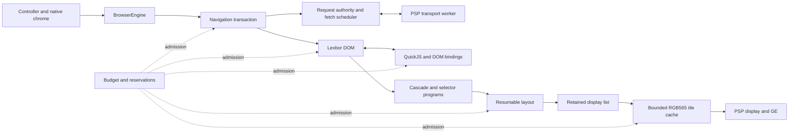
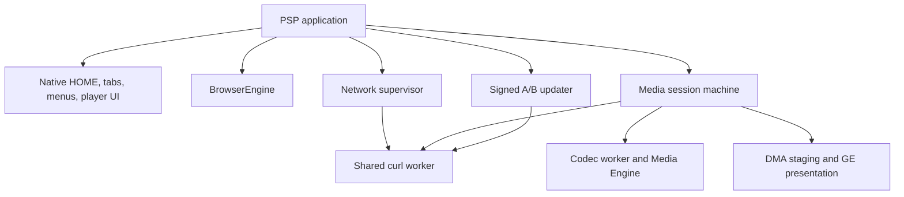
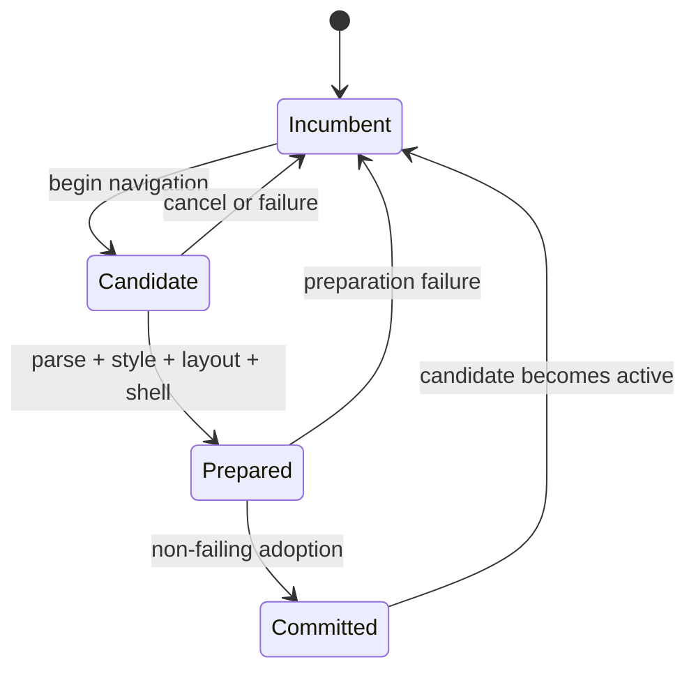
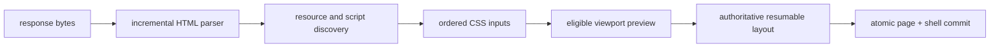

# Architecture

Tilefinch is a C11 web browser built for the Sony PSP: a 333 MHz, 32-bit
single-core MIPS system with 64 MiB of physical RAM, a 480×272 RGB565 display,
and no virtual memory. The shipping PSP-3000 build uses PSPSDK's grow-to-largest
heap while retaining 2 MiB outside it; physical validation measures about
43 MiB allocatable through newlib after the executable, stacks, modules, and
system reserves (PPSSPP reports 47 MiB). That process heap is not page
authority: page and voice work share a 32 MiB envelope, and the ordinary page
profile admits at most 24 MiB. Within those bounds Tilefinch fetches HTTPS
pages, parses HTML and CSS, runs JavaScript, lays out modern mobile sites,
rasterizes them, and presents video through PSP firmware.

The constrained target is not a reduced-quality build of a desktop design.
It shapes the architecture:

- every page-owned byte is admitted through one memory budget;
- every variable-size structure has a fixed bound or an explicit eviction
  policy;
- long operations are resumable and cancellable at deterministic points;
- partially built pages never replace the last usable page;
- firmware, DMA, transport, and browser-thread ownership are explicit;
- host, emulator, and device validation prove different things and are never
  treated as interchangeable.

The result is a small browser whose resource policy can be inspected from the
source rather than inferred from whether a large machine happens to survive a
page.

## System map

`BrowserEngine` is the page ownership boundary. A frontend submits navigation,
input, and frame work through it and receives bounded snapshots or borrowed
read-only views. DOM, runtime, controller, render shell, and allocation ledger
cannot independently outlive the engine.

The PSP frontend adds process services around that boundary:

## The five architectural rules

### 1. One ledger owns page memory

All page-pipeline allocations use `Budget`: DOM, styles, scripts, resources,
layout, display lists, tiles, session state, and allocator metadata. The PSP
profiles expose 16 MiB and 24 MiB content ceilings; those are admission limits,
not estimates of whatever heap happens to remain.

Budget categories identify where memory went but do not create stranded
sub-heaps. Fixed-capacity concurrent pools and inline session tables are
represented by reservations against the same ceiling. Process-lifetime state
which cannot be owned by a page—such as the CA bundle and cross-navigation TLS
session store—is separately bounded and included in the device reserve.

Allocation refusal is a normal result. Parser checkpoints, candidate pages,
layout jobs, cache insertion, and script admission all have rollback or bounded
degradation paths. Failure injection exercises those paths, and teardown
reconciles the ledger to zero.

The important consequence is compositional: adding a cache or a new Web API
does not merely add an allocation. It must state its maximum, its accounting
category, its lifetime, and what remains usable when admission fails.

### 2. The browser graph has one mutation owner

DOM, JavaScript, style, layout, history, cookies, cache policy, and UI state are
mutated only by the browser thread. This avoids locks through the object graph
and makes a cancellation checkpoint a trustworthy transaction boundary.

Workers exist only where the platform can block or where hardware genuinely
runs concurrently:

| Worker | Owns | Publishes |
|---|---|---|
| transport | curl handles and fixed response buffers | immutable response chunks and terminal status |
| codec | one prepared firmware job at a time | decoded audio or a generation-tagged video surface |
| DMA | framebuffer staging transfer | completion for the exact slot generation |
| audio | PSP audio submission | consumed PCM position |
| voice | optional recognizer job | bounded recognition result |
| clock/watchdog | platform timing or liveness observation | atomics and fixed records |

Workers never traverse the DOM, call page allocators, update chrome, or write
profile state. Cross-thread messages use bounded slots, generation tokens, and
release/acquire publication. Thread priorities are named together in
`include/tilefinch/psp_threads.h`, where their ordering is reviewable as one
system.

### 3. Commit complete state, never partial state

Navigation uses an incumbent/candidate transaction:

The incumbent page remains renderable while the candidate receives bytes,
parses, resolves resources, executes admitted blocking scripts, and builds its
authoritative layout. Before the old graph is destroyed, the candidate also
prepares the controller and tile shell. The final adoption moves already-owned
state and cannot allocate.

This transaction is also used by reader mode and site adapters. A failure may
leave the user on the old page or on a bounded error surface, but it does not
publish half a DOM with stale controller or render state.

The experimental compressed-section mode is the named exception: replacing a
resident section may retire its old DOM before materializing its neighbor in
order to keep the memory win. Its narrower guarantee is documented in
[streaming navigation](engineering/STREAMING_NAVIGATION.md).

### 4. Work is budgeted in time as well as bytes

Parsing, selector matching, scripting, layout, resource decode, tile raster,
screenshots, offline saves, and installation all expose bounded pumps. The
main loop spends a quota, presents input-visible progress, and resumes from an
owned continuation.

The authoritative layout is a `LayoutBuildJob` with explicit phases: flow,
compaction, visibility and focus, paint order, spatial indexing, scroll
metadata, and finalization. Container queries get at most one measured probe
followed by one authoritative rebuild. Partial display lists remain private to
the job until `layout_build_job_take()` publishes a complete result.

The engine uses several PSP-specific fast paths without changing results:

- checked 32-bit multiply/divide handles normal viewport geometry and falls
  back to 64-bit arithmetic only for values that require it;
- font advances and kerning use fixed-point values in hot measurement paths;
- selector programs compare interned identifiers and reuse node-local
  attribute facts;
- compiled stylesheet fragments are reused within bounded RAM caches, never
  written to the Memory Stick;
- preview layout limits work to geometry capable of affecting the viewport;
- image discovery carries computed parent style instead of rebuilding the
  cascade per image;
- repeated gradients, glyphs, and tiles use bounded caches with measured
  eviction rather than unbounded memoization.

### 5. Host determinism and device truth are separate gates

The same retained display list and software raster primitives run on host and
PSP. RGB565 conversion uses coordinate-stable ordered dithering, so a pixel
does not depend on traversal order. The host lab can therefore compare the
engine against a 480×272 Chrome reference while unit tests pin exact layout,
counter, and raster behavior.

That does not make host timing a PSP timing prediction. The host proves logic,
rollback, bounds, and visual output. PPSSPP proves the Allegrex build and many
PSP ABI paths. Hardware alone proves cache coherency, module availability,
WLAN timing, Memory Engine behavior, Memory Stick semantics, and real input
latency. [Device qualification](engineering/DEVICE_QUALIFICATION.md) assigns
claims to the environment able to prove them.

## Navigation and first paint

The document stream is not “download, then parse.” A navigation advances a
bounded pipeline:

The resource scanner starts stylesheets and eligible scripts while later HTML
is still arriving. A preview paint is attempted only when the parsed prefix
can produce visible pixels; eligible pages can paint before parser-blocking
scripts execute, while script-dependent pages retain correct blocking order.
Stylesheet suffixes preserve selector compiler and index state, and
`@font-face` discovery occurs in the main CSS parse rather than a second walk.

The fetch scheduler caps active page slots, response bytes, callback work, and
elapsed pump time. It pauses curl delivery when its bounded handoff buffer is
full. The candidate owns every continuation, so replacement or cancellation
can retire the entire pipeline without a callback reaching the next page.

## JavaScript without spending the realm at startup

QuickJS runs inside a page-specific heap limit and the shared page budget. The
platform bootstrap is generated as uncompressed QuickJS bytecode and restored
directly from read-only program data with `JS_READ_OBJ_ROM_DATA`; there is no
per-navigation inflate buffer or duplicate bytecode copy.

Bootstrap features are split into modules with bounded lazy activation.
Core DOM and event semantics are available immediately; larger facilities are
installed when the page first reaches their surface. Lazy factories and
resident bundles have fixed caps, and a generated manifest proves the authored
sources and committed bytecode agree.

Page scripts have source, count, heap, time, and callback-work admission.
Interrupt checks cover QuickJS execution and native callback boundaries.
Compiled external scripts and parsed stylesheet fragments may be reused from
bounded in-memory caches during a process lifetime; neither cache writes
compiled code to storage.

DOM mutations are journaled and coalesced before they trigger style/layout.
The journal is bounded, and exhaustion selects a safe broader invalidation
instead of growing without limit.

## Rendering and presentation

Layout produces a retained display list containing text, fills, borders,
images, stacking contexts, transforms, clipping, fixed/sticky geometry, and
focus metadata. The renderer rasterizes 128×128 RGB565 tiles on demand and
keeps a bounded spatial index so scroll work is proportional to visible
content rather than document length.

Web content and native chrome are separate layers. The browser frame is stable
while menus, find, keyboard, loading, and player controls animate over it.
Mode-specific painters are deliberately out of line so the per-frame browser
and media compositors remain small enough for the Allegrex instruction cache;
the ELF build ratchets those hot symbols independently from total `.text`.

Images are decoded without applying forced-dark color inversion. Dark mode
transforms authored foreground and background colors at paint boundaries,
while photographs, thumbnails, and decoded video retain their source colors.

## Request authority, transport, and cache provenance

All page-originated requests cross one construction boundary. Callers supply
a typed `TilefinchRequestContext`; `fetch_prepare_page_request_context()`
derives cookies, Origin, Referer, Fetch Metadata, credentials, CORS, CSP,
mixed-content and Private Network Access policy, content blocking, and cache
partition authority. Validation rejects page requests which bypass that
preparation marker.

Response security fields are parsed once, while complete wire headers are
available, into typed metadata. CORS, CORP, CSP, HSTS, nosniff, frame policy,
and referrer policy consumers do not reinterpret a truncated generic header
snapshot. Resource-cache entries carry their partition and authorization
grant; authority-bearing entries remain memory-only rather than being
serialized as generic cache records.

On PSP, one shared transport worker owns curl. Up to six ordinary response
lanes grow lazily with concurrency; media uses two larger fixed range windows,
and HOME preconnect has one bodyless descriptor. Redirects remain singular:
the browser authorizes one hop, the worker executes it, and the next hop is not
started until the browser accepts the result. Independent requests still run
concurrently, and HTTP/2 multiplexing remains available.

An authoritative navigation supersedes unfinished optional network work from
its incumbent page before it queues the candidate document. The incumbent DOM
and last frame remain intact for transactional rollback, but thumbnails,
fonts, scripts, and page fetches cannot retain all six worker descriptors ahead
of the link the user just activated. If the candidate is cancelled or fails,
the incumbent remains usable but those superseded requests are not restarted;
this is a deliberate responsiveness tradeoff until the transport grows a
separate authoritative-priority lane.

The release owns its curl, Mbed TLS, and nghttp2 chain. Archives are
digest-pinned, runtime provenance is checked, HTTP/2 negotiates through ALPN
with HTTP/1.1 fallback, and HTTP/3 is out of scope. By default, TLS sessions
are retained in a bounded, checksummed store, scoped to the same site, and
cleared with cache data; a global preference disables cross-boot retention
without disabling process-local reuse. A highlighted built-in HOME destination
may open one bodyless preconnection; moving focus or suspending cancels it.

See [PSP transport](engineering/PSP_TRANSPORT.md) and the
[security model](SECURITY_MODEL.md) for the exact protocol and policy
boundaries.

## Explicit lifecycle machines

The two device subsystems with the most dangerous teardown ordering use pure,
host-testable reducers.

### Network supervisor

The network supervisor reconciles demand (`off`, `ready(profile)`, suspend)
with physical PSP network state. Its inner APCTL/module ladder is pumped rather
than hidden in a blocking effect. Consumers hold generation-bearing transport
leases; network teardown closes admission, drains leases, leaves APCTL, then
unwinds owned rungs in reverse order.

A timeout never unloads the stack beneath a worker still executing inside it.
The stack is retained with an explicit wedge obligation until the lease
retires. Link errors are hints followed by an APCTL probe, so an HTTP error or
CDN rate limit cannot spuriously restart networking. The complete state and
event contract is in [PSP network supervisor](engineering/PSP_NETWORK_SUPERVISOR.md).

### Media session

The media controller distinguishes opening, priming, playing, paused,
buffering, seeking, recovery, dormancy, quiescence, suspend, and failure.
Transitions produce commands; codec drain, DMA join, transport cancellation,
and pipeline release return completion events. No state which owns a pipeline
can jump directly to a resource-free terminal state.

The PSP video path demuxes fragmented or progressive MP4, submits AVC through
the firmware bridge, and color-converts into two generation-tagged surfaces.
Each surface moves through `FREE → ME_WRITING → READY → DMA_READING → FREE`.
DMA and codec completions carry slot identity and generation, stale
completions are discarded, and a timed-out reader quarantines rather than
returning memory to a writer. Video is staged in EDRAM and scaled by the GE;
240p and 360p use the same ownership protocol.

Audio and video share one prepared codec-job queue. Presentation follows media
timestamps, uses bounded startup preroll and adaptive rebuffering, and records
claimed/staged/displayed identities rather than treating an attempted present
as success. The control contract is in
[PSP media session](engineering/PSP_MEDIA_SESSION_STATE.md); the host and
device seams are in [YouTube and media lab](engineering/YOUTUBE_VIDEO_LAB.md).

## PSP frontend ownership

The frontend separates ownership from control:

| Structure | Contains | Must not contain |
|---|---|---|
| `PspProcessResources` | paths, boot configuration, native presentation, text input, clock ownership | media/network policy |
| `PspBrowserResources` | engine-lifetime handles and service objects | duplicate lifecycle authority |
| `PspInteractiveState` | one loop invocation's input, recovery, and validation records | resource ownership decisions |
| `PspEngineViews` | one refreshed snapshot of borrowed engine state | independently refreshed aliases |
| `PspExitPlan` | tagged reason and handoff | teardown obligations |
| `PspShutdownReport` | independent retained/quarantined obligations | user intent |

`psp_app_run_interactive()` is the resident loop. `psp_browser_close()` first
drives media and network machines to safe terminals, then frees only resources
their reports mark releasable. Owners release resources; machines decide when
release is safe.

HOME and Collections are native chrome rather than hidden HTML documents. They
can render immediately from bounded profile snapshots while network warm-up
and page machinery progress in the background. Five tabs retain navigation,
scroll, focus, find, and thumbnail facts; only one engine page graph is live.
Optional tab hibernation and session restore serialize bounded navigation
facts, never a DOM or JavaScript heap.

## Storage and updates

Normal frame, input, style, layout, raster, and playback paths do not access
the Memory Stick. Profile changes are coalesced, caches are optional, and
large work such as screenshots, offline articles, video downloads, and update
installation progresses through bounded pumps. Files with crash-sensitive
state use temporary files, flushes, versioned records, and atomic publication
appropriate to PSP FAT behavior. [Storage](STORAGE.md) is the authoritative
file and write-frequency map.

The updater uses a stable launcher and A/B browser slots. A compact binary
manifest signs release sequence, exact file sizes, and digests. The launcher
anchors verification in the public root embedded by the PSP preset; private
signing keys never enter the repository or release package. Trial boot and
health confirmation are journaled so a failed slot returns to the last healthy
one. [Secure updates](SECURE_UPDATES.md) defines the formats and recovery
rules.

## Validation architecture

Tilefinch treats evidence as part of the design:

| Gate | What it proves |
|---|---|
| focused unit and fault-injection tests | bounds, rollback, parser policy, reducers, allocators |
| selected upstream WPT | web-platform behavior against unchanged tests |
| response-keyed replay | deterministic network inputs and closed request ledgers |
| Chrome fidelity scoreboard | structural pixel similarity at the PSP viewport |
| PSP cross-build ratchets | 32-bit ABI, actual `.text`, `.rodata`, stack and hot-symbol size |
| PPSSPP | packaged EBOOT, Allegrex execution, deterministic scripted flows |
| physical PSP | firmware, caches, WLAN, Memory Stick, latency, media and lifecycle truth |

Release logging is compiled out. Validation builds aggregate counters in RAM
and normally publish one bounded report through PSPLink, avoiding Memory Stick
traffic during a run. Per-event flushing is reserved for crash localization.

## Source map

The main ownership boundaries are intentionally visible:

- `src/browser_engine.c` — public engine lifetime and facade;
- `src/navigation.c` and `src/navigation/` — candidate loads and commit;
- `src/style*.c`, `src/layout*.c`, `src/render.c`, `src/render/` — visual
  pipeline;
- `src/js_runtime.c`, `src/js_*`, `src/bootstrap/` — JavaScript and Web APIs;
- `src/fetch.c`, `src/fetch/`, `src/request_context.c`, `src/session.c` —
  transport policy and browser session state;
- `src/media_*.c`, `src/psp_media_*.c`, `src/media_backend_psp.c` — media;
- `src/psp_network*.c`, `src/psp_app/` — PSP lifecycle and frontend;
- `src/update_*.c`, `src/update_launcher_psp.c` — update verification,
  installation, and launch;
- `cmake/TilefinchCore.cmake` — canonical core source inventory;
- `src/generated/` — generated bootstrap and font artifacts, never hand-edited.

Private implementation seams use `.inc` files included exactly once by their
owning translation unit. This keeps tightly coupled hot code reviewable without
turning internal state into a public API or perturbing PSP code generation.

For implementation work, continue with [Development](DEVELOPMENT.md),
[Security model](SECURITY_MODEL.md), and the focused subsystem contracts in
[engineering](engineering/README.md).
