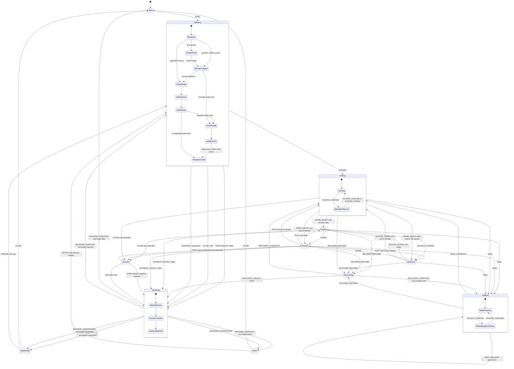

# PSP media session state

The PSP media session uses a shallow hierarchical state machine instead of
independently-added control flags. The state machine is the shipping lifecycle
authority. Decoder, demux, transport, DMA, presentation, and buffer ownership
remain separate backend responsibilities.

The host-compilable model lives in `psp_media_state.c`. Its transition
function is pure: it receives one pre-sampled event and returns the next state
plus non-blocking commands. Blocking or fallible work is an invoked service
which later supplies a completion, timeout, or failure event.

The state machine is source-independent. Provider video, offline files, and
compatible page `<video>` elements enter the same opening and playback states.
For page media, activation resolves the element's selected MP4 or VOD HLS
source, applies
`media-src`, mixed-content, private-network, CORS, cookie, redirect, and content-
blocking policy, and launches the native player. MP4 uses a one-byte Range
probe before the progressive demux; HLS uses bounded master/media playlists,
two segment requests, and the MPEG-TS packet source. Both then use the same
backend, clock, state transitions, and compositor. No page-media bytes are
written to the Memory Stick.

## Resource invariants

Control state and resource ownership must agree at every transition:

| State | Pipeline invariant |
|---|---|
| `Idle` | no pipeline and no retained plan |
| `Opening` | zero or one partial pipeline |
| `Priming`, `Playing`, `Paused`, `Buffering`, `Seeking`, `Recovering` | one complete pipeline |
| `Dormant` | one complete hidden pipeline retained for same-video replay |
| `Quiescing` | zero, partial, or complete pipeline; no new work admitted |
| `Suspended` | no reachable pipeline; optional resume plan retained |
| `Failed` | no reachable pipeline; failure record retained |

Backend health is independent. A quarantined decoder can retain memory which
is unsafe to free, but no session pipeline may reach it. Retry is disabled
until process restart. This keeps `Failed`'s pipeline invariant truthful
without pretending quarantine reclaimed firmware-owned state.

Transport priority follows admitted media work, not the URL in the omnibar.
`Opening` and a visible online player reserve two of the six background-worker
descriptors. `Dormant`, hidden internal views, `Failed`, and closed players do
not: a retained decoder receives no feed while hidden, and reopening it
reacquires the reservation before the next media request. This prevents Back,
a cancelled candidate navigation, or a failed video open from permanently
reducing later page and search capacity from six descriptors to four.

No resource-bearing state transitions directly to `Failed` or `Suspended`.
It first enters `Quiescing`, even when an early open failed before allocation;
the service then completes its irrelevant phases immediately.

## Control graph

`Priming` is not `Buffering`. Priming deliberately holds presentation until
the first eligible video frame and required audio prefix are ready. Buffering
is a steady-state transport refill. When bytes stop during priming, the state
is `Priming.WaitingForSource`; two independent mode flags are not required.

Leaving `Buffering` is readiness-dispatched. A brief stall whose audio ring
did not drain returns directly to `Playing`; a drained presentation returns to
`Priming`. This preserves existing behavior and avoids adding a visible hold
after every transient refill.

`Dormant` represents a healthy paused pipeline retained for instant same-video
replay. Calling that state `Idle` would make the resource invariant false, so
retention is explicit and reclaimable.

## Total event grid

Every valid event/state pair is defined. Inapplicable events are deliberate
no-ops, not absent cases. Important non-obvious cells include:

- `PAUSE` during priming, seeking, buffering, or recovery updates the resume
  target without violating an in-flight operation;
- `SEEK` during seeking re-enters it with a new generation;
- `SEEK` during recovery records the newest target and starts it at the first
  safe recovery boundary;
- `DECODER_REFUSED` during paused, priming, buffering, and seeking enters the
  same recovery discipline;
- `PAUSE_AFTER_FRAME` records a one-shot boundary and `FRAME_DISPLAYED`
  consumes it; ordinary frame presentation does not dispatch continuously;
- preview start/end and playback end are explicit events, so seek chrome and
  replay state are projections rather than parallel UI authority;
- `CLOSE` and `SUSPEND` are accepted during opening and every active state;
- repeated close/suspend events during quiescing cannot bypass its ownership
  ordering;
- a steady-state playback failure, including one published just after its
  pipeline was released, still crosses the explicit quiesce boundary before
  `Failed`.

Host tests enumerate the full event/state product, require a handled result,
and check the resource invariant after every result.

## Effects and invoked services

Transition commands only request work. They never wait for it. The controller
sees three truthful quiescing rungs: stop admission, cancel transport, and
quiesce the backend. Codec drain, DMA join, timeout classification, and the
quarantine decision remain inside backend ownership code because they are not
independently pumpable controller services. That invoked backend service later
returns `BACKEND_QUIESCED` or `BACKEND_QUARANTINED`. Resource release is
immediate only after it established that no worker, DMA transfer, GE path, or
borrowed surface can still reference the pipeline.

Quiescing uses target-sensitive pump policy without changing its ordering:

- suspend uses aggressive budgets because the PSP power callback has an
  external deadline;
- close uses ordinary cooperative budgets so chrome remains responsive;
- failure starts cooperatively but escalates promptly when the decoder is
  already suspected wedged.

## UI projection

Chrome is a pure projection of `(state, context)`, not a list of UI deltas.
This prevents stale overlays and makes authoritative and shadow projections
directly comparable. The projection describes visibility, progress overlay,
control availability, playing state, and whether Retry is legal.

Input handling and publication preserve that single authority. Revealing the
controls, moving a seek preview, dismissing a preview, closing, and retrying
already change useful UI state before their potentially slow service runs, so
the frontend may publish those pixels before dispatch. Play/Pause is different:
the input layer produces only a `PLAY` or `PAUSE` intent. The reducer consumes
that event, commits the new state, and only then may the ordinary end-of-frame
present publish the resulting glyph and legend. A pre-dispatch present for
Play/Pause would expose the old projection for one vblank and the new one on
the next, which appears as a flash across the bottom chrome.

This is a presentation-order rule, not another lifecycle flag. The UI helper
classifies whether an intent has meaningful pre-dispatch pixels; it never
predicts the reducer's next state.

## Network impairment contract

Transport recovery is policy beneath the lifecycle machine; it does not add
parallel session states. `Playing` enters `Buffering` only after 350 ms of
continuous source starvation. Presentation then stops while source and decode
work continue. A normal refill requires two seconds of network runway and a
continuous 250 ms stable interval before presentation resumes. Startup and a
page with repeated stalls require three seconds; after repeated trouble the
stable interval rises to 600 ms. This prevents brief radio gaps from flashing
the chrome and prevents a marginal refill from oscillating between Playing and
Buffering.

A demanded range window treats useful bytes as progress regardless of their
rate. With no progress, fresh connections are attempted after 2, 4, and 8
seconds. After the third attempt, the last request remains eligible to recover
until the logical incident reaches an absolute 30-second deadline. The
deadline survives replacement connections, so a one-byte trickle cannot keep
the player pending forever. A seek or a newly selected logical window starts a
fresh incident and immediately supersedes the old request.

Malformed, short, or range-rejecting responses are never admitted. Provider
routes can spend a bounded candidate-refresh allowance, and a user who selected
360p may then try the 240p route; a pinned 240p preference is not silently
changed. Terminal delivery failure enters the ordinary failure/quiesce path and
produces the bounded diagnostic snapshot rather than leaving Buffering active
forever.

The host resilience gate uses the real range source, MP4 demux, scheduler, and
buffer policy against deterministic delivery faults. Its coupled scenario
continues feeding while the presentation clock is held, distinguishes fetched
samples from displayed samples, bounds A/V skew, and requires every buffering
episode to close after stable recovery. The PSP background transport worker
and firmware presentation path remain hardware-qualified boundaries.

## Validation contract

The reducer is authoritative and host-compilable. Tests enumerate the complete
state/event product, require every cell to be handled, and assert the resource
invariant after every result. Scripted traces cover cold open, both startup
orderings, playback, pause, forward and backward seek, source starvation,
decoder refusal, superseded seek, close, suspend, resume, retry, and teardown.

Validation PSP builds retain a bounded transition ring and aggregate counts
for state mismatches, invariant failures, stale service completions, slot
generation mismatches, DMA/surface quarantine, claimed/staged/displayed
identity, buffering, skew, and watchdog recovery. These records stay in RAM
during a run and are normally published once through PSPLink; the playback
path does not write them to the Memory Stick.

The following rules keep telemetry from certifying the wrong pixels:

- events enter through one browser-thread tap and use one pre-sampled context;
- a present is counted only at the shared on-screen completion funnel;
- decoded and staged pictures carry slot, generation, identity, PTS, and a
  bounded pixel signature;
- expected supersession discards are distinguished from unexplained stale
  completions;
- recovery wall time and media-time reposition are measured separately;
- release builds compile the transition trace and validation formatter out.

A rewind of at least 30 seconds replaces the codec backend through the normal
quiesce/open services. Scrub movement is UI-only: it changes the highlighted
target without resetting firmware or superseding HTTP ranges. Committing a
smaller seek performs one bounded reset, then cooperatively proves that both
the video and audio source heads are resident before entering `Priming`.
Startup or a committed seek may leave `Priming` only after a claimed picture
crosses the displayed baseline; the physical DAC hold is an actuator fact, not
proof that this control boundary occurred.

`reopen_seek_completion_pending` is validation accounting only. It
distinguishes a user-requested rewind which uses the reopen service from an
ordinary resume-open when counting seek completions. It never chooses a state,
command, guard, target, or resource transition.

The model does not own codec, DMA, transport, or demux policy. It constrains
when those services may be invoked and when their resources may be released.
Hardware qualification cases are listed in
[Device qualification](DEVICE_QUALIFICATION.md).
