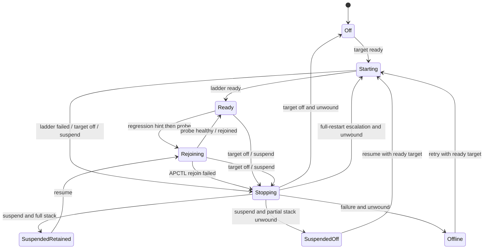

# PSP network lifecycle supervisor

The PSP network supervisor is the outer lifecycle owner for Tilefinch's
network stack. It does not replace `PspNetworkStatus`: the existing bounded
profile/module/init/association ladder remains intact and is invoked as the
`Starting` service. The supervisor makes ownership, suspend, retry and
teardown policy explicit around that proven ladder.

## Control model



`Stopping` is a pumped compound state:

```text
StopAdmission -> DrainLeases -> LeaveAPCTL -> UnwindRungs -> destination
                         |
                         +-- timeout, suspend target -> SuspendedRetained
                         |   (stack alive, no new leases, old lease recorded)
                         |
                         +-- timeout, other target -> LeaseWedged
                             (stack alive; unload forbidden until release)
```

Every effect is non-blocking and infallible. Firmware calls, bounded waits and
fallible cleanup are invoked services whose completion comes back as an event.
No timeout grants permission to terminate a stack while another thread might
still be executing inside it.

## Resource invariants

| State | Network resources | Admission |
|---|---|---|
| `Off`, `Offline`, `SuspendedOff` | no rungs | closed |
| `Starting` | none through partial/full, owned by inner ladder | closed |
| `Ready` | full stack | open |
| `Rejoining` | full stack | closed |
| `Stopping` | current stack until reverse unwind completes | closed |
| `SuspendedRetained` | full or retained-wedged stack | closed |

`Offline` always means teardown has completed; retry can never construct a
second stack over residual resources. `SuspendedRetained` preserves the
already-proven fast resume path. A suspend deadline that expires during lease
drain retains the stack and its outstanding lease rather than calling
`sceNetInetTerm` underneath curl or the resolver.

The ownership/adoption flags inside `PspNetworkContext` remain context. An
adopted initialized service still has to be terminated during a full reset;
module ownership only decides whether module unload is legal.

## Demand arbitration

The supervisor consumes one resolved target. Request precedence is fixed and
tested:

```text
shutdown > suspend > voice memory inhibit > navigation > boot warmup
```

Each requester has a generation. A stale clear cannot cancel a newer demand.
Voice can therefore unload the network to recover its contiguous allocation
without boot warmup immediately bringing the stack back.

## Event grid

The reducer is total: every state/event cell either transitions or is an
explicit deliberate no-op. The exhaustive host test iterates the complete
matrix. The compact table below uses `-` for that deliberate no-op; `T` means
the common target reconciler handles the cell.

| Event | Off | Starting | Ready | Rejoining | Stopping | Susp. retained | Susp. off | Offline |
|---|---:|---:|---:|---:|---:|---:|---:|---:|
| target changed | T | T | T | T | T | T | T | T |
| resume | - | - | - | - | - | probe | start | - |
| ladder ready | - | ready | - | - | - | - | - | - |
| ladder failed | - | stop/offline | - | - | - | - | - | - |
| regression hint | - | - | probe | - | - | - | - | - |
| probe healthy | - | - | - | ready | - | - | - | - |
| probe failed | - | - | - | APCTL rejoin | - | - | - | - |
| rejoined | - | - | - | ready | - | - | - | - |
| rejoin failed | - | - | - | stop/restart or offline | - | - | - | - |
| admission stopped | - | - | - | - | drain/leave | - | - | - |
| leases released | - | - | - | - | leave | clear wedge | - | - |
| drain timeout | - | - | - | - | retain/quarantine | - | - | - |
| APCTL disconnected | - | - | - | - | unwind | - | - | - |
| leave timeout | - | - | - | - | unwind | - | - | - |
| rung unwound | - | - | - | - | next rung | - | - | - |
| unwound | - | - | - | - | destination | - | - | - |
| retry | - | - | - | - | - | - | - | start |

## Consumer boundary

Admission is lease-based. A lease is acquired once per logical operation, not
per HTTP chunk. The shared transport's existing bounded, generation-bearing
slot table is the authoritative lease table: queued, running, completed but
unretired, and preconnect slots all count. The browser thread takes one
bounded snapshot of those atomics per transition; workers never mutate
supervisor state.

The shared transport worker carries page, media, update, and preconnect work.
The only `sceNetResolverStartNtoA` call is curl's `gethostbyname` seam on that
same worker, so it is covered by the same slot lease. Teardown first closes a
global admission gate, asks the worker to cancel, and waits for those slots.
The media machine couples to networking only by retiring its transport slot
during media quiescence.

A consumer error is a hint, not proof of stack regression. DNS/connect and
socket send/receive failures set a one-shot hint; HTTP status, TLS policy, and
timeouts do not. The supervisor samples APCTL immediately and escalates only
a corroborated link failure, so an HTTP 403 or CDN rate limit cannot restart
the PSP network stack. Ready-state monitoring is a cheap APCTL/WLAN probe
every five seconds, not a full interface report.

## Pump policy and performance parity

Background boot warmup advances one bounded ladder unit per frame. Foreground
navigation demand may advance up to 12 quiescent units in the same frame so
the eight pre-association rungs do not add roughly 250 ms at a 30 Hz tick.
Suspend stopping has an aggressive but still bounded 24-unit allowance to fit
the external power-callback deadline. No policy loop exceeds 32 units.

Validation records three parity numbers on the same PSP and access point:
cold warmup-to-Ready, navigation-demand-to-Ready, and retained
resume-revalidate time. Shipping builds do not carry shadow bookkeeping.

## Implementation

The reducer is authoritative. The old `network_started` and
`network_warmup_active` caller flags are gone. `Starting` uses the unchanged
inner ladder; foreground demand advances cheap rungs within an 8 ms/12-unit
slice while background warmup advances one unit after input and presentation.

Transport admission, five-second health probes, corroborated consumer hints,
one APCTL-only rejoin, and full restart escalation are live. APCTL leave and
reverse rung teardown are explicit pump services: each pump performs at most
one state poll or one firmware termination/unload call. Runtime recovery uses
one pump per browser frame. Compatibility call sites that require teardown to
finish before their next local action synchronously *drive that same pump*
with heartbeat/cancellation opportunities; there is no hidden firmware poll
loop inside the service.

A navigation arriving during `Rejoining` or restart-target `Stopping` drives
that same recovery service with the demand quota and keeps presenting its
cancelable reconnect UI. It never treats the inner ladder's stale `READY`
value as proof that the outer lifecycle recovered, and it refuses to open a
new ladder over `LeaseWedged` resources.

Suspend while Ready retains the initialized stack. It closes admission and
requests transport cancellation without waiting past the power deadline. If
a slot remains, `SuspendedRetained` records a lease wedge and unload is
forbidden until the worker publishes retirement after resume. Cancel during
`Starting` only marks the ladder terminal; APCTL disconnect belongs solely to
the outer `Stopping` service.

## Qualification

The pure reducer, request arbitration, complete event grid, and resource
invariants run as host tests. Validation builds observe the authoritative
controller at one event tap and retain mismatches in a bounded RAM ring rather
than aborting a device run. Aggregate output is published through PSPLink, not
written per transition to the Memory Stick.

Device qualification covers cold warmup, foreground demand during warmup,
cancel during association, retained logical suspend/resume, voice memory
reclaim followed by navigation, forced access-point loss, controlled exit, and
the three timing quantities above. A test must report zero state mismatches,
invariant failures, and unsafe stack-unload attempts. Physical power behavior
and AP-controlled loss remain environment-specific observations, not claims a
host injection can establish.

The inner `PspNetworkStatus` ladder remains deliberately independent and owns
only its bounded profile/module/init/association sequence.
