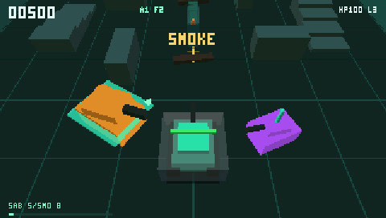

# Treadline Arena

Treadline Arena is a third-person tank combat game built for Tilefinch and the
PSP. Drive with independent treads, aim the turret separately, break apart the
arena, and fight through short matches designed for a 480×272 display. The
entire game can be installed into Tilefinch's offline library.

## Features

- Four ways to play: Survival, Team Control, Convoy Escort, and the escalating
  Onslaught mode.
- Three distinct tank classes with different armor, mobility, reload speed,
  and secondary weapons.
- Five reusable gadgets: Mines, Smoke, Shield, Repair Drone, and Boost Treads.
- Directional armor, ricocheting shells, destructible barriers, opening gates,
  ramps, pickups, particles, and class-specific Command abilities.
- Cadet, Veteran, and Ace bot difficulties, with bots that defend objectives,
  flank, seek cover, and coordinate attacks.
- Authored arenas plus shareable, seeded Onslaught arenas that are checked for
  connectivity, flanking routes, useful cover, and fair sightlines.
- Arcade and Classic controls, three levels of aim assist, Stable and Follow
  camera modes, optional effects and menu music, and locally saved gameplay
  preferences.
- Offline play after installation. The game does not connect to the network
  unless the player explicitly starts multiplayer.
- Direct two-player Team Control over LAN or an invite code, without an
  account, lobby, Tilefinch server, or relay.
- Keyboard, pointer, standard gamepad, and PSP controls.

## Install and play

### Install in Tilefinch

1. Host this repository—or just the contents of this directory—over HTTPS.
2. Open `examples/treadline-arena/index.html` in Tilefinch.
3. Open **Page tools → Install offline app**.
4. Review the installation preview, then choose **Install**.
5. Launch **Treadline Arena** from the Offline section of the Library.

The HTML, CSS, JavaScript, icon, and manifest are same-origin and
self-contained. Once installed, ordinary single-player launch and play require
no Wi-Fi connection. Reinstall or Update from the installation screen after
changing the packaged files.

You can also open the page directly in a modern desktop browser. Offline
installation is optional there; keyboard, pointer, gamepad, audio, and
browser-to-browser multiplayer remain available.

### PSP controls

Focus **Deploy** and press X. Hold Start+Select for 0.7 seconds when prompted to
give the page control of the PSP buttons. The same chord returns control to
Tilefinch.

**Arcade** is the default. Push the analog nub in the direction you want to
travel. The hull turns toward that camera-relative heading and drives when the
nub leaves its dead zone; pulling more than 120 degrees behind the hull backs
up instead of forcing a long turn.

- Triangle aims away from the camera, X aims toward it, Square aims left, and
  O aims right. Hold adjacent buttons for diagonal aim; rolling between them
  also produces a clean diagonal sweep.
- R fires the main cannon and L fires the class secondary weapon.
- D-pad Up activates the gadget and D-pad Down activates Command when enabled
  and charged.
- Start pauses. Select has no game action because Start+Select always returns
  controls to Tilefinch.

Choose **Controls: Classic** on the setup panel for the original independent
tread layout: L/R power the treads, O reverses, the nub aims, X fires, Square
uses the secondary, D-pad Up uses the gadget, and Triangle activates Command.

Aim assist is independently selectable. **Snap** (the default) bends aim toward
the nearest enemy inside a 30-degree cone. **Lock** holds a visible target until
the aim control is released or smoke blocks sight. **Off** leaves the raw aim
direction untouched for ricochets and manual leading.

### Computer controls

- In Arcade, WASD or the arrow keys choose a movement direction. IJKL or numpad
  4/6/8/2 aim; adjacent directions aim diagonally. Space fires and Shift uses
  the secondary.
- In Classic, A/D power the individual treads, W drives both forward, and S
  drives both in reverse. The arrows, IJKL, pointer, or numpad aim. Space fires,
  E uses the secondary, F uses the gadget, and Q activates Command.
- P or Escape pauses.

A connected standard gamepad is also supported. An idle gamepad never disables
keyboard input.

## Modes and loadouts

### Game modes

- **Survival** — clear increasingly defended arenas before the last redeploy.
- **Team Control** — fight beside an allied tank and hold the central capture
  point. This is also the direct two-player mode.
- **Convoy Escort** — protect a crawler as it crosses a contested arena and
  gate.
- **Onslaught** — survive escalating waves in one generated arena. The result
  screen shows the accepted seed so the same layout can be played again.

### Tank classes

- **Scout** — light armor, high speed, fast reload, and a three-shell secondary
  burst.
- **Striker** — balanced armor and speed, with an armor-piercing secondary that
  breaches a barrier and ignores temporary shields.
- **Bulwark** — slower and larger, with 50% more armor and a close-range
  canister secondary.

### Gadgets and Command

Mines, Smoke, Shield, Repair Drone, and Boost Treads can be paired with any
class. Their cooldowns are shown in the in-game HUD.

Command is an optional match setting and is Off by default. Objective play,
hits, ricochets, barrier breaches, and eliminations charge one class-specific
ability: Scout Overdrive, Striker Sabot, or Bulwark Aegis.

## Combat and arenas

Armor is directional: frontal hits are reduced, side hits deal their stated
damage, and rear hits are amplified. Arena walls can ricochet a shell once;
after that, the shell's bounce is spent. Destructible barriers become low
rubble after repeated hits, opening new routes and sightlines during a fight.

True wedge ramps affect combat as well as appearance. A shell fired from the
upper part of a ramp passes over low barriers while still striking tanks and
solid obstacles. Arena layouts combine lanes, blind doglegs, loops, flanking
routes, gates, capture zones, and erosion walls that reward opening the map.

Bots have objective roles rather than only chasing the nearest tank. Allies
capture and support; defenders hold useful ground; flankers approach from the
side; convoy attackers set up ahead of the crawler; and damaged or blocked
tanks seek safer positions. Difficulty changes reaction, accuracy, and firing
behavior without increasing the number of actors.

The retained HUD shows armor, score, mode progress, cannon and ricochet cues,
gadget recharge, hit confirmation, incoming damage direction, and an
edge-mounted objective compass. The Stable camera keeps the world orientation
fixed, while Follow gently turns behind the player's tank.

## Multiplayer

Team Control supports one direct remote player. The host simulates the match;
the guest sends input and displays the host's replaceable snapshots.

On PSP:

- **Find LAN** needs no code when both PSPs are on the same Wi-Fi.
- Otherwise, the host shares the numeric invite code.
- If the direct attempt is blocked by NAT, the joining player can share their
  response code and the host can choose **Enter response code**.

Some symmetric-NAT or CGNAT networks cannot make a direct connection because
Tilefinch deliberately provides no account, matchmaking server, or traffic
relay.

In a modern browser, **Host web game** and **Join web game** use a service-free
WebRTC DataChannel adapter. The host and guest exchange the displayed offer and
response text privately. Public STUN may help the peers discover their routes,
but there is no Tilefinch server, TURN relay, account, or lobby. Browser and PSP
sessions intentionally do not cross-connect.

See [Direct multiplayer](../../docs/MULTIPLAYER.md) for the API, privacy,
network-policy, and lifecycle contract.

## Engineering details

Treadline Arena is both a game and a qualification example for Tilefinch's
bounded WebGL game profile. Its steady gameplay frame uses one cached static
arena draw, one compact instanced box draw, and one retained HUD draw. Tanks,
shells, pickups, particles, shadows, and decals share fixed pools; optional
effects are dropped before critical actors when the 64-instance visual budget
is full. Gameplay avoids per-frame collection pressure and does not allocate
new entity pools as difficulty increases.

The renderer retains immutable geometry and updates bounded transform and tint
streams. HUD text and indicators share one quantized draw stream, so changing a
score or meter does not rebuild HTML or add a new steady-state draw. The title,
setup, pause, and multiplayer surfaces remain ordinary accessible HTML.

Onslaught generation runs only at a mode transition. It uses a separate
xorshift state, fixed typed-array scratch grids, a bounded flood-fill queue, and
at most 20 attempts. Placement is integer-only on half-world-unit cells. The
gameplay random stream is untouched, and a failed search falls back to an
authored arena.

Multiplayer protocol v3 carries a generated arena's accepted seed, 16-bit
layout checksum, and 16-bit active-barrier mask in every host snapshot. A fresh
client rebuilds that fixed layout once without running the host's validator.
Checksum mismatch falls back to an authored arena and displays a warning rather
than silently desynchronizing. Any generator or motif-table change requires a
multiplayer protocol bump.

Both control schemes translate into the same fixed online command: one bit for
each tread, one reverse bit, and the existing aim vector. Arcade's nub is an
intent control rather than an analog throttle, so it preserves protocol v3
interoperation with Classic clients. Adding analog throttle would require a
future protocol bump.

The host sends fixed 12-byte input records at 20 Hz and bounded replaceable
snapshots of at most 320 bytes at 15 Hz. Rendering is independent of packet
arrival, stale sequence numbers are ignored, and reconnect or late join obtains
the complete arena identity from the first accepted snapshot.

Preferences are stored locally, but unfinished matches are not serialized.
Reloading returns to a deterministic title state. Backgrounding and resuming
uses one collision-safe capped step instead of replaying accumulated frames.

For the wider compatibility and performance contract, see
[Tilefinch Game Profile](../../docs/GAME_PROFILE.md) and
[WebGL support](../../docs/WEBGL.md).
