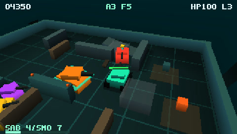

# Treadline Arena

Treadline Arena is a third-person tank combat game built for Tilefinch and the
PSP. Drive with the analog nub, aim the turret separately, break apart the
arena, and fight through a 25-mission campaign or short matches designed for a
480×272 display. The entire game can be installed into Tilefinch's offline
library and played without Wi-Fi.



## Features

- **The Line**, a campaign of 25 missions in five theaters, each worth three
  medals, with radio briefings, optional Range Faults and an Ace Reprise
  after the ending.
- Seven ways to play: Survival, Team Control, Convoy Escort, Onslaught,
  Daily Arena, Billiards, and a two-player pass-the-PSP artillery duel.
- A Practice Range with targets that never shoot back, a one-press aim
  guide, and timed drills (see below).
- An optional exact aim guide (Sight or Full, at a score cost) that shows
  where the next shell meets a wall and which way it bounces, and short
  tracers behind your own shells (see "Aim guide and tracers").
- A new seeded Daily Arena each UTC day, with a fixed loadout, a local best
  score, and a shareable date code. No daily service or account is needed.
- Three-second killcams, deterministic last-run playback, and checksummed
  replay codes. Replays remain in RAM unless you explicitly copy a code.
- Three distinct tank classes with different armor, mobility, reload speed,
  and secondary weapons.
- Five reusable gadgets: Mines, Smoke, Shield, Repair Drone, and Boost Treads.
- Directional armor, ricocheting shells, destructible barriers, opening gates,
  ramps, pickups, particles, and class-specific Command abilities.
- Bank-shot and double-bank bonuses, multipart bosses every fifth Onslaught
  wave, oil/ice/mud, and explosive chain crates.
- Cadet, Veteran, and Ace bot difficulties, with bots that defend objectives,
  flank, seek cover, and coordinate attacks.
- Authored arenas plus shareable, seeded Onslaught arenas that are checked for
  connectivity, flanking routes, useful cover, and fair sightlines.
- Arcade, Classic and Gunner controls, pivot turns, a dodge lunge and
  brake-drifts, three levels of aim assist, Stable and Follow
  camera modes, optional effects and adaptive music, and locally saved gameplay
  preferences.
- Charge-and-release shells, adjustable reversing, medal-unlocked paints,
  and Day, Dusk, Night, and Storm arena lighting.
- Lighting baked into the arena: lit floors, contact shadows, a sky
  backdrop, cooling sparks and scorch marks.
- Offline play after installation. The game does not connect to the network
  unless the player explicitly starts multiplayer.
- Direct two-player Team Control over LAN or an invite code, without an
  account, lobby, Tilefinch server, or relay.
- Keyboard, pointer, standard gamepad, and PSP controls.

## Install and play

### Install in Tilefinch

1. Host this repository—or just the contents of this directory—over HTTPS.
2. Open `examples/treadline-arena/index.html` in Tilefinch.
3. Open **Page tools → Install offline app**.
4. Review the installation preview, then choose **Install**.
5. Launch **Treadline Arena** from the Library's **Saved** section.

Everything the game needs comes from the same site and is installed with
it. Once installed, ordinary single-player launch and play require no Wi-Fi
connection. Reinstall or Update from the installation screen after changing
the packaged files.

After a Tilefinch update, **Library → Saved** marks the game **RECOMPILE**;
choose **Recompile** once so later launches do not compile the game from
source again.

If Deploy shows **Unavailable** and the game says it could not load all of
its files on a PSP, the usual cause is a script size limit below the game's
largest script: raise `file_kb` in the PSP app's `boot.cfg` to 512 or more.

What the package holds and how it fits Tilefinch's script limits: see
[Package and script limits](#package-and-script-limits).

You can also open the page directly in a modern desktop browser. Offline
installation is optional there; keyboard, pointer, gamepad, audio, and
browser-to-browser multiplayer remain available.

### PSP controls

From the main menu choose **Quick Match**, focus **Deploy** and press X (or
**Continue** for the campaign). Hold Start+Select for 0.7 seconds when prompted to
give the page control of the PSP buttons. The same chord returns control to
Tilefinch.

**Arcade** is the default. Push the analog nub in the direction you want to
travel. The hull turns toward that camera-relative heading and drives when the
nub leaves its dead zone; pulling behind the hull backs up instead of forcing a
long turn. **Reverse** selects 90, 105, or 120 degrees (default).

- Triangle aims away from the camera, X aims toward it, Square aims left, and
  O aims right. Hold adjacent buttons for diagonal aim; rolling between them
  also produces a clean diagonal sweep.
- Tap and release R for a normal shot. Hold at least 0.4 seconds and release
  for a faster, stronger shell that cannot ricochet. L uses the secondary.
- D-pad Up activates the gadget and D-pad Down activates Command when enabled
  and charged.
- Start pauses. Select has no game action because Start+Select always returns
  controls to Tilefinch.

**Controls** (Settings, Controls tab, or Pause) chooses the scheme with
◄ ► or X, sets Aim assist and Reverse, and lists the current scheme one action
per row on two pages, Driving and Shooting (L/R switches pages). A third page,
**Aim guide**, sets the guide level with ◄ ► or X and explains each level. Face buttons
are written as words because the menu fonts lack the triangle and cross marks.
The Quick Match panel shows a one-line summary that points there.

Choose **Scheme: Classic** in Controls for the original independent
tread layout: L/R power the treads, O reverses, the nub aims, X charges/fires on release, Square
uses the secondary, D-pad Up uses the gadget, and Triangle activates Command.

**Scheme: Gunner** keeps Arcade's nub driving (including **Reverse**) and
turns the face buttons into a turret crank, so the left thumb never leaves the
nub:

- Square and Circle traverse the turret left and right from where it points.
  A one-frame tap moves it about one degree at the PSP's 30 fps; held, it eases up to 3.6 rad/s over half
  a second, just under the turret's 3.8 rad/s slew so the barrel never lags.
  Holding both does nothing. O also resumes from pause, so a crank or snap
  held while leaving a menu waits for release.
- Triangle snaps the aim to the hull's facing. The hull, not the camera:
  the Stable camera always looks the same way, so "camera forward" is just a
  compass direction, while the hull is where your front armor and travel point.
  Snap, then pivot, to bring the gun around fast.
- R fires (tap or hold to charge), L uses the secondary, X uses the gadget
  (D-pad Up still works), D-pad Down activates Command.
- Aim assist only acts between presses: **Snap** nudges toward a target in the
  cone once when you let go, **Lock** keeps tracking it until you traverse
  again, **Off** leaves the crank raw.

**Movement extras** work in every scheme:

| | Arcade | Classic | Gunner | Keyboard |
|---|---|---|---|---|
| Pivot in place | D-pad Left/Right | D-pad Left/Right | D-pad Left/Right | Z / C |
| Lunge | double-tap the nub | press L+R twice | double-tap the nub | double-tap a move key (W in Classic) |

- **Pivot** runs the treads in opposite directions: a 180 takes about
  0.77 s and the turret keeps its aim. While pivoting the nub is ignored.
- **Lunge** adds 1.6x class speed along the hull (backwards when reversing),
  fading over a quarter second: about one extra unit for a Striker. A double
  tap is a press of at most 0.3 s followed by a second press in the same
  direction within 0.25 s. It recharges for 2.5 s; the gadget bar's track
  turns amber until it is ready.
- **Brake-drift**: when the hull is moving faster than 1.2x its class speed
  (a lunge, Boost Treads, a Scout's Command) and one tread is released or
  reversed, grip drops for 0.4 s (0.9 s on ice) and the hull slides along its
  old line while it turns, then traction returns smoothly.
- Veteran and Ace bots pivot toward goals behind them, and lunge sideways out
  of a human shell's line (Veteran 20%, Ace 45% of shots aimed across their
  flank). Cadets do neither.

Aim assist is independently selectable. **Snap** (the default) bends aim toward
the nearest enemy inside a 30-degree cone. **Lock** holds a visible target until
the aim control is released or smoke blocks sight. **Off** leaves the raw aim
direction untouched for ricochets and manual leading.

### Aim guide and tracers

The aim guide previews the next shell from your barrel. It runs the same
swept collision the shells use (walls and closed gates bounce it; barriers
and crates stop it; the arena edge bounces it) from the shell's real spawn
point, heading and collision radius, recomputed every frame.

- **Off** (the default everywhere): the turret only. Bank shots by eye.
- **Sight**: a thin line from the barrel to the first wall, a bar on
  that wall, and a short cyan stub that shows which way the shell will bounce
  but not where it lands. A block marks a barrier or crate that stops the
  shell, and a charged shell (which cannot ricochet) shows no stub.
- **Full**: Sight plus the dimmer bounce leg to the next wall or the end of
  range (first bounce only). A leg that would hit an enemy turns red, with a
  red plate under that enemy. Full never confirms an enemy you cannot see:
  smoke on the shell's path, a campaign foe still hidden in its camouflage
  (Whiteout, Night City) and the Fog of Memory fault all leave the guide
  neutral, and a hidden hull never shortens the drawn line.

The guide is an assist with a score cost: Sight scores x0.9 and Full x0.75,
applied like a Range Fault's multiplier to campaign mission scores and to
Quick Match final scores and bests. A run is priced at the highest level it
used while playing, so turning the guide off in the pause menu before the
end does not undo it; a level only browsed in the menu costs nothing. The
Controls page shows each level's cost, mission results show the guide's
multiplier next to the score, and a replay records the level its run used.
In multiplayer each player's own setting prices only
their own result and never reaches the host's simulation. Medals are skill
checks (no wall bumps, bank hits, times) and do not depend on the guide,
just as they do not depend on Aim assist. The Practice Range has no score,
so its guide is free; it starts Off with a one-press toggle on its panel.

Shells sweep the path they travel each frame rather than testing points, so
they meet the first face, corner or hull along it and turn exactly at the
contact, whatever the frame rate. A rounded corner turns a shell the way
nearest a mirror reflection (a glancing hit turns aside, a near head-on one
comes back), and a concave corner costs one bounce per wall. The guide shows
exactly where the shell will go, corners included.

**Tracers** (at every guide level): your newest shell leaves a short, fading
trail along the path it actually took, bounces included. They are feedback,
not a preview.

How the guide and tracers are drawn, and what they cost on a PSP: see
[Aim guide and tracer drawing](#aim-guide-and-tracer-drawing).

### Computer controls

- In Arcade, WASD or the arrow keys choose a movement direction. IJKL or numpad
  4/6/8/2 aim; adjacent directions aim diagonally. Space charges/fires on release and Shift uses
  the secondary.
- In Classic, A/D power the individual treads, W drives both forward, and S
  drives both in reverse. The arrows, IJKL, pointer, or numpad aim. Space charges/fires on release,
  E uses the secondary, F uses the gadget, and Q activates Command.
- In Gunner, movement is as in Arcade; J/L traverse the turret, I snaps it to
  the hull, Space fires, Shift uses the secondary, F the gadget, Q Command.
- Z and C pivot in every scheme; double-tap a movement key to lunge.
- P or Escape pauses.

A connected standard gamepad is also supported. An idle gamepad never disables
keyboard input.

### Menus and settings

The main menu offers **Continue** (or **Start campaign**), **Campaign**,
**Quick Match**, **Practice Range**, **Multiplayer**, **Garage**,
**Replays** and **Settings**. Daily Arena is a MODE choice on Quick Match. In
menus the D-pad moves focus, X selects, O goes back, L/R switch tabs or
pages, and START deploys.

**Settings** has three tabs. *Controls* opens the Controls screen and sets
Command; *Camera & Display* sets Camera, Light, Shake, Effects and
Objective arrow;
*Audio* sets Music, Music volume, Radio and Range remarks. **Garage** shows
the loadout and medal count and sets the paint and a three-letter callsign.
Preferences and progress are saved on the device only.

The arena has a strong key light, a lit floor centre, deeper ground
contact, contact shadows under blocks, and a backdrop that leans in from the
floor's edge up into a lit sky band. Changing **Light** (or a campaign
theater's tint) takes effect at once. Sparks cool from white-hot through
orange to smoke, and a destroyed tank leaves a scorch mark once its sparks
have burned out. Earlier versions offered a Classic look as a setting; saves
that still carry it load normally and the setting is ignored (see
[Arena look](#arena-look)).

## The Line (campaign)

**Continue** on the main menu launches the next campaign mission (its
briefing first, the first time). **Campaign** lists five theaters of five
missions; each mission is an existing mode with one twist, worth three medals
(Clear, Challenge, Mastery). Difficulty (Cadet, Veteran or Ace) is chosen once.
Progress is saved on the device after every mission; a damaged or unknown
save starts fresh.

- **Radio** (Full, Brief, Off) controls MARSHAL, VESPER and SUNSET. Full
  briefing and result lines appear in the panel; in play, short lines use the
  HUD toast (quiet while Command is on). Holding START skips briefing lines.
  Replaying a cleared mission defaults to Off. **Range Logs** re-reads every
  unlocked line and lore entry. **Range remarks** (Settings, Audio) allows a
  gentle local note about the time or how long you were away; nothing leaves
  the device.
- **Range Faults** are optional modifiers with score multipliers, unlocked by
  hidden memory cards (one per mission, in a hard corner).
- After the ending, **Reprise** replays Survival-style missions on fixed,
  validated generated arenas at Ace.
- Medals unlock theater ribbons, Quick Match paints, Quick Mines (10 medals)
  and Fast Command (20 medals); the sidegrades apply inside the campaign only.

Campaign runs record and replay like other modes: mission, faults,
difficulty and every save-derived input travel in the replay code.
Menus are laid out for 480x272 with text about 25% larger than the first
campaign build: the briefing radio pages two lines at a time (L/R pages back),
a focused Range Fault explains itself in the message line, and the legend names
what L/R does on each screen.

How the campaign is built and checked: see
[Campaign internals](#campaign-internals).

## Practice Range

**Practice Range** on the main menu (or on Quick Match; Daily moved to Quick
Match's MODE choice to make room) opens a calm range: nothing shoots back, your
tank takes no damage, and there is no timer or game over.

- **Layout.** A target lane straight ahead with targets at about 5, 9 and 12
  units (gold); a bank yard to its side whose deflector walls hide two cyan
  targets that only a ricochet can hurt (direct hits show BANK IT); and a
  slalom track with three poles, a dead-end corner, a return lane and two ice
  patches. Targets pop when their armor runs out and come back 1.4 s later.
  Hits show the hit marker and a HUD bark (HIT 18, BANK 28, 2X BANK 28, DOWN).
- **Range panel** (Start in the range): Controls (scheme and aim assist, the
  same menu as Settings), Class, Gadget, Targets (Still, Moving, Off), Aim
  guide (Off, Sight, Full), Drills and Leave range. Every switch applies
  without leaving.
  Moving targets sweep their lane slowly (at most about 1.2 units/s) so you
  can practise leading.
- **Aim guide**: Off at first; one press on the panel turns on Sight, two
  Full (the shell's first leg, its bounce leg and a red plate under a
  target it would hit; see "Aim guide and tracers"). The range has no score,
  so the guide costs nothing here; its level is its own and lasts for the
  session.
- **Drills** keep a local best time. *Slalom*: eight gates through the
  poles, a pivot at the corner, a lunge down the lane and a drift on the ice.
  *Bank shots*: down four cyan targets. *Moving targets*: down five. Each
  drill's line in the drill list names the controls it uses in your current
  scheme; the HUD score shows elapsed tenths of a second during a drill and
  hits in the free range. With no target up, the objective mast and HUD
  arrow point at the next slalom gate (or the middle of the lane).
- **Stats**: shots, hits, accuracy and bank hits for the visit appear on the
  Range panel; lifetime totals on the drill list. Best times and totals are
  saved with your campaign progress in a section of their own: if that
  section is damaged or unknown, only the range resets, never campaign
  progress.
- **Replays**: the range never records, and entering the range clears the
  last-run replay like any new run.

How the range is built: see
[Practice Range internals](#practice-range-internals).

## Music

The music follows the fight. **Explore** (no foe close) plays the arena's
motif every other bar over the engine hum. **Alert** (a foe within about 6.5
units) adds a bass pulse. **Combat** (shots near you, hits or damage in the
last 4.5 s) speeds the tempo by half again, with arpeggios and a driving bass.
**Danger** (armor under 30%) turns the motif minor over a heartbeat bass,
which replaces the heartbeat effect. Short stingers mark a kill, a cleared
arena, a boss, victory and defeat. Changes land on the next bar line. The
music calms only after 3.5 s of quiet and at least two bars, so it does not
flap. Each theater has its own motif: the Proving Yard's is Marshal's warm
bugle-call theme, which the victory fanfare quotes. Vesper's yearning minor
sixth turns major when she fights beside you. Sunset descends evenly and
coldly. The Practice Range and the last match stay calm, and Whiteout and
Lights Out never announce a hidden foe. The title theme keeps the old menu
melody's contour.

Settings > Audio has **Music** (Full, Off, or Menus for the title and result
screens only; Full is the default) and **Music volume** (Low, Mid, High).
Both are kept with your campaign progress. Sound effects always take
priority over the music.

How the music is mixed and what it costs: see [Music engine](#music-engine).

## Modes and loadouts

### Game modes

- **Survival** — clear increasingly defended arenas before the last redeploy.
- **Team Control** — fight beside an allied tank and hold the central capture
  point. This is also the direct two-player mode.
- **Convoy Escort** — protect a crawler as it crosses a contested arena and
  gate. The crawler is solid: it rams barriers on its route into rubble,
  crushes crates, and nudges a tank in its path aside; a tank pinned against
  scenery or another tank stalls it rather than being crushed.
- **Onslaught** — survive escalating waves in one generated arena. The result
  screen shows the accepted seed. Every fifth wave brings a boss: disable its
  treads to stop it or its turret to silence it.
- **Daily Arena** — the day's seed, class, gadget, and Veteran starting
  difficulty are fixed. Share the day's date code; open the page with
  `?daily=YYYYMMDD` and select Daily Arena to revisit that date. The device's
  clock supplies the default UTC date. Only the most recently played day's
  best is stored locally; there is no global leaderboard.
- **Billiards** — direct hits can weaken enemies but only a ricochet can
  finish them. Bank kills award +250; double banks award +500.
- **Pass the PSP** — two local players alternate 12-second movement/aiming
  turns with the same selected loadout. A cannon/secondary shot ends the turn
  after its shells resolve. Hand over the PSP at Ready. No Wi-Fi required.

### Tank classes

- **Scout** — light armor, high speed, fast reload, and a three-shell secondary
  burst.
- **Striker** — balanced armor and speed, with an armor-piercing secondary that
  breaches a barrier and ignores temporary shields.
- **Bulwark** — slower and larger, with 50% more armor and a close-range
  canister secondary.

### Gadgets and Command

Mines, Smoke, Shield, Repair Drone, and Boost Treads can be paired with any
class. Their cooldowns are shown in the in-game HUD.

Command is an optional match setting and is Off by default. Objective play,
hits, ricochets, barrier breaches, and eliminations charge one class-specific
ability: Scout Overdrive, Striker Sabot, or Bulwark Aegis.

## Combat and arenas

Armor is directional: frontal hits are reduced, side hits deal their stated
damage, and rear hits are amplified. Normal player shells bounce twice (bots
once); charged shells cannot bounce. Destructible barriers become low
rubble after repeated hits, opening new routes and sightlines during a fight.

True wedge ramps affect combat as well as appearance. A shell fired from the
upper part of a ramp passes over low barriers while still striking tanks and
solid obstacles. Arena layouts combine lanes, blind doglegs, loops, flanking
routes, gates, capture zones, and erosion walls that reward opening the map.

Quick Match foes deploy on the far arc ahead of your start, never within 6
units of a player (about 8 units on a fresh arena or wave); Team Control
and Convoy respawns move to the far side of the arena when you sit on their
base. Campaign missions keep their own starting placements.

Bots have objective roles rather than only chasing the nearest tank. Allies
capture and support; defenders hold useful ground; flankers approach from the
side; convoy attackers set up ahead of the crawler; and damaged or blocked
tanks seek safer positions. Guards hold cover, but not forever: in Survival,
Billiards, Onslaught and Daily a guard that has traded no damage for ten
seconds, or that has only guards left beside it, leaves cover and flanks
until the next exchange; a campaign guard leaves its post only as the last
foe standing. Difficulty changes reaction, accuracy, and firing
behavior without increasing the number of actors.

Bots check solid cover and smoke, lead moving targets with difficulty-scaled
seeded error, and favor their current target. Veteran/Ace bots can plan a bank
off an outer wall. A bounded navigation grid supplies detours; personalities
vary aggression and preferred range. These are heuristics, not a guarantee
that every shot or route will be optimal.

Target choices follow the bot's reaction cadence rather than instantly
switching every frame. Orbiting bots check clearance and change direction
around blocked arcs; repeated stuck escapes alternate when neither side is
clearly better. Firing still checks current cover and smoke.

**Pockets and breaches.** Shells destroy crates and ordinary barriers; walls,
the arena edge, the gate and the campaign's powered-off zone walls they
cannot. No tank is placed where only indestructible scenery shuts it off
from the fight for its own hull size: it is moved to the nearest open spot
that routes (foes still keep their distance from the player). A small patch
closed only by crates or barriers is kept about half the time, by a coin
drawn from the run's random state, so replays repeat it. A bot with no way to
its target shoots one: it finds the cheapest way through destructible
scenery, squares up to the first blocker, shoots it (banked off an outer wall
if that is the only line, backing out of a chain crate's blast when it has
room) and drives through, re-planning when the scenery changes; the same
handles pockets that form mid-fight. A bot holding cover or an objective
does not blast its way to it, and one with no breach to make (a closed gate)
waits rather than grinding against the wall.

Crates leave oil or ice when destroyed; explosive crates can trigger nearby
crates. Mud slows travel, while oil and ice preserve momentum. Hazards are
currently single-player/local-duel features, not multiplayer snapshot state.

## Replays, medals, and lighting

**Replay last run** re-simulates recorded input and checks the final digest.
**Share replay** exposes a replay code to copy; **Play code** opens a field
for an imported code. Checksums reject damaged codes and the simulation version
rejects incompatible recordings. Mismatches are reported explicitly. The RAM
log holds 8,192 steps (about 4.5 minutes at 30fps); exported data is capped at
128KiB, so a long/high-entropy run can be replayable locally but too large to
share. Starting another run replaces the log. Codes contain inputs, loadout,
seed and timing—not accounts or network data.

Medals unlock **Paint** choices: finish Convoy without the main cannon (Copper),
eliminate three enemies with one mine (Ice), score three bank kills (Royal),
clear Onslaught wave five (Sunburst), or win Team Control without a redeploy
(Pearl). **Light** selects Day, Dusk, Night, or Storm; these are baked arena
tints rather than dynamic weather effects.

The HUD shows armor, score, mode progress, cannon and ricochet cues,
gadget recharge, hit confirmation, incoming damage direction, and an
edge-mounted objective arrow. A mast marks the objective in the arena: Team
Control's transmitter, the convoy, or the nearest foe (a mission's own
targets where it has them). The mast keeps its target until that target is
gone or another stays clearly nearer (within 80% of the distance) for half
a second, so two foes at about the same distance no longer swap it back and
forth. **Settings > Camera & Display > Objective arrow** is Auto by default:
the HUD arrow shows only where the objective is not a foe that comes to
you, namely Team Control (the transmitter), Convoy Escort (the convoy while
it runs), Pass the PSP (the other player, often off screen), the Practice
Range with no target up (the next slalom gate), and the campaign missions
1-1 and 1-2 (stationary drill targets), 2-3 (the nearest standing barrier),
2-4 and 4-3 (the transmitter), 3-2, 4-2 and 4-4 (the archive crawler, the
monument, the cleanup crawler) and 5-2 (the nearest salvage card). On shows
it everywhere, Off nowhere. The Stable camera keeps the world orientation
fixed, while Follow gently turns behind the player's tank. The camera pulls
in at once when scenery would come between it and the tank, eases back out
only after the way has stayed clear for 0.3 s, and frames a new arena from
its first frame.

## Multiplayer

Team Control supports one direct remote player. The host simulates the match;
the guest sends input and displays the host's replaceable snapshots.

On PSP:

- **Find LAN** needs no code when both PSPs are on the same Wi-Fi.
- Otherwise, the host shares the numeric invite code.
- If the direct attempt is blocked by NAT, the joining player can share their
  response code and the host can choose **Enter response code**.

Some symmetric-NAT or CGNAT networks cannot make a direct connection because
Tilefinch deliberately provides no account, matchmaking server, or traffic
relay.

In a modern browser, **Host web game** and **Join web game** use a service-free
WebRTC DataChannel adapter. The host and guest exchange the displayed offer and
response text privately. Public STUN may help the peers discover their routes,
but there is no Tilefinch server, TURN relay, account, or lobby. Browser and PSP
sessions intentionally do not cross-connect.

See [Direct multiplayer](../../docs/MULTIPLAYER.md) for the API, privacy,
network-policy, and lifecycle contract.

## Engineering details

Treadline Arena is both a game and a qualification example for Tilefinch's
bounded WebGL game profile. Its steady gameplay frame uses one cached static
arena draw, one compact instanced box draw, and one retained HUD draw. Tanks,
shells, pickups, particles, shadows, and decals share fixed pools; optional
effects are dropped before critical actors when the 64-instance visual budget
is full. Gameplay avoids per-frame collection pressure and does not allocate
new entity pools as difficulty increases.

The renderer retains immutable geometry and updates bounded transform and tint
streams. HUD text and indicators share one quantized draw stream, so changing a
score or meter does not rebuild HTML or add a new steady-state draw. The title,
setup, pause, and multiplayer surfaces remain ordinary accessible HTML.

The 30fps target remains a physical-device qualification requirement, not a
guarantee from host tests. Device runs on a PSP-3000 in October 2026
(validation build, installed package; see the
[performance ledger](../../docs/engineering/PERFORMANCE_LEDGER.md)) are close:
the bot-driven long soak missed 1-2 of about 1,340 two-vblank deadlines and
the Onslaught soak 0-1, and an Onslaught boss wave with real input and audio
missed 3 of 2,176 (readiness p95 28.2 ms). The late frame that remains in the
long soak is the synchronous arena change; the others are combat frames that
stack a sound start (0.84 ms), a particle burst and a decal. Whenever no menu
or toast covers it, the full-viewport canvas is published by the GE in about
0.7 ms instead of about 5 ms of CPU conversion and copy. Music's cost on the
device is not yet measured in a soak.

The menus are tuned for Tilefinch's canvas overlay. The page registers no
focus-event listener (focus notes poll `document.activeElement`), focus
styles are outlines, menu text helpers skip writes that would not change the
text, and Range Fault and drill notes wait for focus to rest 150 ms of wall
time. On a PSP-3000 a focus move is one 51 ms loop and a note write
114-117 ms. Opening Quick Match from the title is one 300 ms loop; after
Deploy the first frame without the menu arrives in about 0.5 s and steady
gameplay starts about 0.58 s after the press (about 180 ms of that first
turn is `music.js` building its segments); generated arenas are built in bounded slices behind the
FORGING ARENA screen.

Detailed AI and movement clocks are opt-in qualification work; use a matched
run with those clocks disabled when measuring displayed gameplay cadence.
Explicitly enable killcam history in input qualifications that measure normal
gameplay; the qualification override is covered by the host feature gate.
Bots share bounded goal/revision-keyed route fields, with actor-specific
waypoints and fresh visibility checks; a field search reads one sentinel
array per neighbour, and waypoint candidates are sight-tested best first.
Pocket checks flood row bit masks; breach plans are bounded 256-cell
searches made only when a route is exhausted, at most twice a second. Contact distances use multiplication
instead of software exponentiation on the PSP.
Fixed-position barriers and crates use bounded candidate grids followed by exact
collision checks; destruction still takes effect immediately. Qualification
also separates cannon, secondary, gadget and command action costs.
Onslaught's four AI parameter tables are interpolated once per wave, not once
per actor query. These optimizations preserve collision outcomes, simulation
cadence, and random-number consumption; deterministic league comparisons check
that the resulting matches remain unchanged.
Audio attribution splits envelope setup into cancellation, reset, attack and
release. The bounded envelope microprobe runs after gameplay measurement;
its deliberate burst must not be counted as a gameplay-frame maximum.
HUD rebuilding yields under load but makes bounded progress, retaining its
previous complete mesh until the replacement is ready.
Measurement and video runs can choose the aim guide per run with
`aim=off|sight|full` in the page URL, and hide shell tracers with
`tracers=off`; neither changes saved settings.

Onslaught generation runs only at a mode transition. It uses a separate
xorshift state, fixed typed-array scratch grids, a bounded flood-fill queue, and
at most 20 attempts. Placement is integer-only on half-world-unit cells. The
gameplay random stream is untouched, and a failed search falls back to an
authored arena.

Multiplayer protocol v4 carries a generated arena's accepted seed, 16-bit
layout checksum, and 16-bit active-barrier mask in every host snapshot. A fresh
client rebuilds that fixed layout once without running the host's validator.
Checksum mismatch falls back to an authored arena and displays a warning rather
than silently desynchronizing. Any generator or motif-table change requires a
multiplayer protocol bump.

All control schemes translate into the same fixed online command: one bit for
each tread, one reverse bit, and the existing aim vector. Arcade's nub is an
intent control rather than an analog throttle, so the schemes interoperate.
Version 4 interprets the existing fire bit as held state for charge/release.
Version 5 widens the input flags to 16 bits in the same 12-byte record: bits
8 and 9 make a tread negative (pivot) and bit 10 is a lunge edge, retained
until a packet is sent like the other one-shot actions. A peer whose packets
carry another version is disconnected with "The other player runs a different
Treadline version." instead of silently desynchronizing. Analog throttle needs
a future protocol bump.

The host sends fixed 12-byte input records at 20 Hz and bounded replaceable
snapshots of at most 320 bytes at 15 Hz. Rendering is independent of packet
arrival, stale sequence numbers are ignored, and reconnect or late join obtains
the complete arena identity from the first accepted snapshot.

Preferences are stored locally, but unfinished matches are not serialized.
Reloading returns to a deterministic title state. Backgrounding and resuming
uses one collision-safe capped step instead of replaying accumulated frames.

### Package and script limits

The HTML, CSS, JavaScript, icon, and manifest are same-origin and
self-contained. The package holds seven deferred scripts, about 685 KiB of
JavaScript, and all seven are precompiled within Tilefinch's eight-script,
1 MiB budget. `game.js` is about 400 KiB of the 512 KiB Game Profile
per-script limit (the bot AI lives in `bots.js`, 72 KiB). The PSP app's
default `boot.cfg` `file_kb` (4096) admits it, and a game staged by
`scripts/stage-psp-game.sh` gets `file_kb=512`; a value below `game.js`'s
size skips it, and the menu then says the game could not load its files
(Deploy reads **Unavailable**).

`controls.js` (control schemes, pivot, lunge, drift) is a deferred script
that loads before `game.js`. `bots.js` holds the bot AI (navigation and
route fields, pocket checks and breaches, the planning queue, aim, bank
shots and fire decisions); `game.js` creates it once at load and calls its
functions directly. `campaign.js`, `practice.js` and `music.js` are
described below.

`multiplayer-web.js` is loaded only by browsers without Tilefinch's direct
multiplayer API, so a PSP never fetches it and the package leaves it out.
The package's file list is [`package-files.txt`](package-files.txt), which
every packaging command, script and test in this repository reads. A
qualification package (for a `?qualification=` URL) also carries
`qualification.js`, the harness tooling (67 KiB) that the page fetches only
for those URLs, as its eighth script.

### Arena look

The arena's look is baked into vertices the game already uploads, so it
adds no draw. Light (and a campaign theater's tint) is one live uniform, so
it never rebuilds geometry or the retained frame. Saves that still carry the
retired Classic look keep it under `lk`; they load normally and the value is
ignored.

### Aim guide and tracer drawing

Guide lines and tracers are optional geometry: each leg is one thin ribbon,
so Sight draws three boxes (like the reticle it replaced), Full at most five,
and the tracer one or two; each set is admitted whole or dropped when a
crowded frame has no room. Every extra box costs about 0.2 ms a frame on a
PSP, which is why the legs are not dashed. They are visual only; no
simulation, bot, control or replay state reads them. Replays record the
guide level from replay version 14.

### Campaign internals

Progress is saved locally after every mission under `treadline-campaign-v1`.
`campaign.js` attaches to `game.js` through nine bounded hooks (`attach`,
`arena`, `tick`, `damage`, `owns`, `hidesHits`, `concealed`, `objective` and
`menu`) and adds no draw call, texture or steady-state allocation.

`python3 scripts/check-treadline-menu-layout.py [--shots DIR]` lays every
menu screen out in the host lab and fails on clipped labels, panel scrolling
or hidden focus (CTest `tilefinch-treadline-menu-layout-tests`).
`python3 scripts/run-treadline-campaign-sweep.py` plays every mission
headlessly with bot proxies and prints a difficulty table.

### Practice Range internals

`practice.js` loads before `campaign.js`, which forwards its arena, tick and
damage hooks while the range runs and lends it the menu. The range borrows
the generated-arena slot with the slot's fixed shape (eight walls, two
ramps), so it adds no geometry upload, texture or draw call; targets are the
existing bot tanks with their AI switched off (`tank.inert`) and no cannon.
`game.js` gained the inert flag, reads of `practice.on` and the Range's aim
guide level (`practice.aimLevel`), and four bridge entries.

Best times and totals are saved in the campaign save under `pr` with their
own version. The range never records because live class, gadget and target
switches are not replay inputs, so recording them would need a new replay
format; REPLAY_VERSION is unchanged.

### Music engine

`music.js` loads before `game.js` and adds no audio node or voice. The lead
borrows the second effect oscillator and the bass the engine-hum
oscillator. Effects always win: they use the first oscillator when it is
free and otherwise take the lead voice at once, and music never touches a
voice while an effect sounds. Each bar is one prebuilt gain curve per voice
(plus a pitch curve when the bar changes pitch) of at most 64 samples. It is
scheduled at most half a second ahead, after the previous curve has
finished. A frame costs a few comparisons, and the intensity state is
evaluated five times a second. Choosing a new program is not cheap: when a
Quick Match Survival run moves to its next arena, the new arena's program is
built at once (about 0.2 ms on the host; on the PSP, Deploy's whole music
build measured about 180 ms). Music only reads game state. It is off in the
bot league and campaign sweep, and timing qualification URLs leave it out
unless they add `music=on`. `node scripts/render-treadline-music-previews.js
RENDERER OUT_DIR` renders listening previews through the real mixer with
`tilefinch-game-audio-render`.

### Share codes

A Daily Arena date code is `TD1-YYYYMMDD`. A shared replay is a `TR1` code.

### Headless bot league

Build `tilefinch-canvas-webgl-conformance-tests` in the release preset, then:

```sh
python3 scripts/run-treadline-bot-league.py --matches 108
```

This evaluates the real game in Tilefinch's QuickJS runtime without rendering
or audible audio. It uses fixed 30Hz steps, up to 60 simulated seconds per
match, and fixed seeds across three arenas. Scripts: 0=bot vs bot, 1=circle
strafe, 2=hide/peek, 3=rush. Results include winners, time-to-kill, shots, damage
contacts, wall-wasted shots, stuck time, front/rear damage, and objective time.
`--output /absolute/private/path/results.jsonl` retains per-seed records.
Compare difficulty groups under the same harness, not asserted win-rate
targets. Conformance checks that repeating a seed is identical.

New pools are allocated once: eight hazards, four crates, six 256-cell
navigation fields, 8,192 input steps, and a 48-frame packed killcam ring. Replay
and killcam storage together use about 0.9MiB. No steady-state draw is added;
the 64-instance and 4,096 translated-vertex ceilings still apply. Optional
hazards/effects are omitted before tanks and shells when the stream fills.
Physical-PSP timing and manual control feel need qualification after this
expansion; host correctness tests are not a device frame-time guarantee.

### Testing tools

All of these run on the host from the release build (`cmake --preset
release`, then build `tilefinch-canvas-webgl-conformance-tests` and
`psp-browser-interactive-lab`):

| Tool | What it checks |
|---|---|
| `python3 scripts/run-treadline-invariants.py` | About 180 seeded runs across every mode, mission, sampled Range Fault and drill; fails on collisions through scenery, overlaps, unreachable objectives, out-of-range values or replay mismatches. About a minute. |
| `python3 scripts/run-treadline-bot-league.py --matches 108` | Deterministic bot-versus-bot and scripted-player matches (see above). |
| `python3 scripts/run-treadline-campaign-sweep.py` | Every campaign mission at each difficulty with bot proxies; prints a difficulty table. |
| `python3 scripts/check-treadline-menu-layout.py [--shots DIR]` | Every menu screen laid out at 480x272: clipping, scrolling, hidden focus and focus-event listeners (CTest `tilefinch-treadline-menu-layout-tests`). |
| CTest `tilefinch-treadline-feature-budget-tests` | The packaged game's features inside a 7 MiB JavaScript realm. |
| `node scripts/render-treadline-music-previews.js RENDERER OUT_DIR` | Listening previews of the music through the real mixer. |

CTest runs the rows that name a CTest (and Treadline's reference scenes,
aim guide and Node tests); the invariant sweep, bot league and campaign sweep
are run by hand.

The invariant sweep's about 180 seeded runs use bot proxies and a scripted
player that lunges, pivots and drifts. It fails on any tank or shell inside
or through scenery, overlap, unreachable pickup or objective, out-of-range
value, replay mismatch, tank inside the convoy, Quick Match foe deployed
within 6 units of the player, lone guards that trade no damage for 45 s, or
camera motion that oscillates, pumps or jumps; it also lists long bot stalls.

On PPSSPP or a PSP, the qualification URL switches `qualification=long-soak`
(an automated bot-driven match), `mode=control|convoy|onslaught`, `seed=N`
and `music=on` select a measured workload, and
`tests/input-scripts/treadline-*.txt` drive the scripted device runs; see
[Canvas and WebGL game qualification](../../docs/DEVELOPMENT.md#canvas-and-webgl-game-qualification).

For the wider compatibility and performance contract, see
[Tilefinch Game Profile](../../docs/GAME_PROFILE.md) and
[WebGL support](../../docs/WEBGL.md).
